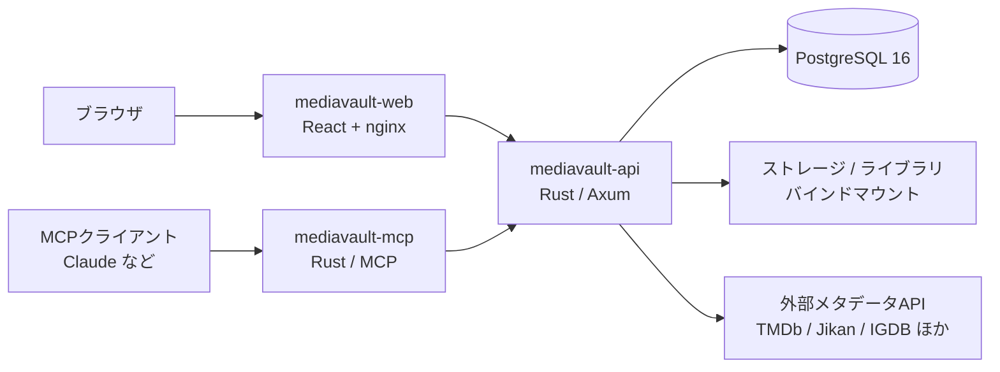

# MediaVault

映画・ドラマ・アニメ・漫画・小説・ゲーム・学術書・論文/文献のメタデータを、ひとつのコレクションとして一元管理するセルフホスト型アプリケーションです。

外部メタデータAPI（TMDb / Jikan / Annict / IGDB / Steam / 楽天ブックス / 国立国会図書館 / OpenLibrary / openBD）から作品情報を取り込み、タグ・カテゴリ・マイリストで整理し、手元のファイルや配信リンクと紐づけて管理できます。MCPサーバーを同梱しているので、Claude などの AI クライアントから自然言語でコレクションを操作することもできます。

<!--
スクリーンショットを docs/images/ に置いたら、以下のコメントを外してください。

-->

## 特徴

- **8メディア種別を1つのDBで管理** — 映画・ドラマ・アニメ・漫画・小説・ゲーム・学術書・論文を共通の `items` モデル＋種別ごとの詳細フィールドで扱います
- **外部API検索から1クリックで登録** — タイトル・ISBN・作者などで横断検索し、取得したメタデータをそのままコレクションへ取り込みます
- **手動登録にも対応** — APIに存在しない同人誌・自主制作作品なども自由に追加できます
- **整理機能** — タグ、カテゴリ、お気に入り、任意名のマイリスト、年別ビュー
- **作品同士の関連付け** — 続編・スピンオフ・DLC・原作/映像化などの関係、および他メディアからの引用を記録できます
- **シーズン/巻/話数の管理** — アニメ・ドラマのシーズンとエピソード、漫画・小説の巻をグループ単位でまとめられます
- **リンク・ファイル・トレーラー** — 配信サービスへのリンク、ファイルサーバー上のパス、トレーラーURLをアイテムごとに保持します
- **視聴/読了記録** — ステータスと視聴日・読了日、評価を記録します
- **インポート/エクスポート** — ブクログCSV・Steamライブラリのインポート、Obsidian / Notion 向けエクスポート
- **MCPサーバー同梱** — AIクライアントから検索・登録・整理を実行できます
- **認証なしの単一ユーザー設計** — LAN内やリバースプロキシ配下での個人利用を前提に、ログイン機構を持たず軽量に動きます

<!--

-->

## 構成



| コンポーネント | 技術 | 役割 |
|---|---|---|
| `mediavault-web` | React 19 + TypeScript + Vite + Tailwind CSS v4 + TanStack Query | UI。nginx で静的配信 |
| `mediavault-api` | Rust + Axum + sqlx | REST API（公開 `/api/v1`、内部 `/internal`） |
| `mediavault-mcp` | Rust + MCP (Streamable HTTP) | AIクライアント向けツール群 |
| `api-client-lib` | Rust | 外部メタデータAPIクライアント（レート制限つき） |
| `mediavault-postgres` | PostgreSQL 16 | データストア |

## 動作要件

- Docker / Docker Compose
- 外部メタデータAPIを使う場合は各サービスのAPIキー（未設定のプロバイダーは単に利用できないだけで、起動は可能です）

## セットアップ

```bash
git clone <このリポジトリのURL> mediavault
cd mediavault

cp .env.example .env
# .env を編集する（最低限、以下の2つは必須）
#   MEDIAVAULT_DB_PASSWORD : DBパスワード
#   MCP_AUTH_TOKEN         : openssl rand -base64 48 で生成した値

docker compose up -d --build
```

起動後:

| URL | 内容 |
|---|---|
| http://127.0.0.1:8080 | Web UI |
| http://127.0.0.1:8080/api/v1/health | API ヘルスチェック |
| http://localhost:8081/healthz | MCP ヘルスチェック |

`docker compose ps` で全サービスが `healthy` になれば完了です。

## 設定

主な環境変数（すべて `.env`。詳細は [.env.example](.env.example) を参照）。

### 基本

| 変数 | 既定値 | 説明 |
|---|---|---|
| `TZ` | `Asia/Tokyo` | タイムゾーン |
| `BIND_ADDRESS` | `127.0.0.1` | Web UI の公開先。LANに開くなら `0.0.0.0` |
| `MEDIAVAULT_WEB_PORT` | `8080` | Web UI のホスト側ポート |
| `MEDIAVAULT_ALLOWED_ORIGIN` | `http://127.0.0.1:8080` | CORS 許可オリジン。公開URLを変えたら合わせて変更する |
| `MEDIAVAULT_DB_PASSWORD` | （必須） | PostgreSQL のパスワード |

### ストレージ

| 変数 | 既定値 | 説明 |
|---|---|---|
| `MEDIAVAULT_DB_SOURCE` | `mediavault-db` | DBデータの保存先。名前付きボリュームかホストの絶対パス |
| `MEDIAVAULT_STORAGE_SOURCE` | `mediavault-storage` | アップロードファイルの保存先（コンテナ内 `/srv/mediavault`） |
| `LIBRARY_SOURCE` | `shares` | 既存の作品ファイル置き場。読み取り用にマウントされる（コンテナ内 `/library`） |

### 外部メタデータAPI

`TMDB_API_KEY` / `STEAM_API_KEY` / `STEAM_USER_ID` / `IGDB_CLIENT_ID` / `IGDB_CLIENT_SECRET` / `ANNICT_ACCESS_TOKEN` / `RAKUTEN_APPLICATION_ID` / `RAKUTEN_ACCESS_KEY`

いずれも任意です。設定したプロバイダーだけが検索・インポートで使えるようになります。国立国会図書館 / OpenLibrary / openBD / Jikan はキー不要です。

### MCP

| 変数 | 既定値 | 説明 |
|---|---|---|
| `MCP_AUTH_TOKEN` | （必須） | MCP エンドポイントの Bearer トークン |
| `MCP_BIND_ADDRESS` | `0.0.0.0` | MCP の公開先インターフェース |
| `MEDIAVAULT_MCP_PORT` | `8081` | MCP のホスト側ポート |
| `INTERNAL_API_KEY` | 空 | 内部API (`/internal`) 用キー。未設定でも起動する |

## MCP からの利用

エンドポイントは `http://<ホスト>:8081/mcp`（Streamable HTTP）。`/healthz` を除き `Authorization: Bearer <MCP_AUTH_TOKEN>` が必須です。

Claude Code の場合:

```bash
claude mcp add --transport http mediavault http://<ホスト>:8081/mcp \
  --header "Authorization: Bearer <MCP_AUTH_TOKEN の値>"
```

設定ファイルで指定する場合:

```json
{
  "mcpServers": {
    "mediavault": {
      "type": "http",
      "url": "http://<ホスト>:8081/mcp",
      "headers": { "Authorization": "Bearer <MCP_AUTH_TOKEN の値>" }
    }
  }
}
```

提供ツール:

| ツール | 内容 |
|---|---|
| `search_library` | コレクション内の検索 |
| `search_external_catalog` | 外部メタデータAPIの横断検索 |
| `import_external_item` | 外部検索結果をコレクションへ取り込み |
| `create_item` | 手動でのアイテム作成 |
| `get_item_context` | アイテムの詳細・関連情報の取得 |
| `update_consumption` | 視聴/読了ステータス・日付・評価の更新 |
| `organize_item` | タグ・カテゴリ・マイリストの整理 |
| `relate_items` | アイテム間の関連付け |
| `add_access_link` | リンク・ファイル・配信URLの追加 |
| `collection_overview` | コレクション全体のサマリー |
| `health` | 稼働確認 |

詳細は [docs/backend/mediavault-mcp/README.md](docs/backend/mediavault-mcp/README.md) を参照してください。

## インポート

- **ブクログ (CSV)** — 設定画面からエクスポート済みCSVをアップロードします。書式は [docs/booklog-import-sample/README.md](docs/booklog-import-sample/README.md) を参照
- **Steam ライブラリ** — `STEAM_API_KEY` と `STEAM_USER_ID` を設定すると、所有ゲームを一括で取り込めます

<!--

-->

## 開発

### フロントエンド

```bash
cd frontend
yarn install
yarn dev          # 開発サーバー
yarn test         # Vitest（ユニット）
yarn test:e2e     # Playwright（E2E）
yarn lint
yarn storybook    # コンポーネントカタログ
```

### バックエンド

```bash
cd backend
cargo fmt
cargo clippy --all-targets -- -D warnings
cargo test --include-ignored   # DB接続を伴う統合テストを含む
cargo build -p mediavault-api
```

DBマイグレーションは `backend/mediavault-api/migrations/` に置かれ、sqlx で管理されています。

## ドキュメント

| 資料 | 内容 |
|---|---|
| [docs/PRD.md](docs/PRD.md) | 全体要件 |
| [docs/backend/mediavault-api/index.md](docs/backend/mediavault-api/index.md) | REST API 仕様（共通形式・エラーコード） |
| [docs/backend/mediavault-api/data-model.md](docs/backend/mediavault-api/data-model.md) | データモデル |
| [docs/backend/mediavault-mcp/](docs/backend/mediavault-mcp/) | MCPサーバーの設計・ツール仕様 |
| [docs/frontend/design/](docs/frontend/design/) | 画面設計 |
| [docs/api-client-lib/](docs/api-client-lib/) | 外部API調査メモ |

## セキュリティについて

MediaVault は**単一ユーザー・セルフホスト前提**の設計で、公開API (`/api/v1`) に認証がありません。インターネットに直接公開せず、LAN内で運用するか、リバースプロキシ（Caddy / nginx など）で HTTPS 終端と認証をかけてください。MCP エンドポイントは Bearer トークンで保護されています。

## ライセンス

（未設定）
