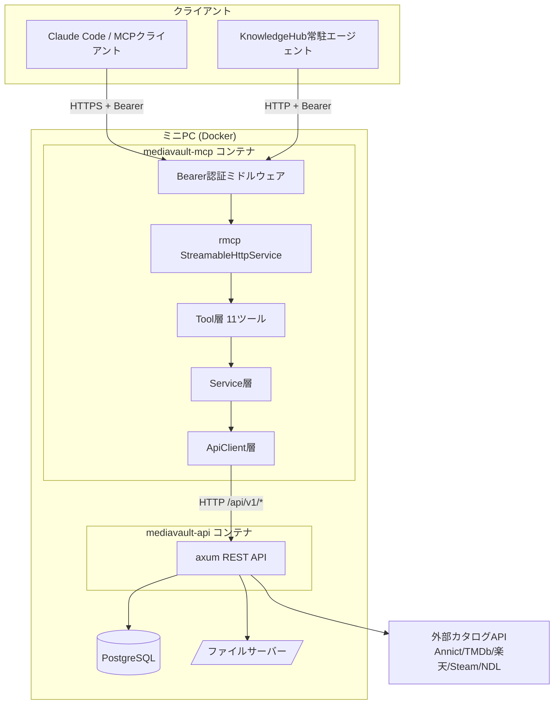

# mediavault-mcp アーキテクチャ設計

**作成日**: 2026-08-07
**関連要件定義**: [requirements.md](../spec/requirements.md)
**ヒアリング記録**: [design-interview.md](design-interview.md)

**【信頼性レベル凡例】**:
- 🔵 **青信号**: 要件定義書・設計文書・既存実装・ユーザヒアリングを参考にした確実な設計
- 🟡 **黄信号**: それらから妥当な推測による設計
- 🔴 **赤信号**: それらにない推測による設計

---

## システム概要 🔵

**信頼性**: 🔵 *[requirements.md](../spec/requirements.md) 概要・[PRD.md](../PRD.md) §1より*

MediaVault-mcp は、AIエージェントから MediaVault のコレクションを操作するための MCP サーバーである。REST API のエンドポイントをそのままツール化せず、利用者の目的単位のツール（11個）へ集約する。

データは所有せず、状態も持たない（ステートレス）。すべての読み書きは MediaVault-api への HTTP 呼び出しに変換される。

## アーキテクチャパターン 🔵

**信頼性**: 🔵 *[tech-stack.md](../tech-stack.md)・要件 REQ-003 / REQ-140 / NFR-303 より*

- **パターン**: **3層のレイヤードアーキテクチャ**（Tool層 → Service層 → ApiClient層）
- **選択理由**:
  - MCP ツールは「目的単位」であり、1ツールが複数の API 呼び出しを組み立てる（REQ-022, REQ-041, REQ-060）。この組み立てロジックを Service 層に隔離することで、Tool 層をスキーマ定義とパラメータ検証に専念させられる。
  - Service 層に集約することで、`wiremock` による統合テストが Tool 層を通さずに書ける（NFR-302）。
  - MCP はデータを所有しないためリポジトリ層・ドメイン層は不要。過剰な層を作らない。

```
┌─────────────────────────────────────────┐
│ Tool層 (src/tools/)                      │
│  rmcp の #[tool] マクロ、入出力スキーマ     │
│  引数バリデーション、結果の構造化          │
└──────────────┬──────────────────────────┘
               │
┌──────────────▼──────────────────────────┐
│ Service層 (src/services/)                │
│  複数API呼び出しの合成、名前→ID解決、      │
│  冪等性の担保、部分失敗の集約             │
└──────────────┬──────────────────────────┘
               │
┌──────────────▼──────────────────────────┐
│ ApiClient層 (src/api/)                   │
│  reqwest、ApiOk/ApiError のデシリアライズ  │
│  エラー分類、タイムアウト                 │
└─────────────────────────────────────────┘
```

## コンポーネント構成

### MCPサーバー層 🔵

**信頼性**: 🔵 *[tech-stack.md](../tech-stack.md)・REQ-001 / REQ-002 より*

- **MCP SDK**: `rmcp` 3.1系（`server` / `transport-streamable-http-server` / `macros`）
- **HTTPサーバー**: axum 0.8（mediavault-api と同一系統）
- **トランスポート**: Streamable HTTP のみ。`StreamableHttpService` を `/mcp` にマウント
- **スキーマ生成**: `#[tool]` / `#[tool_router]` マクロが Rust 構造体から JSON Schema を生成（型の重複定義を避ける）
- **提供機能**: Tools のみ。Resources / Prompts は提供しない（REQ-131）

### 認証層 🔵

**信頼性**: 🔵 *ヒアリング（tech-stack フェーズ）・REQ-115 / REQ-122 / NFR-101 ~ NFR-104 より*

- **方式**: 静的 Bearer トークン。MCPプロセス自身が検証し、リバースプロキシでは終端しない
- **実装**: tower ミドルウェア（`axum::middleware::from_fn`）。既存の `mediavault-api/src/middleware/api_key_auth.rs` と同じ構造を取るが、比較を `subtle::ConstantTimeEq` に置き換える 🟡
- **起動時検証**: `MCP_AUTH_TOKEN` が未設定または空文字なら起動を失敗させる（REQ-122）。既存 api の `unwrap_or_default()` + 空文字チェック方式は、設定漏れ時に「常に401」となり気付きにくいため採用しない 🟡
- **適用範囲**: `/mcp` は認証必須、`/healthz` のみ認証対象外（NFR-104）

### ApiClient層 🔵

**信頼性**: 🔵 *ヒアリング（tech-stack フェーズ「mcpクレート内に自前実装」）・REQ-003 より*

- **HTTPクライアント**: `reqwest` 0.12（`json`）。コネクションプールを保持する単一インスタンスを `Arc` で共有
- **レスポンス型**: mediavault-api の `ApiOk<T>` / `ApiError` に対応する `ApiEnvelope<T>` でデシリアライズする（既存 `models/response.rs` の形に一致）
- **エラー分類**: 3種に分類し、混同させない（REQ-120, EDGE-001, EDGE-002）
  | 種別 | 発生条件 |
  |---|---|
  | `ApiClientError::Connection` | 接続失敗・タイムアウト・DNS失敗 |
  | `ApiClientError::Auth` | 内部API呼び出しで 401 `UNAUTHORIZED` |
  | `ApiClientError::Api { code, message, status }` | MediaVault-api が返した業務エラー |
- **タイムアウト**: 接続 3秒 / 全体 15秒（外部カタログ検索のみ 30秒）🟡
- **認証**: 内部API（`/api/v1/internal/*`）呼び出し時のみ `Authorization: Bearer {INTERNAL_API_KEY}`（NFR-103）

### 状態管理 🔵

**信頼性**: 🔵 *REQ-003・PRD §13より*

MCPサーバーはステートレスである。DB もキャッシュストアも持たない。

- **保持するもの**: 設定（`Config`）、reqwest クライアント、起動時刻、バージョン文字列のみ
- **タグ／カテゴリ／マイリストの名前→ID解決はキャッシュしない** 🟡
  - 単一ユーザー・低同時実行であり、キャッシュの利得が小さい
  - 別セッションで作成されたタグを取りこぼすと「候補なし」の誤答になり、REQ-111 の意味が損なわれる
  - 1回の `organize_item` 内では取得結果を使い回す（呼び出し内メモ化のみ）

## システム構成図 🔵

**信頼性**: 🔵 *[tech-stack.md](../tech-stack.md)（別コンテナ構成）・[06_deployment-routing.md](../../../basic-design/06_deployment-routing.md) より*



**構成上の要点**:
- MCP と api は別コンテナ。障害分離と個別再起動が可能（REQ-121）
- MCP から DB・ファイルサーバーへの経路は存在しない（REQ-140, NFR-303）
- 外部カタログAPIへは api を経由してのみ到達する（MCP が直接叩かない）

## ディレクトリ構造 🔵

**信頼性**: 🔵 *[tech-stack.md](../tech-stack.md)・レイヤードアーキテクチャの採用より*

```
backend/
├── Cargo.toml                        # workspace members に mediavault-mcp を追加
└── mediavault-mcp/
    ├── Cargo.toml
    ├── Dockerfile
    ├── src/
    │   ├── main.rs                   # 設定読込 → 起動時検証 → axum起動
    │   ├── config.rs                 # Config（環境変数）
    │   ├── auth.rs                   # Bearer検証ミドルウェア
    │   ├── server.rs                 # MediaVaultServer（ServerHandler / tool_router）
    │   ├── tools/                    # Tool層: スキーマ定義と引数検証
    │   │   ├── mod.rs
    │   │   ├── search_library.rs
    │   │   ├── get_item_context.rs
    │   │   ├── search_external_catalog.rs
    │   │   ├── import_external_item.rs
    │   │   ├── create_item.rs
    │   │   ├── update_consumption.rs
    │   │   ├── organize_item.rs
    │   │   ├── relate_items.rs
    │   │   ├── add_access_link.rs
    │   │   ├── collection_overview.rs
    │   │   └── health.rs
    │   ├── services/                 # Service層: 合成・解決・冪等性・部分失敗
    │   │   ├── mod.rs
    │   │   ├── search.rs
    │   │   ├── context.rs            # get_item_context の並列合成
    │   │   ├── catalog.rs            # 外部検索・インポート
    │   │   ├── item_write.rs         # create_item / update_consumption
    │   │   ├── organize.rs           # 名前→ID解決 + 冪等付与
    │   │   ├── relation.rs
    │   │   ├── link.rs               # 配信/通常/トレーラーの振り分け
    │   │   └── overview.rs
    │   ├── api/                      # ApiClient層
    │   │   ├── mod.rs
    │   │   ├── client.rs             # reqwest ラッパ
    │   │   ├── error.rs              # ApiClientError
    │   │   ├── envelope.rs           # ApiOk/ApiError 相当
    │   │   └── models.rs             # api のレスポンス型（必要分のみ）
    │   └── result/                   # 構造化レスポンス共通型
    │       ├── mod.rs
    │       ├── outcome.rs            # ToolOutcome / ToolError
    │       └── operation.rs          # OperationResult（部分失敗）
    └── tests/                        # wiremock ベースの統合テスト
        ├── common/mod.rs             # モックサーバー・フィクスチャ
        ├── search_library.rs
        ├── organize_item.rs
        └── ...
```

## 主要な設計決定

### D-01: エラーは構造化結果に統一する 🔵

**信頼性**: 🔵 *ヒアリング2026-08-07 Q1・REQ-146 / REQ-114 / NFR-201 より*

すべての MCP ツールは、業務エラーであっても MCP プロトコル上は成功（`Ok`）を返し、結果本体に `outcome` フィールドを持たせる。

```
outcome: "success" | "partial" | "error" | "ambiguous" | "not_found"
```

- **理由**: 部分失敗（REQ-114）と完全失敗を同じスキーマで表現でき、AI が単一の読み方で判定できる。`isError` を使うと部分失敗が表現できず、形式が二重化する。
- **例外**: プロトコル違反、認証失敗、引数スキーマ違反は rmcp が返すプロトコルレベルのエラーとする（これらはツールに到達しない）。
- **`retriable`** フラグを併せて返し、AI が再試行の可否を判断できるようにする 🟡

### D-02: 書き込み系ツールは UUID のみ受け取る 🔵

**信頼性**: 🔵 *REQ-142・ヒアリング（requirements フェーズ Q6）より*

`update_consumption` / `organize_item` / `relate_items` / `add_access_link` の対象指定引数は `Uuid` 型のみ。タイトル文字列を受け取る引数を定義しない。これにより NFR-301（誤書き込み0件）が型レベルで保証され、テストは「入力スキーマの列挙」で機械的に検証できる。

### D-03: 冪等性は「事前取得 + 差分適用」で担保する 🔵

**信頼性**: 🔵 *ヒアリング2026-08-07 Q2・REQ-113 より*

`organize_item` は付与前に `GET /api/v1/items/{id}`（タグ・カテゴリを含む）と `GET /api/v1/items/{id}/mylists` で現状を取得し、未付与のものだけを POST する。

- **理由**: 「既に付与済み」を確実に判別でき、結果で `already_attached` として区別できる（REQ-061）。409 を握る方式は、エンドポイントごとに 409 を返すか検証が必要で、`POST /items/{id}/tags/{tag_id}` が 409 を返す保証がない。
- **コスト**: 追加の GET が1〜2回。単一ユーザー環境では許容範囲。

### D-04: 検索結果は要約形（ItemSummary）で返す 🔵

**信頼性**: 🔵 *ヒアリング2026-08-07 Q4・PRD §11・REQ-143 より*

`search_library` / `collection_overview` は `ItemSummary`（id / title / media_type / release_year / status / rating / is_favorite / tags）のみを返す。`description` や `details` は含めない。詳細が必要な場合は `get_item_context` を呼ぶ。

### D-05: get_item_context は並列合成する 🔵

**信頼性**: 🔵 *ヒアリング（requirements フェーズ Q5）・REQ-022 / NFR-005 より*

`GET /items/{id}` と、関連・マイリスト・グループ・キャスト・スタッフ・ファイル・リンク・トレーラーの取得を `tokio::try_join!` ではなく **`futures::join!`（各結果を独立に `Result` で保持）** で並列実行する。1つが失敗しても他を返すため（REQ-021）、`try_join!` は使わない。

各セクションは3状態を持つ:
```
Loaded(Vec<T>) | Empty | Failed { code, message }
```
これにより「未登録」と「取得失敗」が区別される（REQ-021, EDGE-105）。

### D-06: search_library に year / sort を公開する 🔵

**信頼性**: 🔵 *ヒアリング2026-08-07 Q3・`models/item.rs` の `ListItemsQuery` 実装より*

既存 `ListItemsQuery` に実装済みの `year` と `sort` をツール引数として公開する。`date_field` は意味が分かりにくく AI が誤用しやすいため公開しない 🟡。US-09（「最近追加したもの」「特定年の作品」）に直接役立つ。

## 非機能要件の実現方法

### パフォーマンス 🔵

**信頼性**: 🔵 *NFR-001 ~ NFR-006 より*

| 要件 | 実現方法 |
|---|---|
| NFR-001 所蔵確認1回 | `search_library` 内でタグ名/カテゴリ名の解決を含めて完結させる |
| NFR-002 コンテキスト1回 | D-05 の並列合成 |
| NFR-003 外部検索→登録2回 | `search_external_catalog` の結果を `import_external_item` へそのまま渡せる形にする（`provider` / `external_id` を保持） |
| NFR-004 整理1回 | `organize_item` がタグ・カテゴリ・マイリストを1回で処理 |
| NFR-006 タイムアウト | reqwest のタイムアウト設定（接続3秒 / 全体15秒 / 外部検索30秒）🟡 |

**レスポンスサイズ**: 一覧は既定20・上限50（REQ-143）。`ItemSummary` により1件あたりのトークン量を抑える（D-04）。

### セキュリティ 🔵

**信頼性**: 🔵 *NFR-101 ~ NFR-104・REQ-145 より*

| 対策 | 実装 |
|---|---|
| 認証 | 静的Bearer、`subtle` による定数時間比較 |
| 起動時ガード | `MCP_AUTH_TOKEN` 未設定なら起動失敗 |
| 内部APIキー保護 | `Config` 内で `secrecy::SecretString` 相当のラッパに包み、`Debug` 実装でマスクする 🟡 |
| ログ | `tracing` でツール名・所要時間・`outcome` のみ記録。引数本文とヘッダーは記録しない |
| 破壊的操作 | 削除系ツールを実装しない（REQ-141）。ApiClient に DELETE メソッドを持たせない 🟡 |

### 可用性 🟡

**信頼性**: 🟡 *REQ-121・NFR-006 から妥当な推測*

- MediaVault-api 停止時も MCP プロセスは起動・待ち受けを継続し、`health` ツールで `reachable: false` を返す
- `/healthz` は MediaVault-api の状態に依存しない（MCPプロセス自身の生存のみ）ため、api 障害でコンテナが再起動ループに陥らない
- リトライは冪等な GET のみ最大1回。書き込みは自動リトライしない（二重登録防止）🟡

## 技術的制約

### アーキテクチャ制約 🔵

**信頼性**: 🔵 *REQ-140 / REQ-141 / REQ-144 / NFR-303 より*

- `Cargo.toml` の依存に `sqlx` を含めない（CI で `cargo tree` により検証）
- ApiClient に DELETE を実装しない
- 要約・embedding 生成のためのライブラリを依存に含めない

### 外部依存の制約 🔵

**信頼性**: 🔵 *[note.md](../spec/note.md) 既存実装調査・[prep.md](../spec/prep.md) より*

以下は mediavault-api 側の先行改修が完了するまで実装できない:

| 制約 | 依存する PREP | 影響する設計 |
|---|---|---|
| `relation_type` が `reference` / `dlc` の2値 | PREP-01 | `relate_items` の enum |
| `title` 検索が本題のみ | PREP-02 | `search_library` |
| 総件数が取得できない | PREP-03 | `search_library` の `total_count` |
| `collection/overview` 未実装 | PREP-04 | `collection_overview` |

### 互換性制約 🔵

**信頼性**: 🔵 *[tech-stack.md](../tech-stack.md)・既存 workspace より*

- edition 2024（mediavault-api と同一）。`api-client-lib` のみ 2021 のままで、本クレートは依存しない
- axum 0.8 / tokio 1.x / serde 1 を workspace 内で揃える
- 第2段階での stdio 追加時に Tool層・Service層を変更しないよう、トランスポート依存を `main.rs` と `server.rs` に閉じる（REQ-902）🟡

## 関連文書

- **データフロー**: [dataflow.md](dataflow.md)
- **型定義**: [interfaces.rs](interfaces.rs)
- **MCPツール仕様**: [mcp-tools.md](mcp-tools.md)
- **設計ヒアリング**: [design-interview.md](design-interview.md)
- **要件定義**: [requirements.md](../spec/requirements.md)
- **技術スタック**: [tech-stack.md](../tech-stack.md)

## 信頼性レベルサマリー

- 🔵 青信号: 31件 (79%)
- 🟡 黄信号: 8件 (21%)
- 🔴 赤信号: 0件 (0%)

**品質評価**: ✅ **高品質**
