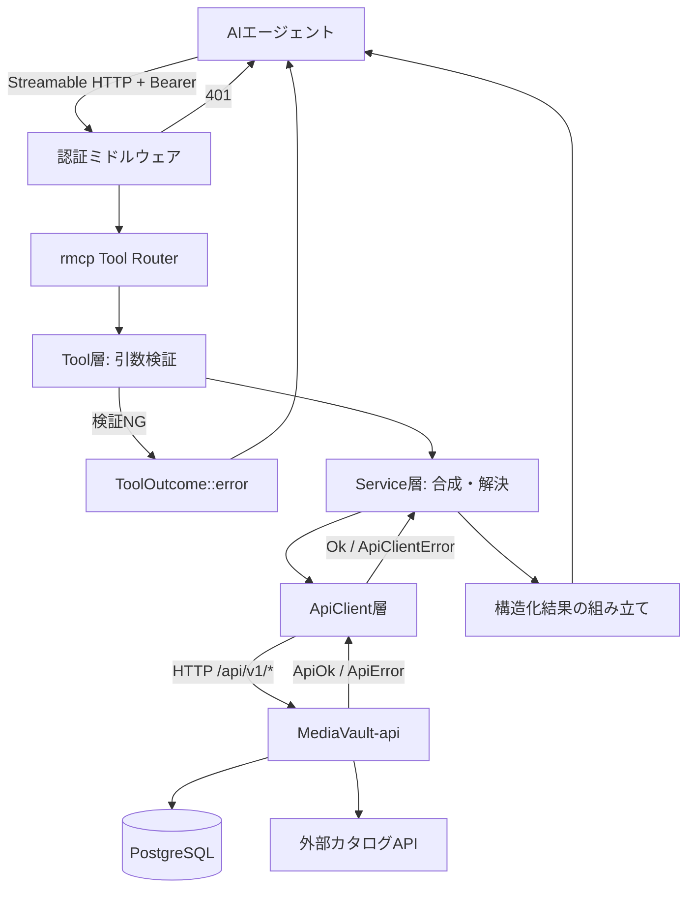
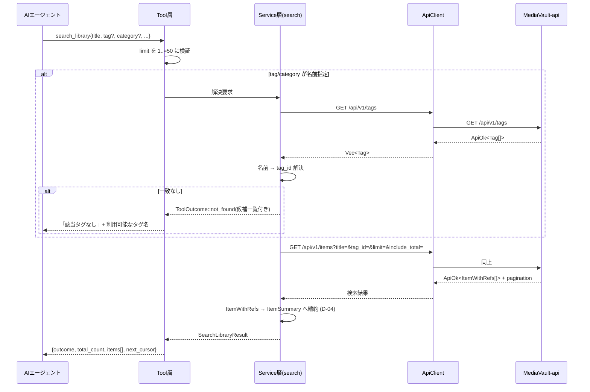
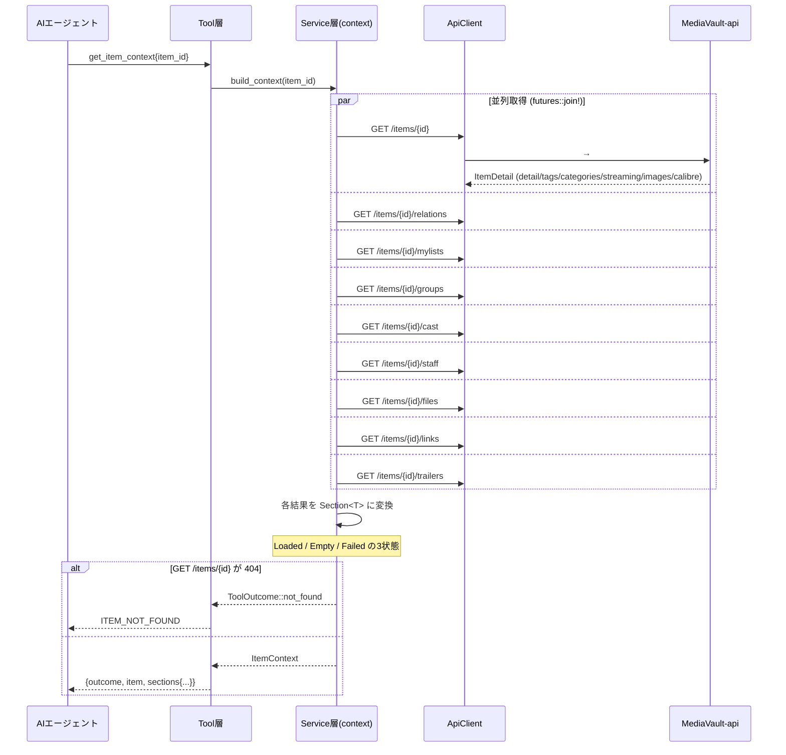
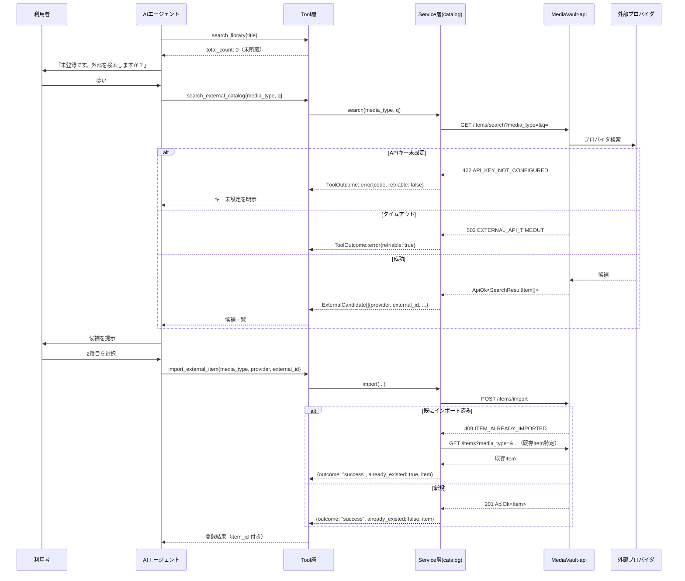
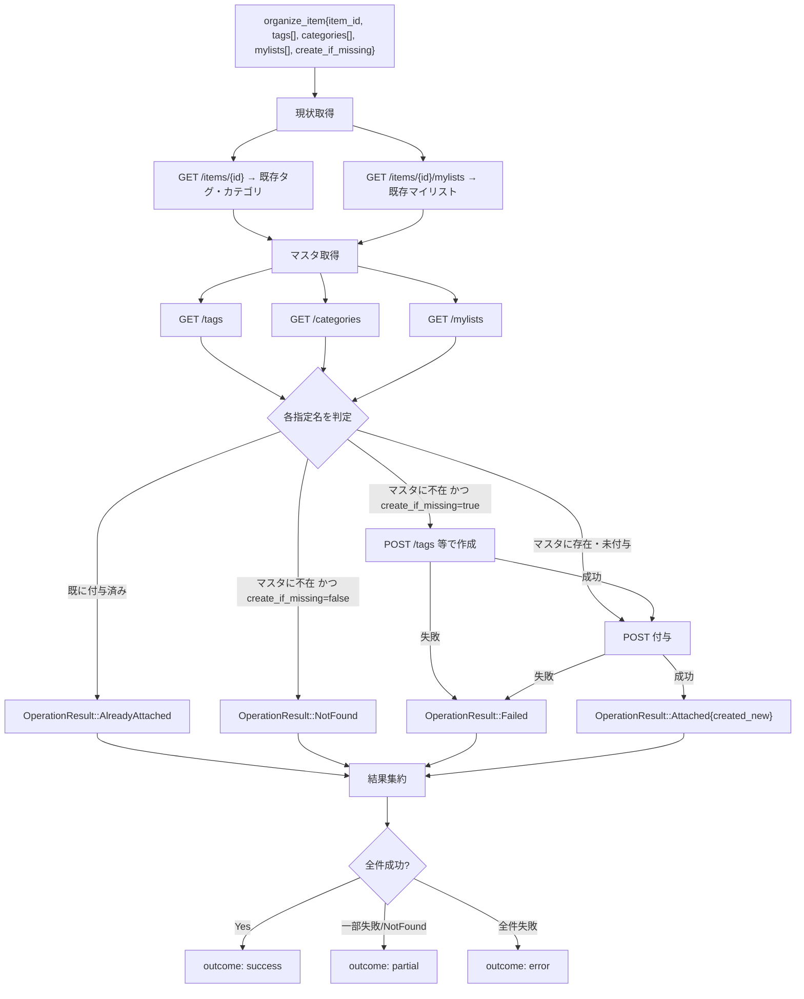
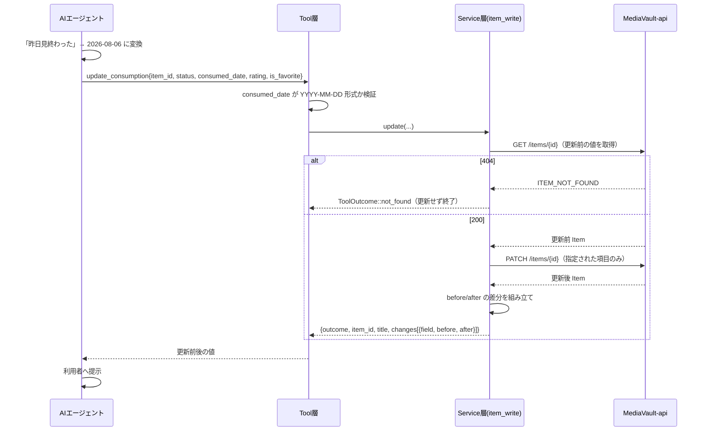
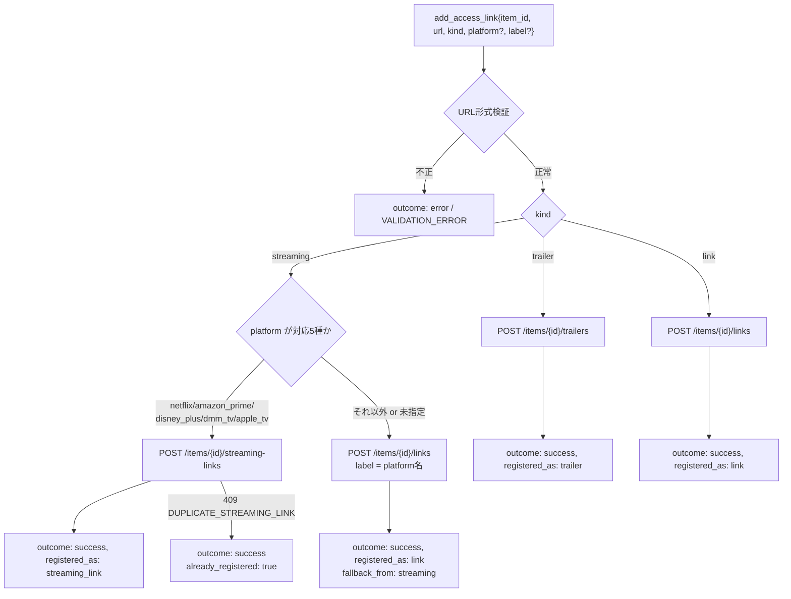
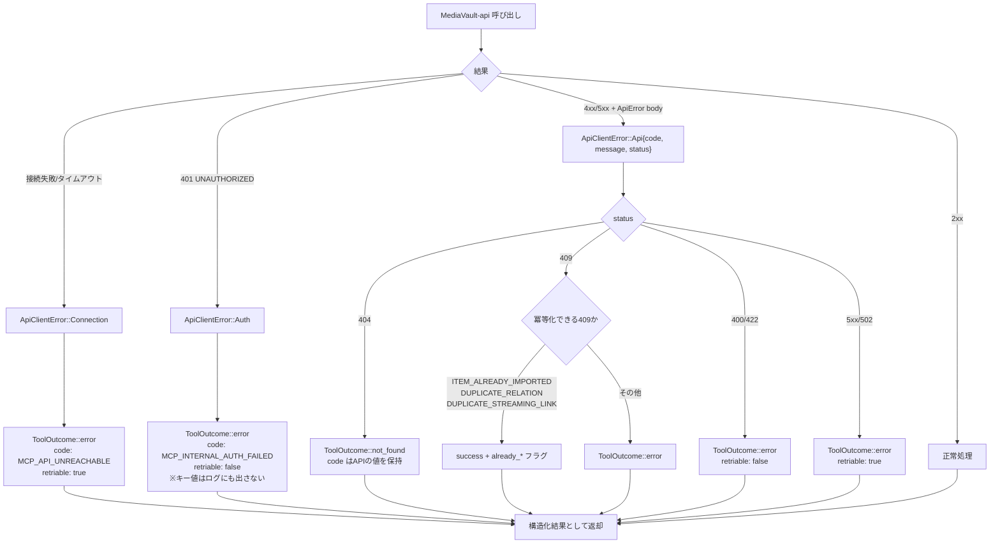
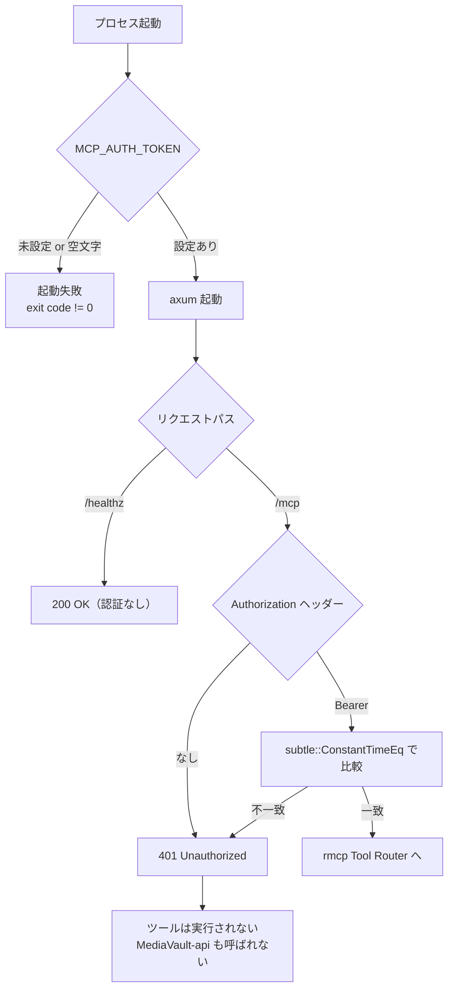
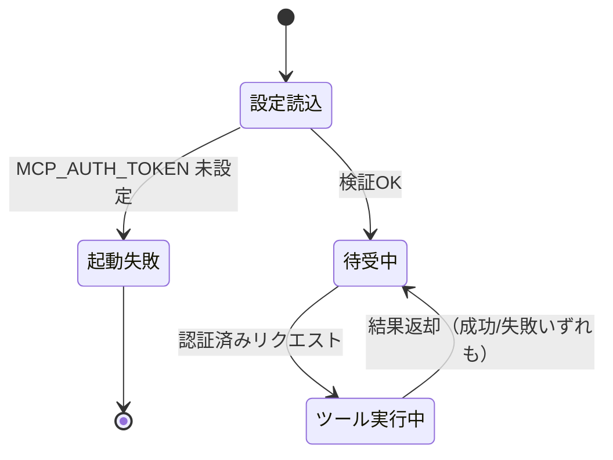

# mediavault-mcp データフロー図

**作成日**: 2026-08-07
**関連アーキテクチャ**: [architecture.md](architecture.md)
**関連要件定義**: [requirements.md](../spec/requirements.md)

**【信頼性レベル凡例】**:
- 🔵 **青信号**: 要件定義書・設計文書・既存実装・ユーザヒアリングを参考にした確実なフロー
- 🟡 **黄信号**: それらから妥当な推測によるフロー
- 🔴 **赤信号**: それらにない推測によるフロー

---

## システム全体のデータフロー 🔵

**信頼性**: 🔵 *[architecture.md](architecture.md)・REQ-003 より*

**要点**:
- MCP から PostgreSQL・外部カタログAPIへの直接経路は存在しない（REQ-140）
- 認証はツール到達前に完了する（REQ-115）
- 業務エラーもプロトコル上は成功として構造化結果で返る（D-01）

---

## 主要機能のデータフロー

### 機能1: search_library（所蔵確認）🔵

**信頼性**: 🔵 *US-01・REQ-010 ~ REQ-014・受け入れ基準 TC-010-01 ~ TC-014-01 より*

**関連要件**: REQ-010, REQ-011, REQ-012, REQ-013, REQ-014, REQ-143

**詳細ステップ**:
1. Tool層が `limit` を検証する。51以上は `50` へ丸めるのではなく **バリデーションエラー** とする（EDGE-101 の決定：AIに上限を明示的に伝えるため）🟡
2. タグ名・カテゴリ名が指定された場合、Service層が `GET /tags` / `GET /categories` を呼んで ID を解決する。この解決結果は**この呼び出し内でのみ**使い回す（キャッシュしない）
3. 名前が解決できない場合は検索を実行せず、利用可能な名前一覧とともに `not_found` を返す。空振り検索よりAIが次の手を打ちやすい 🟡
4. `GET /items` に本題・原題・別名を横断する検索（PREP-02 完了が前提）と、該当件数（PREP-03 完了が前提）を要求する
5. `ItemWithRefs` から `description` などを落とし `ItemSummary` へ縮約する
6. `pagination.next_after_created_at` / `next_after_id` を不透明な `next_cursor` 文字列にまとめて返す 🟡

---

### 機能2: get_item_context（作品コンテキスト取得）🔵

**信頼性**: 🔵 *US-02・REQ-020 ~ REQ-022・NFR-005・ヒアリング Q5 より*

**関連要件**: REQ-020, REQ-021, REQ-022, NFR-002, NFR-005, EDGE-105

**詳細ステップ**:
1. `GET /items/{id}` は**必須**の取得。これが 404 なら全体を `not_found` として即返す（他の結果は破棄）
2. それ以外の8件は `futures::join!` で並列実行し、個々の失敗を許容する（`try_join!` は使わない）
3. 各セクションを3状態へ変換する:
   - 成功かつ要素あり → `Loaded(items)`
   - 成功かつ空 → `Empty`（「未登録」）
   - 失敗 → `Failed { code, message }`（「取得失敗」）
4. 1件でも `Failed` があれば全体の `outcome` を `partial` にする。すべて成功なら `success`
5. `GET /items/{id}` が既にタグ・カテゴリ・配信リンク・画像・Calibre連携を含むため、それらの追加呼び出しは行わない（PRD §8 の整理どおり）

---

### 機能3: 外部カタログ検索 → 登録 🔵

**信頼性**: 🔵 *US-03・REQ-030 ~ REQ-033・REQ-112・REQ-117・`items.md` の API 仕様より*

**関連要件**: REQ-030, REQ-031, REQ-032, REQ-033, REQ-112, REQ-117, NFR-003

**詳細ステップ**:
1. `search_external_catalog` のレスポンス型は `ExternalCandidate` であり、MediaVault の `item_id` フィールドを**持たない**。これにより所蔵品との取り違えが型レベルで防がれる（REQ-032）
2. `provider` と `external_id` は `import_external_item` へそのまま渡せる形で返す（NFR-003）
3. 409 `ITEM_ALREADY_IMPORTED` を受けた場合、Service層が既存 Item を特定して返す。エラーとして返さない（REQ-112）🟡
   - 特定手段: `GET /items?media_type=X` を走査して `external_id` 一致を探す。PRD §8 の「重複候補検索API」が将来実装されればそちらへ切り替える

---

### 機能4: organize_item（冪等な整理）🔵

**信頼性**: 🔵 *US-06・REQ-060 / REQ-061 / REQ-111 / REQ-113・ヒアリング Q2（事前取得方式）より*

**関連要件**: REQ-060, REQ-061, REQ-111, REQ-113, EDGE-003

**詳細ステップ**:
1. 現状取得（2呼び出し）とマスタ取得（最大3呼び出し）を **並列** で実行する 🟡
2. 指定された名前ごとに4分岐で判定する。名前比較は前後空白除去 + 完全一致（大文字小文字は区別する）🟡
3. 付与の POST は指定順に逐次実行する。並列にすると部分失敗時の「未処理」の意味が曖昧になるため 🟡
4. 途中で失敗しても後続を続行し、各操作の結果を `OperationResult` として記録する
5. **全体をロールバックしない**。作成済みのタグや付与済みの関連はそのまま残し、結果に正確に反映する（REQ-114 の「成功したように見せない」であって「なかったことにする」ではない）🟡

---

### 機能5: update_consumption（視聴・読了記録）🔵

**信頼性**: 🔵 *US-05・REQ-050 ~ REQ-052・REQ-110・`PATCH /items/{id}` 仕様より*

**関連要件**: REQ-050, REQ-051, REQ-052, REQ-110, NFR-203

**詳細ステップ**:
1. 日付の自然言語解釈は MCP クライアント（AI）の責務。`consumed_date` が `YYYY-MM-DD` にパースできなければ Tool層で拒否する（REQ-052）
2. 更新前の値を取得するため `GET` を1回追加する。REQ-051 の「更新前後の値を返す」には必須
3. `PATCH /items/{id}` は全フィールド Optional のため、`status` / `consumed_date` / `rating` / `is_favorite` を1リクエストで送れる（`PATCH /items/{id}/status` は使わない）🟡
4. 変更がなかったフィールドは `changes` に含めない 🟡

---

### 機能6: add_access_link（リンク振り分け）🔵

**信頼性**: 🔵 *US-08・REQ-080 / REQ-081・ヒアリング（requirements フェーズ Q4）より*

**関連要件**: REQ-080, REQ-081, REQ-116

**詳細ステップ**:
1. URL は `url` クレートでパースし、スキームが `http` / `https` であることを確認する 🟡
2. 配信プラットフォームが対応一覧にない場合、`item_links` へ `label` としてプラットフォーム名を付けて登録する（REQ-081）
3. フォールバックが起きたことを `fallback_from: "streaming"` として結果に含める。AI が利用者へ説明できるようにするため
4. `DUPLICATE_STREAMING_LINK`（409）は「既に登録済み」として成功扱いにする（冪等性）🟡

---

## エラーハンドリングフロー 🔵

**信頼性**: 🔵 *D-01・REQ-120・EDGE-001 / EDGE-002・`models/response.rs` の ApiErrorCode より*

**エラーコードの扱い**:
- MediaVault-api 由来の `code` と `message` は**そのまま保持**して返す（REQ-146）
- MCP 自身が生成するエラーには `MCP_` プレフィックスを付け、api 由来と区別する 🟡

**冪等化する409の一覧**:

| エラーコード | ツール | 扱い |
|---|---|---|
| `ITEM_ALREADY_IMPORTED` | `import_external_item` | 既存Itemを特定して success |
| `DUPLICATE_RELATION` | `relate_items` | `already_related: true` で success |
| `DUPLICATE_STREAMING_LINK` | `add_access_link` | `already_registered: true` で success |
| `DUPLICATE_TAG_NAME` / `DUPLICATE_CATEGORY_NAME` | `organize_item` | 作成競合とみなし、再取得して付与へ進む 🟡 |

---

## 認証フロー 🔵

**信頼性**: 🔵 *REQ-115・REQ-122・NFR-101 / NFR-102 / NFR-104 より*

---

## 状態管理フロー 🔵

**信頼性**: 🔵 *[architecture.md](architecture.md) 状態管理・REQ-003 より*

MCPサーバーはステートレスであり、永続的な状態遷移を持たない。保持するのはプロセス起動時に確定する不変の設定のみ。

**セッション間で共有される状態はない**。タグ・カテゴリ・マイリストの解決結果もキャッシュしないため、別経路（Web UI等）での変更が即座に反映される。

---

## データ整合性の保証 🟡

**信頼性**: 🟡 *REQ-114・PRD §6 原則5 から妥当な推測*

- **トランザクション**: MCP はトランザクション境界を持たない。複数の API 呼び出しにまたがる原子性は保証されない
- **代替手段**: 部分失敗を隠蔽せず、`OperationResult` で各操作の成否を返す（REQ-114）。AI と利用者が状態を把握して手動で補正できる形にする
- **ロールバックしない理由**: 補償トランザクション（作成済みタグの削除等）は削除系APIの呼び出しを必要とし、REQ-141「削除系を公開しない」と矛盾する。また補償自体が失敗しうる
- **冪等性**: 再試行で重複を作らない設計（D-03、冪等化する409の扱い）により、AI が安全に再実行できる

---

## 関連文書

- **アーキテクチャ**: [architecture.md](architecture.md)
- **型定義**: [interfaces.rs](interfaces.rs)
- **MCPツール仕様**: [mcp-tools.md](mcp-tools.md)
- **要件定義**: [requirements.md](../spec/requirements.md)
- **受け入れ基準**: [acceptance-criteria.md](../spec/acceptance-criteria.md)

## 信頼性レベルサマリー

- 🔵 青信号: 12件 (55%)
- 🟡 黄信号: 10件 (45%)
- 🔴 赤信号: 0件 (0%)

**品質評価**: ✅ **高品質**（🟡 はいずれも要件から導出した実装レベルの具体化であり、要件の解釈に曖昧さは残っていない）
