# MediaVault データモデル（内部実装リファレンス）

`backend/mediavault-api` のDBスキーマ（sqlxマイグレーション）・Rust struct・リクエストDTO・バリデーションの詳細を、カテゴリ別にまとめたリファレンス。実装・DB変更を行う際はここを正とする。

APIレスポンスに登場するstructのフィールド一覧のみを見たい場合は [mediavault-api/data-model.md](../mediavault-api/data-model.md) を参照。エンドポイント仕様（リクエスト/レスポンス例）は [mediavault-api/index.md](../mediavault-api/index.md) を参照。

## 概要

- ORM: **sqlx**（`sqlx = { version = "0.8", features = ["postgres", "runtime-tokio", "macros", "chrono", "uuid"] }`）。sea-orm/dieselは未使用。
- DB: PostgreSQL
- マイグレーション:
  - `backend/mediavault-api/migrations/20260623000001_init_schema.up.sql` — ENUM型7種 + `items` + メディア別詳細テーブル8種
  - `backend/mediavault-api/migrations/20260623000002_add_relation_tables.up.sql` — タグ/カテゴリ/マイリスト、関連付け/リンク/ファイル/トレーラー、グループ/エピソード、スタッフ、APIキー管理、`updated_at`自動更新トリガー
- DB行 → Rust struct のマッピングは `#[derive(sqlx::FromRow)]`、Postgres ENUM ↔ Rust enum は `#[derive(sqlx::Type)]` + `#[sqlx(type_name = "...")]` を使用。
- Rustモデルファイルは `backend/mediavault-api/src/models/*.rs`。

## ER図

```mermaid
erDiagram
    ITEMS ||--o| ANIME_DETAILS : "1:1 (media_type=anime)"
    ITEMS ||--o| MOVIE_DETAILS : "1:1 (media_type=movie)"
    ITEMS ||--o| DRAMA_DETAILS : "1:1 (media_type=drama)"
    ITEMS ||--o| MANGA_DETAILS : "1:1 (media_type=manga)"
    ITEMS ||--o| NOVEL_DETAILS : "1:1 (media_type=novel)"
    ITEMS ||--o| GAME_DETAILS : "1:1 (media_type=game)"
    ITEMS ||--o| ACADEMIC_BOOK_DETAILS : "1:1 (media_type=academic_book)"
    ITEMS ||--o| PAPER_DETAILS : "1:1 (media_type=paper)"

    ITEMS ||--o{ ITEM_TAGS : ""
    TAGS ||--o{ ITEM_TAGS : ""
    ITEMS ||--o{ ITEM_CATEGORIES : ""
    CATEGORIES ||--o{ ITEM_CATEGORIES : ""
    MYLISTS ||--o{ MYLIST_ITEMS : ""
    ITEMS ||--o{ MYLIST_ITEMS : ""

    ITEMS ||--o{ ITEM_LINKS : ""
    ITEMS ||--o{ ITEM_STREAMING_LINKS : ""
    ITEMS ||--o{ ITEM_FILES : ""
    ITEMS ||--o{ ITEM_TRAILERS : ""

    ITEMS ||--o{ ITEM_RELATIONS : "item_id"
    ITEMS ||--o{ ITEM_RELATIONS : "related_item_id (self-referential)"

    ITEMS ||--o{ ITEM_GROUPS : "item_id"
    ITEMS ||--o{ ITEM_GROUPS : "parent_item_id (nullable)"
    ITEM_GROUPS ||--o{ ITEM_EPISODES : "season/chapterのみ"

    ITEMS ||--o{ ITEM_STAFF : ""
    STAFF ||--o{ ITEM_STAFF : ""

    API_CREDENTIALS {
        enum provider PK
    }
```

- `items` (1) — `anime/movie/drama/manga/novel/game/academic_book/paper_details` (1) : `item_id`をPK兼FKとした1:1（`media_type`に応じてどれか1行のみ存在）
- `items` (M) — `tags` (M) : `item_tags`
- `items` (M) — `categories` (M) : `item_categories`
- `mylists` (M) — `items` (M) : `mylist_items`
- `items` (1) — `item_links` / `item_streaming_links` / `item_files` / `item_trailers` (N) : 単純な1:N（`item_streaming_links`のみ`UNIQUE(item_id, platform)`で1プラットフォーム1件までに制限）
- `items` (M) — `items` (M) : `item_relations`（自己参照、`relation_type`: reference/dlc）
- `items` (1) — `item_groups` (N) : season/volume/chapter。`item_groups.parent_item_id`は別の`items.id`を参照し階層グルーピングに使う
- `item_groups` (1) — `item_episodes` (N) : `group_type=volume`のグループへのepisode追加はDBトリガーで禁止
- `items` (M) — `staff` (M) : `item_staff`（`role`/`character_name`付き）
- `api_credentials` : `provider`（enum）をPKとする独立テーブル、他エンティティとのFK関係なし

## ENUM型一覧

| ENUM型 | 値 | 対応するRust enum |
|---|---|---|
| `media_type` | anime, movie, drama, manga, novel, game, academic_book, paper | `item::MediaType`（`sqlx(rename_all="snake_case")`） |
| `item_status` | not_started, in_progress, completed | `item::ItemStatus` |
| `item_source` | api, manual | `item::ItemSource` |
| `group_type` | season, volume, chapter | `item_group::GroupType` |
| `relation_type` | reference, dlc | `item_relation::RelationType` |
| `file_type` | pdf, image, other | `item_file::FileType` |
| `streaming_platform` | netflix, amazon_prime, disney_plus, dmm_tv, apple_tv | `item_streaming_link::StreamingPlatform` |
| `api_provider` | tmdb, igdb, ndl, steam, openlibrary, anilist | `api_credential::ApiProvider`（`OpenLibrary`/`AniList`のみ`#[sqlx(rename=...)]`でDB値と対応。serde側は`open_library`/`ani_list`。Jikanはキー不要のため対象外） |

## カテゴリ別詳細

- [items.md](./items.md) — items本体 + メディア別詳細テーブル8種
- [tags.md](./tags.md) — タグ
- [categories.md](./categories.md) — カテゴリ
- [mylists.md](./mylists.md) — マイリスト
- [item-relations.md](./item-relations.md) — アイテム関連付け（reference/dlc）
- [item-groups.md](./item-groups.md) — グループ（season/volume/chapter）
- [item-episodes.md](./item-episodes.md) — エピソード
- [item-files.md](./item-files.md) — ファイル（Calibre連携含む）
- [item-links.md](./item-links.md) — 外部リンク
- [item-streaming-links.md](./item-streaming-links.md) — 配信サービスURL（Netflix/AmazonPrime/DisneyPlus/DmmTv/AppleTv）
- [item-trailers.md](./item-trailers.md) — トレーラー
- [staff.md](./staff.md) — スタッフ
- [api-credentials.md](./api-credentials.md) — 外部APIキー管理

DB非対応（サービス層・クエリ・レスポンス共通型）のRustモデルファイル（`item_search.rs`, `external_search.rs`, `import.rs`, `item_import.rs`, `response.rs`）は各対応する [mediavault-api/*.md](../mediavault-api/index.md) エンドポイントの説明、または [mediavault-api/data-model.md](../mediavault-api/data-model.md) の共通レスポンス型セクションを参照。
