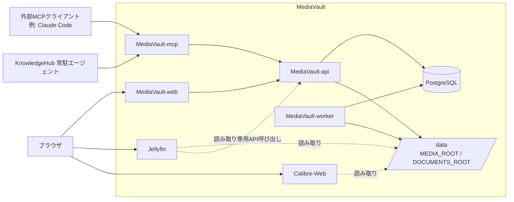

# MediaVault 基本設計 — アーキテクチャ

← [00_overview.md](00_overview.md)

## コンポーネント構成図

※ ネットワーク分離（`proxy-net`/`db-net`）やコンテナ公開方式などインフラ詳細は本図では扱わない。詳細はインフラ設計側 `サービス/MediaVault/README.md`・`設計.md` を参照。

## コンポーネント責務・技術スタック

| コンポーネント | 技術スタック | 責務 | 依存 |
|---|---|---|---|
| MediaVault-web | React + TypeScript（SPA） | 一覧/検索/詳細/登録/編集UI。ビューアなし、Jellyfin/Calibre-Webへリンクアウト | MediaVault-api（`/api`、同一オリジン） |
| MediaVault-api | Rust + Axum + sqlx | 単一 `/api`。メタデータCRUD、検索、ファイル操作、ジョブ登録、ナレッジ格納。全データ変更の唯一経路 | PostgreSQL、`/data`、（検索バックエンドとしてPostgres FTS または Meilisearch） |
| MediaVault-worker | Rust | `jobs` テーブルをポーリングし非同期実行 | PostgreSQL、`/data`、（wiki/embed自前実行時のみLLMエンドポイント） |
| MediaVault-mcp | MCPサーバー（薄いアダプタ） | AIエージェント向けツールを公開。`MediaVault-api` の `/api` のみを呼び出し、DB直接アクセスはしない | MediaVault-api |
| Jellyfin | OSS（バンドル） | 動画/写真のブラウザ視聴 | `/data`（読み取り専用）、（読み取り専用でMediaVault-apiのメタデータを参照する場合あり） |
| Calibre-Web | OSS（バンドル、`linuxserver/mods:universal-calibre`使用） | 書籍(PDF)/漫画(CBZ)のブラウザ閲覧 | 独自の書庫（`calibredb add` で取り込み）。MediaVault-apiへコールバックしない一方向設計 |
| PostgreSQL | 共有インフラ | メタデータ・ジョブキューの永続化 | — |

各コンポーネントの詳細設計:

- MediaVault-web → [../frontend/PRD.md](../frontend/PRD.md)
- MediaVault-api → [../backend/PRD.md](../backend/PRD.md) / [../backend/mediavault-api/index.md](../backend/mediavault-api/index.md)
- MediaVault-worker → [../worker/PRD.md](../worker/PRD.md)
- MediaVault-mcp → [../mcp/PRD.md](../mcp/PRD.md)

## OSS境界の設計判断

| 領域 | 判断 | 採用 |
|---|---|---|
| 動画視聴 | 自作しない、ブラウザで開く | Jellyfin（バンドル、リンクアウト） |
| 書籍/PDF閲覧 | 自作しない、ブラウザで開く | Calibre-Web（バンドル、リンクアウト） |
| ナレッジ生成 | 生成方法の決定はアプリ外 | KnowledgeHub側エージェント（mcp経由） |
| それ以外 | コア機能として自作 | Rust API / React UI / ファイル管理 / ジョブ / データモデル |

## インフラ詳細への参照

コンテナのネットワーク所属（`proxy-net`/`db-net`）、ポート非公開方針、環境変数（`DATA_ROOT`/`MEDIA_ROOT`/`DOCUMENTS_ROOT`/`TZ`/`PUID`/`PGID`/Postgres認証情報/`SEARCH_BACKEND`/`LLM_BASE_URL`等）、リバースプロキシ（Caddy）によるドメイン公開などは、インフラ設計側の以下を参照:

- `インフラ設計/デバイス/ミニPC/サービス/MediaVault/README.md`
- `インフラ設計/デバイス/ミニPC/サービス/MediaVault/設計.md`
