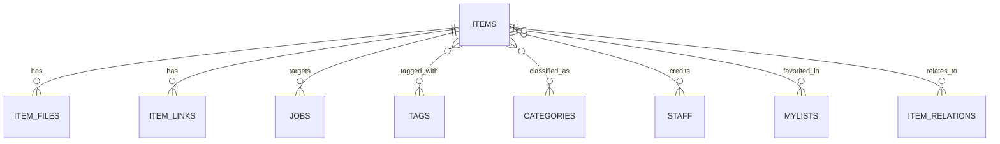

# MediaVault 基本設計 — データモデル概要

← [00_overview.md](00_overview.md)

本ページは `items` を中心とした概念モデル・テーブル間の関係性の全体像を示す。フィールド定義など詳細は [../backend/mediavault-api/data-model.md](../backend/mediavault-api/data-model.md) および各リソースAPIドキュメント（[items.md](../backend/mediavault-api/items.md) 等）を参照。

## ER概要

## テーブル分類と役割

| テーブル | 分類 | 役割 |
|---|---|---|
| `items` | コア | メタデータ本体。`media_type`（video/photo/book/PDF/manga等）で分類 |
| `tags` / `categories` / `staff` / `mylists` | コア | 分類・関連エンティティ・お気に入り |
| `item_files` | コア | `/data` 内の相対パスとファイル実体を紐付ける |
| `item_links` | 拡張 | 外部リンクの統一表現。`kind` = `jellyfin` / `calibre` / `url` |
| `jobs` | 拡張 | workerのジョブキュー（種別/状態/対象item/リトライ）。テーブル定義は [05_job-queue.md](05_job-queue.md) |

正準キーは `items.id`。1つの `item` がファイル・外部リンクを束ねる（[00_overview.md](00_overview.md) の設計原則2）。

ナレッジ（要約/wikiページ/embedding）を保持するテーブルは持たない。ナレッジ本文の正本はKnowledgeHub Vault側にあり、MediaVaultは材料提供に限定する（[04_jobs-and-agent-integration.md](04_jobs-and-agent-integration.md#knowledgehubとの責務分界)）。Vaultノート側がMediaVaultの `items.id` を出典として記録するため、参照方向はVault → MediaVaultの一方向である。

## 設計上の注意（旧設計からの移行）

- 旧 `item_files.calibre_book_id` のようなスキーマ残骸や、旧 `データ連携設計.md`（UUIDシャーディング、`_by-title/` シンボリックリンクビュー）は `item_links` に統合済み。新規実装は `item_links` ベースで行う。
- Jellyfin連携は現行の`mediavault-api`と`item_links`を前提とし、コンテナ名やDBへ直接依存させない。

## 関連ドキュメント

- [../backend/mediavault-api/data-model.md](../backend/mediavault-api/data-model.md)（フィールド定義）
- [../backend/mediavault-api/items.md](../backend/mediavault-api/items.md)、[item-links.md](../backend/mediavault-api/item-links.md)、[item-files.md](../backend/mediavault-api/item-files.md) 等（各リソースAPI）
- [03_api-design.md](03_api-design.md)
