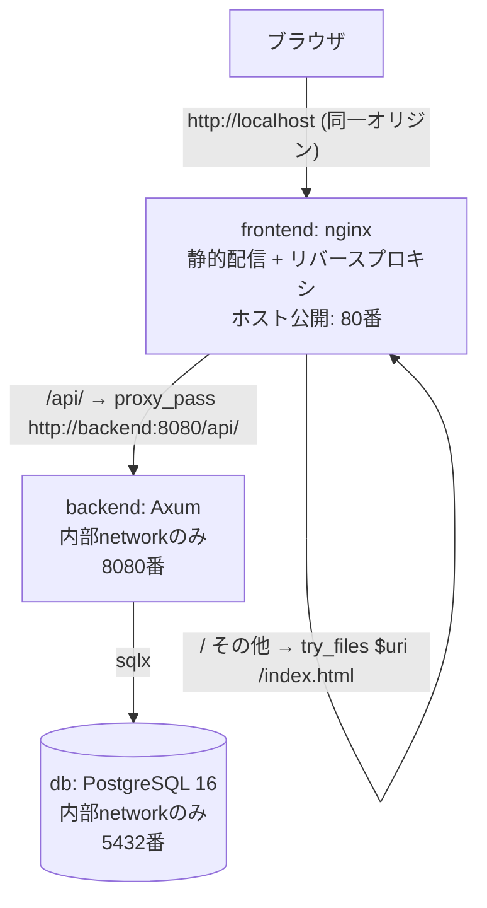

# backend-frontend-integration アーキテクチャ設計

**作成日**: 2026-07-02
**関連要件定義**: [requirements.md](../../spec/backend-frontend-integration/requirements.md)
**ヒアリング記録**: [design-interview.md](design-interview.md)

**【信頼性レベル凡例】**:
- 🔵 **青信号**: EARS要件定義書・設計文書・ユーザヒアリングを参考にした確実な設計
- 🟡 **黄信号**: EARS要件定義書・設計文書・ユーザヒアリングから妥当な推測による設計
- 🔴 **赤信号**: EARS要件定義書・設計文書・ユーザヒアリングにない推測による設計

---

## システム概要 🔵

**信頼性**: 🔵 *要件定義書 概要・REQ-001より*

バックエンド（Rust/Axum、port 8080）とフロントエンド（React/Vite）を1つの統合用docker-composeで結合し、ローカル環境で結合テスト・Webアプリとしての動作確認を容易に行えるようにする。既存のバックエンド単体用 `backend/docker-compose.yml` はそのまま残し、変更しない。本設計は新しいAPI・DBスキーマを追加するものではなく、既存の `backend`（既存API・既存DBスキーマ）と `frontend`（既存実装）をインフラ層で結合するものである。そのため `interfaces.ts`・`database-schema.sql`・`api-endpoints.md` は本設計では生成しない（既存API利用・スキーマ変更なしのため）。

## アーキテクチャパターン 🔵

**信頼性**: 🔵 *PRD 提案アーキテクチャ・ヒアリングQ5より*

- **パターン**: リバースプロキシ型フロントエンド窓口構成（Nginx BFF-lite）
- **選択理由**: ブラウザからのアクセス窓口を `frontend` のnginxのみに一本化し、`backend`・`db` を内部networkに閉じることで、CORS設定不要・同一オリジン通信・攻撃面の縮小を同時に実現するため（ヒアリングQ5で既存ポート公開設定の統合用compose限定の非公開化が確定）

## コンポーネント構成

### フロントエンド 🔵

**信頼性**: 🔵 *frontend/package.json・frontend/CLAUDE.md・ヒアリングQ3より*

- **フレームワーク**: React 19.2 / TypeScript / Vite 8（既存）
- **状態管理**: TanStack Query 5（既存、変更なし）
- **UIライブラリ**: Tailwind CSS 4 + shadcn/ui（既存、変更なし）
- **配信方式**: `yarn build` の成果物（静的ファイル）をnginxで配信する。Vite devサーバーはコンテナ化しない（ヒアリングQ3・REQ-004・REQ-405で確定）

### バックエンド 🔵

**信頼性**: 🔵 *backend/Dockerfile・backend/docker-compose.yml・backend/CLAUDE.mdより*

- **フレームワーク**: Rust / Axum（既存、変更なし）
- **認証方式**: 単一ユーザー・APIキー簡易認証（既存、変更なし）
- **API設計**: REST（`/api/v1` 配下、既存エンドポイントをそのまま利用）
- **ビルド**: 既存の `backend/Dockerfile`（マルチステージビルド、`cargo build --release -p mediavault-api`）をそのまま利用し、変更しない（REQ-002）

### データベース 🔵

**信頼性**: 🔵 *backend/docker-compose.yml・REQ-003より*

- **DBMS**: PostgreSQL 16（`backend/docker-compose.yml` の `db` サービス定義を流用、ヘルスチェック付き）
- **接続方法**: sqlx（既存、変更なし）
- **スキーマ変更**: なし（既存マイグレーションをそのまま利用）

## システム構成図 🔵

**信頼性**: 🔵 *PRD 提案アーキテクチャより*



## ディレクトリ構造（変更差分） 🔵

**信頼性**: 🔵 *PRD ディレクトリ・ファイル構成案・ヒアリング決定（ファイル名: docker-compose.yml）より*

```
./
├── docker-compose.yml          # 新規: 統合用（ルート直下、REQ-301の選択結果）
├── backend/
│   ├── Dockerfile               # 既存・変更なし（REQ-002）
│   ├── docker-compose.yml       # 既存・変更なし（REQ-402、backend単体起動用）
│   └── .env.example              # 既存・変更なし
└── frontend/
    ├── Dockerfile                # 新規（REQ-005）
    ├── nginx.conf                 # 新規（REQ-006）
    ├── src/api/client.ts          # 変更: BASE_URLのデフォルトを相対パス /api/v1 に変更（REQ-009）
    └── vite.config.ts             # 変更なし想定（devサーバー用プロキシはスコープ外、REQ-405）
```

## 非機能要件の実現方法

### パフォーマンス 🟡

**信頼性**: 🟡 *NFR-001より、具体的数値はPRD・要件定義に記載なしのため妥当な推測*

- **起動時間**: `docker compose up` によるフルスタック起動は数分以内を目安とする（`backend` はマルチステージビルドのため初回ビルドはやや時間を要する。2回目以降はDockerレイヤーキャッシュにより短縮される想定）
- **最適化戦略**: `frontend` はビルド成果物の静的配信のみのため、追加のランタイムオーバーヘッドはほぼ発生しない

### セキュリティ 🔵

**信頼性**: 🔵 *NFR-101, NFR-102, REQ-201, REQ-401, REQ-402より*

- **アクセス制御**: `backend`・`db` は統合用composeの内部networkのみに接続し、`ports:` を設定しない（ホストから直接到達不可）
- **通信経路**: ブラウザ→backendの直接通信は行わず、必ず `frontend` のnginxを経由する
- **機密情報管理**: `INTERNAL_API_KEY` 等は `.env` ファイルで管理し、リポジトリにコミットしない（既存の `backend/.env.example` の方針を踏襲）

### スケーラビリティ 🟡

**信頼性**: 🟡 *要件定義に明示的なスケーラビリティ要件はなく、ローカル開発用途からの妥当な推測*

- 本統合構成はローカル結合テスト・動作確認用途であり、水平スケーリングやロードバランシングは対象外（本番運用を想定した設計ではない）

### 可用性 🟡

**信頼性**: 🟡 *EDGE-001, EDGE-002より妥当な推測*

- `db` のヘルスチェックが失敗し続ける場合、`backend` は `depends_on: condition: service_healthy` により起動を待機し続ける（既存挙動の踏襲）
- `backend` 未起動・停止中に `/api/` へアクセスした場合、nginxは502 Bad Gateway等を返す（nginxリバースプロキシの一般的挙動）

## 技術的制約

### パフォーマンス制約 🔵

**信頼性**: 🔵 *REQ-002, REQ-003より*

- `backend` のビルド方式（マルチステージビルド）は既存 `backend/Dockerfile` を変更せずそのまま利用する

### セキュリティ制約 🔵

**信頼性**: 🔵 *REQ-201, REQ-401, REQ-402より*

- 統合用composeにおいて `backend`・`db` に `ports:` を設定してはならない
- 既存の `backend/docker-compose.yml`（backend単体起動用、ホストポート公開あり）は変更しない

### 互換性制約 🔵

**信頼性**: 🔵 *REQ-403, REQ-404, REQ-405より*

- CI（GitHub Actions）の再構築・移行は本設計のスコープに含めない
- selfhosted環境固有の設定（外部ファイルサーバーのバインドマウント、ドメイン/HTTPS終端）は本設計のスコープに含めない
- Vite devサーバー自体のコンテナ化・統合compose組み込みは行わない

## 関連文書

- **データフロー**: [dataflow.md](dataflow.md)
- **ヒアリング記録**: [design-interview.md](design-interview.md)
- **要件定義**: [requirements.md](../../spec/backend-frontend-integration/requirements.md)
- **受け入れ基準**: [acceptance-criteria.md](../../spec/backend-frontend-integration/acceptance-criteria.md)
- **PRD**: [PRD-integration.md](../../PRD-integration.md)

## 信頼性レベルサマリー

- 🔵 青信号: 15件 (75%)
- 🟡 黄信号: 5件 (25%)
- 🔴 赤信号: 0件 (0%)

**品質評価**: 高品質
