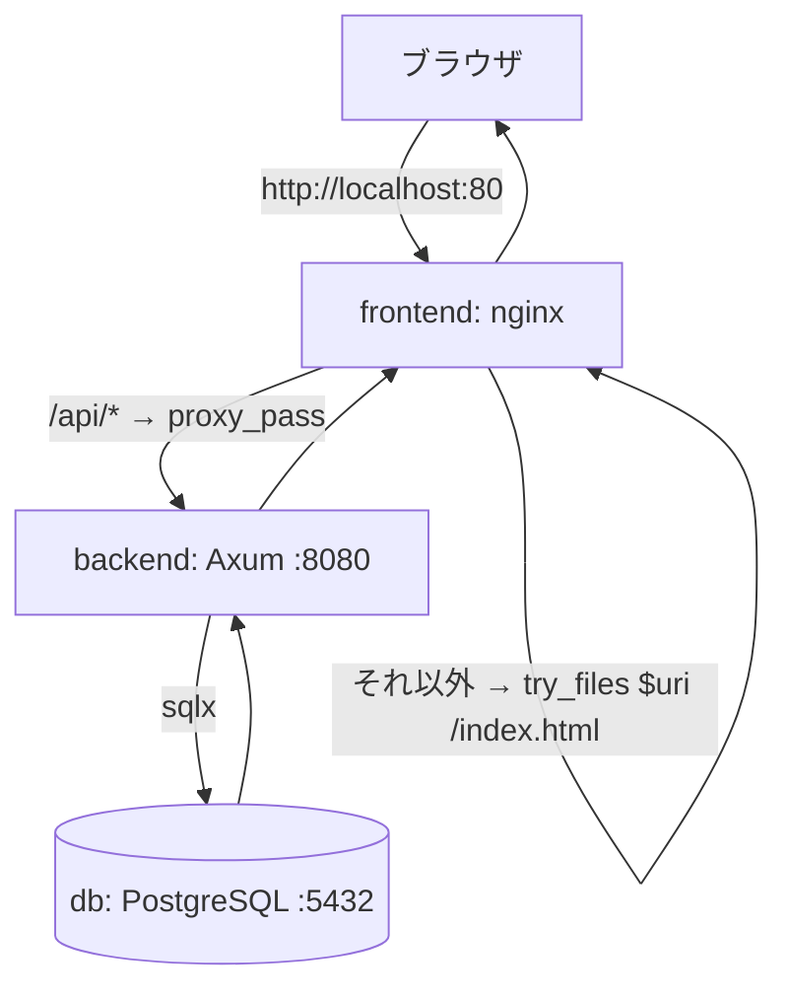
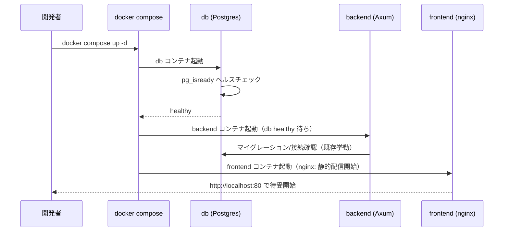
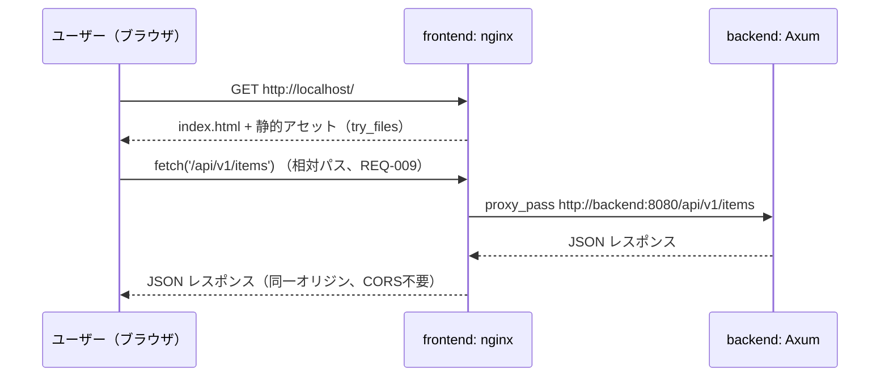
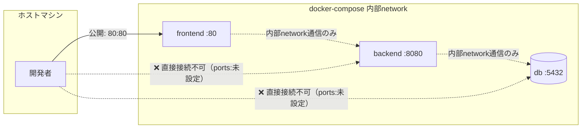
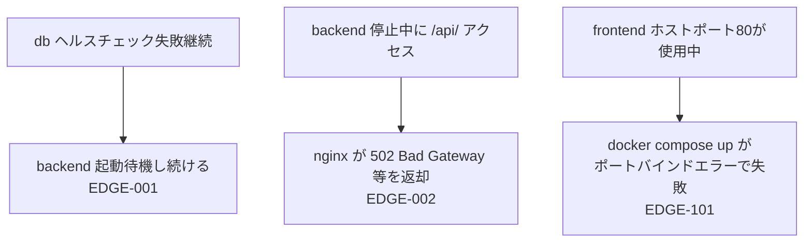
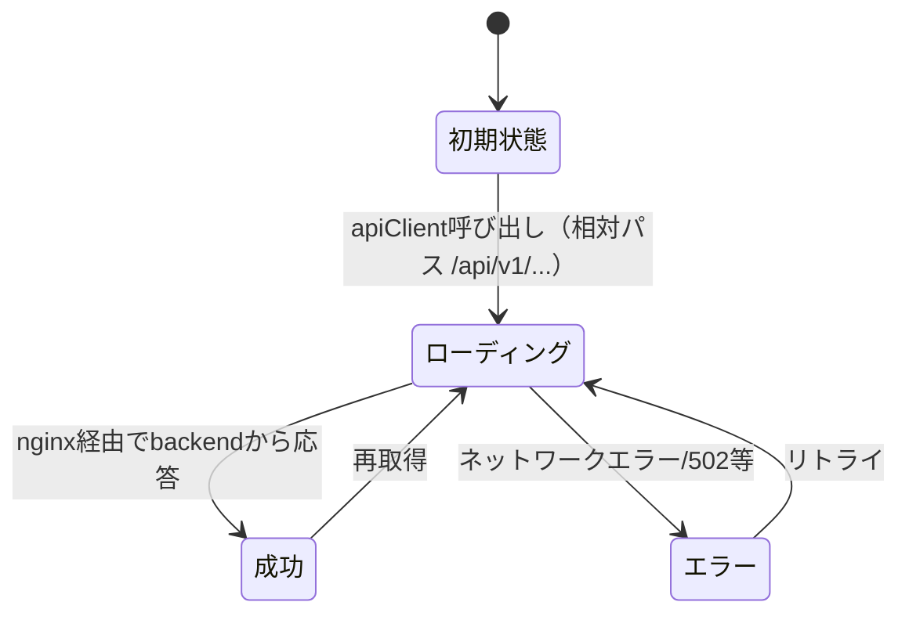

# backend-frontend-integration データフロー図

**作成日**: 2026-07-02
**関連アーキテクチャ**: [architecture.md](architecture.md)
**関連要件定義**: [requirements.md](../../spec/backend-frontend-integration/requirements.md)

**【信頼性レベル凡例】**:
- 🔵 **青信号**: EARS要件定義書・設計文書・ユーザヒアリングを参考にした確実なフロー
- 🟡 **黄信号**: EARS要件定義書・設計文書・ユーザヒアリングから妥当な推測によるフロー
- 🔴 **赤信号**: EARS要件定義書・設計文書・ユーザヒアリングにない推測によるフロー

---

## システム全体のデータフロー 🔵

**信頼性**: 🔵 *PRD 提案アーキテクチャ・要件定義REQ-007/008/009より*

## 起動シーケンス（REQ-001, REQ-101） 🔵

**信頼性**: 🔵 *要件定義REQ-101・既存backend/docker-compose.ymlのdepends_on設定より*

**関連要件**: REQ-001, REQ-101, REQ-002, REQ-003, REQ-004

**詳細ステップ**:
1. `docker compose up` 実行後、`db` サービスがまず起動しヘルスチェック（`pg_isready`）を開始する
2. `db` のヘルスチェックが成功（`service_healthy`）するまで `backend` は起動を待機する（REQ-101）
3. `backend` は既存の `backend/Dockerfile` によりビルド・起動される（REQ-002）
4. `frontend` は `db`/`backend` の起動条件に依存せず、nginxによる静的配信を独立して開始できる（ビルド成果物は事前にDockerfileでビルド済みのため）

## API疎通フロー（REQ-007, REQ-008, REQ-009, REQ-102） 🔵

**信頼性**: 🔵 *PRD nginx設定例・ヒアリングQ3, Q4より*

**関連要件**: REQ-007, REQ-008, REQ-009, REQ-102

**詳細ステップ**:
1. `frontend/src/api/client.ts` の `BASE_URL` は相対パス `/api/v1` をデフォルト値とする（REQ-009）ため、ブラウザは常に現在アクセス中のオリジン（`http://localhost`）宛にリクエストを発行する
2. nginxは `/api/` 宛のリクエストのみを `http://backend:8080/api/` へ `proxy_pass` する（REQ-007）
3. `/api/` 以外（SPAのルート等）は `try_files $uri /index.html` によりReact Routerへ処理を委譲する（REQ-008）
4. ブラウザ視点では常に同一オリジン通信となるため、CORS設定は不要（REQ-102）

## ネットワーク分離フロー（REQ-201, REQ-401, REQ-402） 🔵

**信頼性**: 🔵 *ヒアリングQ5・PRD ポート方針より*

**関連要件**: REQ-201, REQ-202, REQ-401, REQ-402

**詳細ステップ**:
1. 統合用 `docker-compose.yml` において `backend`・`db` サービスには `ports:` を設定しない（REQ-201, REQ-401）
2. `frontend` のみホストの80番ポートに公開する（REQ-202）
3. 既存の `backend/docker-compose.yml`（backend単体起動用、ポート公開あり）はこの分離方針の対象外であり、変更しない（REQ-402）

## エラーハンドリングフロー 🟡

**信頼性**: 🟡 *EDGE-001, EDGE-002・nginxリバースプロキシの一般的挙動からの妥当な推測*

## 状態管理フロー

### フロントエンド状態管理 🔵

**信頼性**: 🔵 *frontend/CLAUDE.md・既存実装（TanStack Query）より、本設計による変更なし*

TanStack Queryによるサーバー状態管理は本結合作業による変更を受けない。`apiClient` のリクエスト先URLのみが相対パス化される（REQ-009）。

### バックエンド・DB状態管理 🔵

**信頼性**: 🔵 *既存backend/docker-compose.ymlのdepends_on・healthcheck設定より、本設計による変更なし*

`backend`・`db` 間の状態管理（マイグレーション、コネクションプール等）は既存実装のまま変更しない。

## データ整合性の保証 🔵

**信頼性**: 🔵 *REQ-002, REQ-003より、既存実装をそのまま利用するため新規の整合性設計は不要*

- **トランザクション管理**: 既存backend実装（sqlx）のまま変更しない
- **マイグレーション**: 既存のマイグレーション機構をそのまま利用し、統合用composeにおいてもスキーマ変更は行わない

## 関連文書

- **アーキテクチャ**: [architecture.md](architecture.md)
- **ヒアリング記録**: [design-interview.md](design-interview.md)
- **要件定義**: [requirements.md](../../spec/backend-frontend-integration/requirements.md)

## 信頼性レベルサマリー

- 🔵 青信号: 9件 (82%)
- 🟡 黄信号: 2件 (18%)
- 🔴 赤信号: 0件 (0%)

**品質評価**: 高品質
