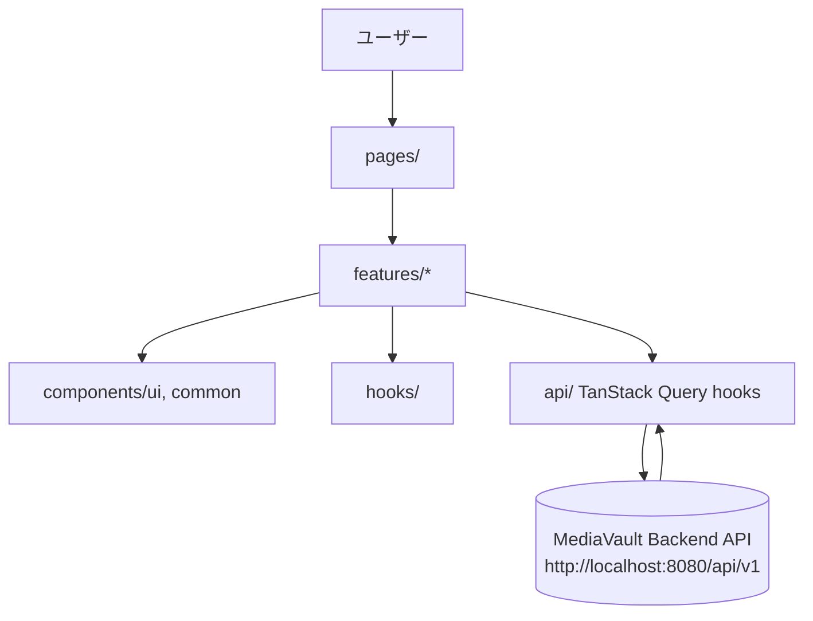

# frontend-collection-ui アーキテクチャ設計

**作成日**: 2026-06-22
**関連要件定義**: [requirements.md](../../spec/frontend-collection-ui/requirements.md)
**ヒアリング記録**: [design-interview.md](design-interview.md)

**【信頼性レベル凡例】**:
- 🔵 **青信号**: EARS要件定義書・設計文書・ユーザヒアリングを参考にした確実な設計
- 🟡 **黄信号**: EARS要件定義書・設計文書・ユーザヒアリングから妥当な推測による設計
- 🔴 **赤信号**: EARS要件定義書・設計文書・ユーザヒアリングにない推測による設計

---

## システム概要 🔵

**信頼性**: 🔵 *requirements.md概要・REQ-401より*

MediaVaultフロントエンドは、映画・アニメ・漫画・小説・ドラマ・ゲーム・学術書/専門書・論文/文献のメタデータを管理するセルフホスト型単一ユーザーSPA。バックエンドAPI（`http://localhost:8080/api/v1`）とJSON通信し、認証・ログイン機能は持たない（REQ-401）。

## アーキテクチャパターン 🔵

**信頼性**: 🔵 *frontend/tech-stack.md・ヒアリングQ1〜Q3より*

- **パターン**: Feature-Sliced寄りのレイヤード構成（`pages` → `features` → `components` → `api`/`hooks`/`types`/`lib`）
- **選択理由**: 単一ユーザー・認証なしのSPAで状態管理の複雑さは低いため、Redux等のグローバル状態管理基盤は不要。サーバー状態はTanStack Query、UI状態はuseState/useContextで十分。画面数・フォーム数が多いため、shadcn/uiのコンポーネント資産で構築速度を優先する。

## コンポーネント構成

### フロントエンド全体構成 🔵

**信頼性**: 🔵 *tech-stack.md・ヒアリングQ1/Q3より*

- **フレームワーク**: React 18.3+ / TypeScript 5.7+ / Vite 6
- **サーバー状態管理**: TanStack Query 5（`useQuery`/`useMutation`、リソース別カスタムフックに集約）
- **UI状態管理**: React内蔵 `useState` / `useContext`（モーダル開閉、フォーム入力中の一時値、グローバルナビの開閉状態等）
- **フォーム**: react-hook-form + zod（ヒアリングQ1で確定）。手動追加・編集・APIキー登録・タグ作成等すべてのフォーム画面で採用し、zodスキーマでクライアント側バリデーション（NFR-201）を行う
- **ルーティング**: React Router v7。`useSearchParams` で一覧フィルタ状態をURLに同期（REQ-003）
- **UIライブラリ**: Tailwind CSS 4 + shadcn/ui。既存デザインシステム（`docs/frontend/ui/01_components.html`）のダークテーマトークンをTailwindのCSS変数として再現
- **通知UI**: sonner（toast）をAPI成功/失敗通知に使用（ヒアリングQ5で確定）

### コンポーネント粒度 🔵

**信頼性**: 🔵 *ヒアリングQ3（Atomic的に分割）より*

```
src/components/
├── ui/        # shadcn/ui生成コンポーネント（Button, Input, Dialog, Select, Tabs等）
└── common/    # 複数画面で再利用する独自コンポーネント（MediaCard, MediaTypeBadge, FilterBar, EmptyState, ConfirmDialog等）

src/features/
├── items/         # 一覧・絞り込み・詳細表示ロジック
├── item-search/   # 外部API検索・インポート
├── item-form/     # 手動追加・編集フォーム（メディア別フォーム部品含む）
├── groups/        # シーズン/巻/章・話数管理
├── relations/     # 関連付け・DLC紐付け
├── links-files/   # リンク・ファイル・トレーラー管理
├── tags-categories/
├── mylists/
├── staff/
├── settings/      # APIキー管理・インポート・エクスポート（未実装ボタン）
└── status/        # 視聴・読了記録更新
```

### バックエンド連携（API層） 🔵

**信頼性**: 🔵 *ヒアリングQ4（fetch + TanStack Query hooks）・backend api-endpoints.mdより*

- **通信方式**: 素の`fetch`をラップした`apiClient`（`src/api/client.ts`）。axios等の追加依存は導入しない
- **エラーハンドリング**: `apiClient`が`ApiError`形式（`{success:false, error:{code,message}}`）を判定し、`ApiClientError`として例外化。各featureのmutation/queryの`onError`でsonner toastに変換
- **リソース別フック**: `src/api/items.ts`, `src/api/search.ts`, `src/api/groups.ts`, `src/api/tags.ts`, `src/api/mylists.ts`, `src/api/relations.ts`, `src/api/staff.ts`, `src/api/links-files.ts`, `src/api/settings.ts`, `src/api/import.ts` にエンドポイント単位のfetch関数とTanStack Queryフック（`useItemsQuery`, `useCreateItemMutation`等）を定義
- **APIベースURL**: `http://localhost:8080/api/v1`（🟡 backend api-endpoints.mdの推測値を継承、`.env`の`VITE_API_BASE_URL`で上書き可能とする 🟡 一般的なVite環境変数パターンから推測）
- **対象外**: `/internal/*` は内部API専用のためフロントエンドからは呼び出さない（REQ-402）

### データベース 🔵

**信頼性**: 🔵 *構成上の確実な事実*

フロントエンドはDBに直接アクセスしない。すべてのデータはバックエンドAPI経由で取得・更新する（DBスキーマはbackend設計の管轄であり本書では扱わない）。

## システム構成図



**信頼性**: 🔵 *tech-stack.md推奨ディレクトリ構造・ヒアリングより*

## ディレクトリ構造 🔵

**信頼性**: 🔵 *frontend/tech-stack.md推奨ディレクトリ構造＋本設計での拡張*

```
frontend/
├── src/
│   ├── pages/            # ルート単位の画面（13画面、画面構成は下記参照）
│   ├── features/         # 機能単位ロジック・フォーム・サブコンポーネント
│   ├── components/
│   │   ├── ui/            # shadcn/ui
│   │   └── common/        # 横断的に再利用するコンポーネント
│   ├── hooks/             # useSearchParamsFilter, useConfirmDialog等の汎用フック
│   ├── api/               # apiClient + リソース別fetch関数・Queryフック
│   ├── types/             # interfaces.ts（本設計のentity/DTO型）
│   ├── lib/               # zodスキーマ, 日付フォーマット等ユーティリティ
│   ├── routes.tsx         # React Router v7 ルート定義
│   └── App.tsx
├── public/
├── tests/
└── ...
```

## 画面構成とルーティング 🔵

**信頼性**: 🔵 *frontend/PRD.md画面構成・REQ-004/404より*

| パス（例） | 画面 | 対応pages |
|---|---|---|
| `/` | 全体一覧（ホーム） | `pages/HomePage.tsx` |
| `/collections/general` | 一覧（一般メディア） | `pages/GeneralListPage.tsx` |
| `/collections/academic` | 一覧（学術書・専門書） | `pages/AcademicListPage.tsx` |
| `/collections/paper` | 一覧（論文・文献） | `pages/PaperListPage.tsx` |
| `/items/:id` | 詳細画面 | `pages/ItemDetailPage.tsx` |
| `/search/general` `/search/academic` `/search/paper` | 検索・追加（メディアグループ別） | `pages/SearchAddPage.tsx`（group propで分岐） |
| `/items/new/general` `/items/new/academic` `/items/new/paper` | 手動追加（メディアグループ別） | `pages/ItemFormPage.tsx`（mode=create） |
| `/items/:id/edit` | 編集 | `pages/ItemFormPage.tsx`（mode=edit） |
| `/mylists` | マイリスト | `pages/MyListsPage.tsx` |
| `/tags-categories` | タグ/カテゴリ管理 | `pages/TagsCategoriesPage.tsx` |
| `/staff` | スタッフ管理 | `pages/StaffPage.tsx` |
| `/settings` | 設定（タブ: APIキー/インポート/エクスポート） | `pages/SettingsPage.tsx` |

合計13画面構成（REQ-004・REQ-404、ヒアリングQ4で確定）。グローバルナビ（サイドバー）からマイリスト・タグ/カテゴリ・スタッフ・設定へアクセスする 🔵。

## 非機能要件の実現方法

### パフォーマンス 🟡

**信頼性**: 🟡 *NFR-001/002から妥当な推測*

- 一覧クエリは`media_type`+フィルタ条件を含む`queryKey`でTanStack Queryにキャッシュし、フィルタ変更のたびの全件再取得を避ける（`staleTime`を適度に設定）
- 一覧表示はページング（`page`/`limit`）を用い、数千件規模でも一度に大量レンダリングしない方針（無限スクロールは採用せずページ送りUIとする 🟡 PRDに明記なし、TanStack Queryのページング実装の単純さを優先）

### セキュリティ 🔵

**信頼性**: 🔵 *NFR-101・REQ-403より*

- 認証トークンは扱わない（単一ユーザー前提）
- 外部APIキーは設定画面入力時のみ平文表示し、登録後一覧では末尾数文字以外をマスク表示（NFR-101）
- APIキー等の機密値はソースコードに直接記述せず、`PUT /settings/api-keys/:provider`経由でのみ送信する（REQ-403）

### スケーラビリティ 🟡

**信頼性**: 🟡 *NFR-002から妥当な推測*

単一ユーザー利用前提のため水平スケーリングは対象外。データ量増加時はバックエンドのページネーション・絞り込みクエリに依存する。

### 可用性 🔴

**信頼性**: 🔴 *要件定義に記載なし*

セルフホスト・単一ユーザー運用のため、SLA・フェイルオーバー要件は定義しない。

## 技術的制約

### パフォーマンス制約 🟡

**信頼性**: 🟡 *NFR-002から妥当な推測*

- 一覧画面はバックエンドAPI応答（目標1秒以内）に対し、追加のレンダリング遅延を1秒未満に抑える

### セキュリティ制約 🔵

**信頼性**: 🔵 *REQ-401/402/403より*

- ログイン・認証画面を実装しない（REQ-401）
- `/internal/*`を呼び出さない（REQ-402）
- APIキーをソースに直接記述しない（REQ-403）

### 互換性制約 🔵

**信頼性**: 🔵 *tech-stack.mdより*

- React 18.3+ / TypeScript 5.7+ / Vite 6 / Tailwind CSS 4 を前提とする

## 関連文書

- **データフロー**: [dataflow.md](dataflow.md)
- **型定義**: [interfaces.ts](interfaces.ts)
- **ヒアリング記録**: [design-interview.md](design-interview.md)
- **要件定義**: [requirements.md](../../spec/frontend-collection-ui/requirements.md)
- **バックエンドAPI仕様（利用先）**: [docs/design/mediavault-backend/api-endpoints.md](../mediavault-backend/api-endpoints.md)
- **バックエンド型定義（参照元）**: [docs/design/mediavault-backend/types.rs](../mediavault-backend/types.rs)

## 信頼性レベルサマリー

- 🔵 青信号: 18件 (64%)
- 🟡 黄信号: 8件 (29%)
- 🔴 赤信号: 1件 (4%)

**品質評価**: 高品質（既存バックエンド仕様・デザインシステムとの対応が明確。パフォーマンス具体値・可用性要件はPRDに数値記載がないため一部🟡🔴推測）
