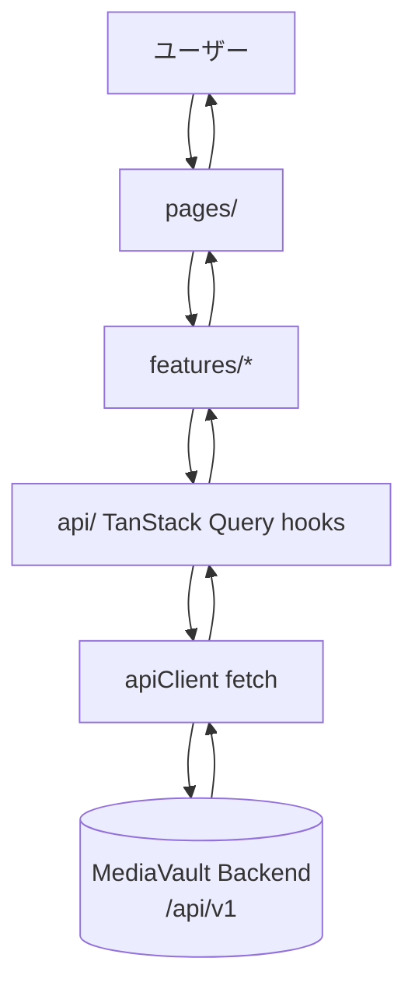
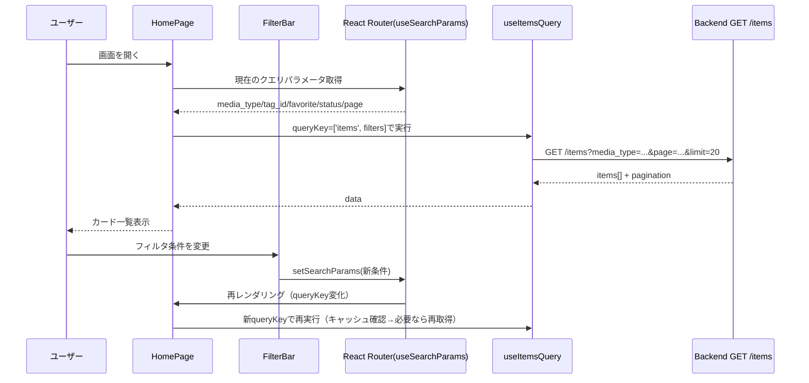
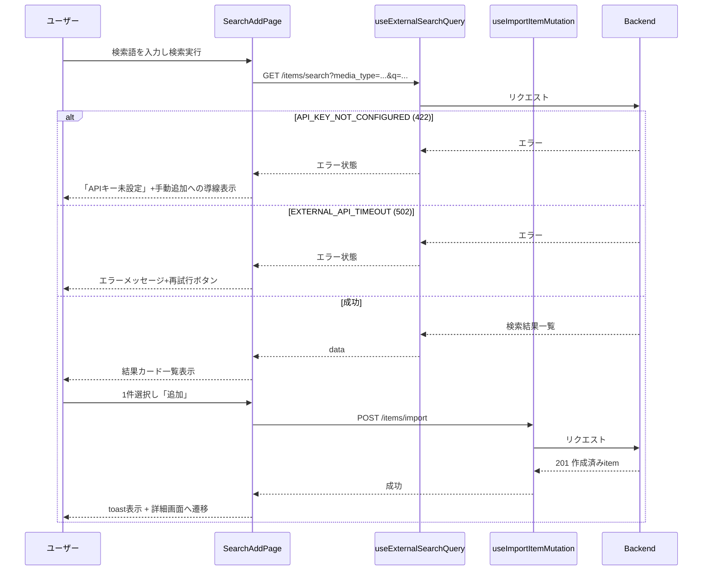
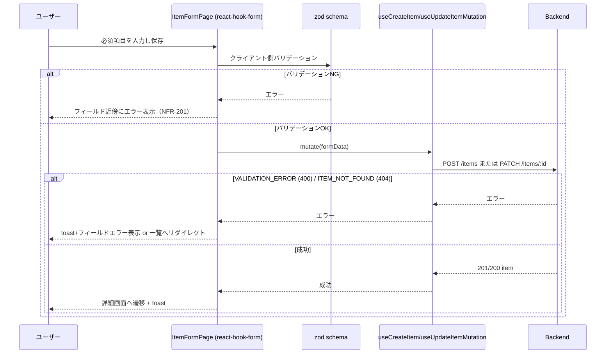
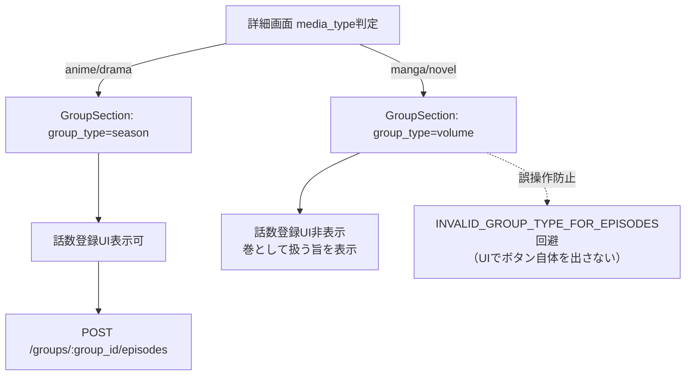
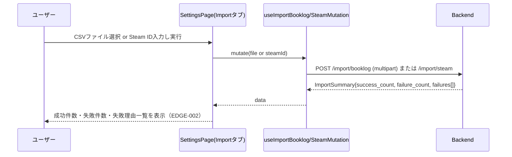
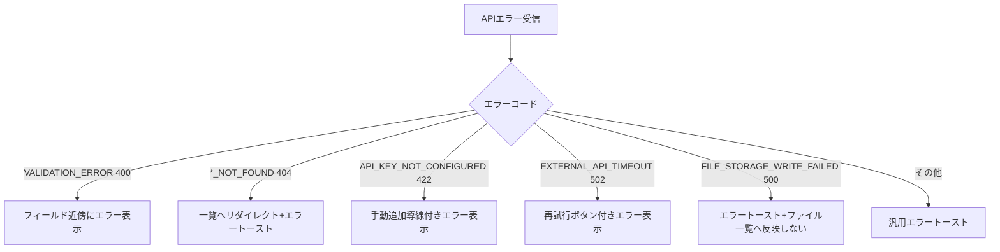
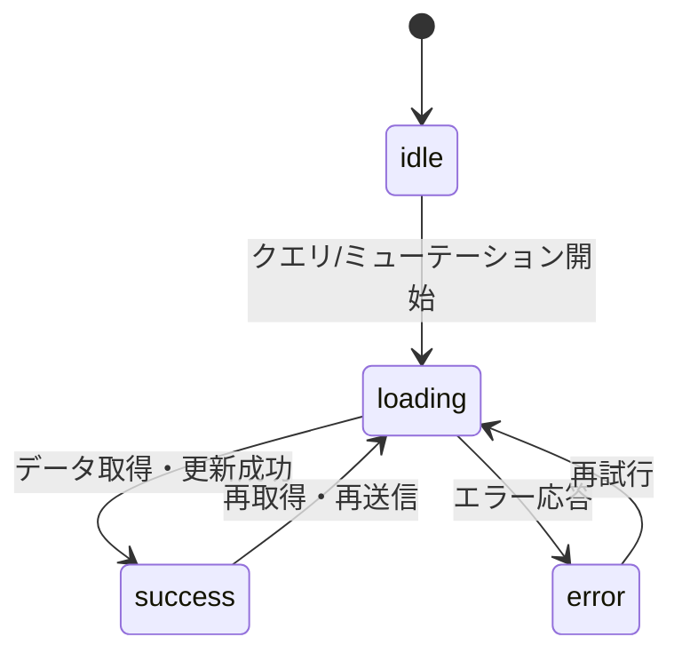

# frontend-collection-ui データフロー図

**作成日**: 2026-06-22
**関連アーキテクチャ**: [architecture.md](architecture.md)
**関連要件定義**: [requirements.md](../../spec/frontend-collection-ui/requirements.md)

**【信頼性レベル凡例】**:
- 🔵 **青信号**: EARS要件定義書・設計文書・ユーザヒアリングを参考にした確実なフロー
- 🟡 **黄信号**: EARS要件定義書・設計文書・ユーザヒアリングから妥当な推測によるフロー
- 🔴 **赤信号**: EARS要件定義書・設計文書・ユーザヒアリングにない推測によるフロー

---

## システム全体のデータフロー 🔵

**信頼性**: 🔵 *requirements.md・architecture.mdより*

## 主要機能のデータフロー

### 機能1: 全体一覧の閲覧・絞り込み 🔵

**信頼性**: 🔵 *ユーザーストーリー1.1/1.2・REQ-001/002/003・TC-001系より*

**詳細ステップ**:
1. 画面マウント時に`useSearchParams`からフィルタ条件を読み出し、TanStack Queryの`queryKey`に含める
2. フィルタUI変更時は`setSearchParams`でURLを更新し、それをトリガーにクエリが再実行される（REQ-003: URL同期）
3. 0件時は`EmptyState`コンポーネントを表示し「追加画面への導線」を出す（EDGE-101）

### 機能2: 外部API検索からの追加 🔵

**信頼性**: 🔵 *ユーザーストーリー2.1/2.2・REQ-005/203・TC-005系より*

**備考**: エラーコード分岐（`API_KEY_NOT_CONFIGURED`/`EXTERNAL_API_TIMEOUT`）はbackend api-endpoints.mdのエラーコードに対応（🔵 EDGE-001）。

### 機能3: 手動追加・編集 🔵

**信頼性**: 🔵 *ユーザーストーリー2.3/3.1・REQ-006/007・TC-006系より*

### 機能4: シーズン/巻管理（メディア別構成） 🔵

**信頼性**: 🔵 *ユーザーストーリー4.1/4.2・REQ-015/016/101/102・EDGE-004より*

**信頼性**: 🔵 *EDGE-004：UI側でvolumeグループには話数登録ボタンを表示しないことでバックエンドのエラーを未然に防止する設計*

### 機能5: 一括インポート（ブクログ/Steam） 🔵

**信頼性**: 🔵 *ユーザーストーリー5.2・REQ-022・EDGE-002より*

## データ処理パターン

### 同期処理 🔵

**信頼性**: 🔵 *アーキテクチャ設計より*

一覧取得・詳細取得・フォーム保存・タグ/カテゴリ操作はすべてユーザー操作に対する同期的なリクエスト/レスポンスで処理する（ポーリング・WebSocket等の非同期通知機構は対象外）。

### 非同期処理（UI上の進捗表示） 🟡

**信頼性**: 🟡 *NFR-203から妥当な推測*

ファイルアップロード（`POST /items/:id/files/upload`）・CSVインポートはリクエスト自体は同期だが、UI側で進捗インジケータ（アップロード中/インポート中）を表示する。

### バッチ処理 🔴

**信頼性**: 🔴 *フロントエンドにバッチ処理要件なし*

フロントエンド側でのバッチ処理は行わない（巡回バッチはバックエンドの内部API管轄）。

## エラーハンドリングフロー 🟡

**信頼性**: 🟡 *backend api-endpoints.mdエラーコード・NFR-201/203から妥当な推測*

## 状態管理フロー

### フロントエンド状態管理 🔵

**信頼性**: 🔵 *architecture.md・tech-stack.mdより*

サーバー状態（一覧・詳細・検索結果等）はTanStack Queryの`status`（`pending`/`success`/`error`）で管理し、フォーム入力状態はreact-hook-formの`formState`で管理する。

## データ整合性の保証 🟡

**信頼性**: 🟡 *NFR-002・既存実装パターンから妥当な推測*

- **キャッシュ無効化**: 作成・更新・削除ミューテーション成功時に、関連する一覧クエリ（`['items', ...]`）を`invalidateQueries`で無効化し再取得する
- **楽観的更新**: お気に入りトグル・status更新等の軽量操作のみ楽観的更新を採用し、失敗時はロールバックする（🟡 一般的なTanStack Queryパターンから推測。要件に明記なし）
- **整合性チェック**: グループ種別（season/volume/chapter）に応じたUI制御で、バックエンドのドメイン制約（EDGE-004）と矛盾しない操作のみを許可する

## 関連文書

- **アーキテクチャ**: [architecture.md](architecture.md)
- **型定義**: [interfaces.ts](interfaces.ts)
- **ヒアリング記録**: [design-interview.md](design-interview.md)

## 信頼性レベルサマリー

- 🔵 青信号: 12件 (60%)
- 🟡 黄信号: 6件 (30%)
- 🔴 赤信号: 2件 (10%)

**品質評価**: 高品質（主要フローはユーザーストーリー・受け入れ基準・バックエンドエラーコードと対応。キャッシュ無効化・楽観的更新の具体策はPRD未記載のため🟡推測）
