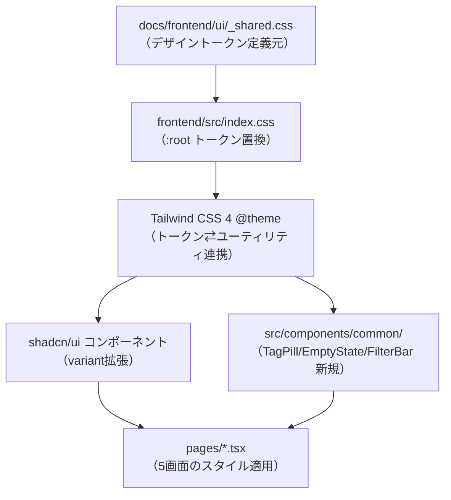

# frontend-ui-compliance アーキテクチャ設計

**作成日**: 2026-07-03
**関連要件定義**: [requirements.md](../../spec/frontend-ui-compliance/requirements.md)
**ヒアリング記録**: [design-interview.md](design-interview.md)

**【信頼性レベル凡例】**:
- 🔵 **青信号**: EARS要件定義書・設計文書・ユーザヒアリングを参考にした確実な設計
- 🟡 **黄信号**: EARS要件定義書・設計文書・ユーザヒアリングから妥当な推測による設計
- 🔴 **赤信号**: EARS要件定義書・設計文書・ユーザヒアリングにない推測による設計

---

## システム概要 🔵

**信頼性**: 🔵 *requirements.md概要・PRD「概要」より*

現行フロントエンド実装(`frontend/`)を、`docs/frontend/ui/`のモックアップ（Obsidianライクな3ペイン・ダークUI）の視覚デザインに準拠させる。対象範囲はデザイントークン・レイアウト構造・コンポーネントの視覚表現に限定し、機能要件（画面構成・API連携・データ項目）・Propertiesパネルの中身は対象外（REQ-401、ヒアリングQ1/Q4）。既存の[frontend-collection-ui](../frontend-collection-ui/architecture.md)アーキテクチャ（React 18.3+ / TypeScript / Vite 6 / Tailwind CSS 4 + shadcn/ui）は変更しない。

## アーキテクチャパターン 🔵

**信頼性**: 🔵 *ヒアリング回答（トークン反映方法）・既存tech-stack.mdより*

- **パターン**: 既存のTailwind CSS 4 + shadcn/ui構成を維持したまま、デザイントークン（CSS変数）とコンポーネントスタイルのみを差し替える「トークン置換＋既存コンポーネント拡張」方式
- **選択理由**: 本要件は視覚デザインの準拠のみが対象（REQ-401）であり、状態管理・API層・ルーティング等のアーキテクチャは[frontend-collection-ui](../frontend-collection-ui/architecture.md)で確定済みのため変更不要。既存のshadcn/uiコンポーネント資産を壊さずスタイル拡張することで実装コストを最小化する（ヒアリング回答「既存shadcn/uiコンポーネントを拡張」）

## コンポーネント構成

### デザイントークン層 🔵

**信頼性**: 🔵 *requirements.md REQ-001・ヒアリング回答（トークン反映方法）より*

- **適用方法**: `frontend/src/index.css`の`:root`に定義された旧トークン（`--bg-base`, `--text-secondary`等）を`docs/frontend/ui/_shared.css`の値（`--bg-app: #1e1e1e`等）に**直接置換**する（`_shared.css`を別ファイルとして二重管理はしない）
- **Tailwind連携**: Tailwind CSS 4の`@theme`ディレクティブ（またはCSS変数参照）経由で、置換後のCSS変数をユーティリティクラス・shadcnコンポーネントの`oklch`系トークン（`--primary`, `--card`等）にマッピングする（REQ-402）
- **media_type別アクセントカラー**（`--accent-anime`等8色）は既存のまま独立したトークンとして維持し、`_shared.css`の単一アクセント色（`--accent: #8b6cf6`）とは別名前空間で共存させる（REQ-002、ヒアリングQ2で確定）
- **フォント**: Inter（UI）/ Source Serif 4（見出し）/ JetBrains Mono（等幅）を`_shared.css`と同じ`@import`または`index.html`のフォントリンクで導入する

### 共通コンポーネント層 🔵

**信頼性**: 🔵 *requirements.md共通コンポーネント要件・ヒアリング回答（実装方針）より*

- **方針**: 既存の`src/components/ui/`（shadcn/ui生成コンポーネント）にvariantを追加・スタイル調整する形で`.btn`, `.btn-accent`, `.btn-ghost`, `.btn-sm`, `.btn-danger`相当の見た目を再現する（`Button`コンポーネントのvariant拡張）
- **新規コンポーネント**（`src/components/common/`配下に追加、既存の粒度方針を踏襲）:
  - `TagPill`: `.tag-pill`相当（`#`プレフィックス付きハッシュタグ風表示）
  - `EmptyState`: `.empty-state`相当
  - `FilterBar` / `Chip`: `.filter-bar`, `.chip`, `.search-box`相当（一覧画面共通）
- **既存拡張が必要なコンポーネント**:
  - `Sidebar.tsx`: ブランドロゴ・件数バッジ・インデント階層・セクション見出し・設定下部固定（REQ-003）
  - `MediaCard.tsx`: カバー画像プレースホルダ・バッジ・お気に入りアイコン・ステータスドット（REQ-004）
  - `RootLayout.tsx`: `.app-shell` / `.app-shell.has-properties`相当のCSSグリッド構造（REQ-006）

### 画面別スタイル適用 🔵

**信頼性**: 🔵 *requirements.md画面別要件（REQ-005〜010）より*

全5画面（全体一覧・アイテム詳細・検索追加・手動追加/編集フォーム・設定）を同時にスタイル対応する（ヒアリング回答「全画面同時対応」）。対応先ページコンポーネントは[frontend-collection-ui](../frontend-collection-ui/architecture.md)の画面構成表に準じる：

| 画面 | 対応pages | 主要変更要件 |
|---|---|---|
| 全体一覧 | `HomePage.tsx` | REQ-003, REQ-004, REQ-005 |
| アイテム詳細 | `ItemDetailPage.tsx` | REQ-006, REQ-007 |
| 検索・追加 | `SearchAddPage.tsx` | REQ-008 |
| 手動追加・編集フォーム | `ItemFormPage.tsx` | REQ-009 |
| 設定 | `SettingsPage.tsx` | REQ-010 |

### データベース・API層 🔵

**信頼性**: 🔵 *requirements.md REQ-401より*

本要件はAPI連携・データモデルを変更しない（REQ-401）。既存の[frontend-collection-ui](../frontend-collection-ui/architecture.md)のAPI層（`src/api/`配下のTanStack Queryフック）はそのまま利用する。

## システム構成図



**信頼性**: 🔵 *requirements.md・ヒアリング回答より*

## ディレクトリ構造（変更箇所のみ） 🔵

**信頼性**: 🔵 *frontend-collection-ui既存ディレクトリ構造・本要件の変更範囲より*

```
frontend/
├── src/
│   ├── index.css              # デザイントークン置換（REQ-001, REQ-402）
│   ├── components/
│   │   ├── ui/                # 既存shadcnコンポーネントにvariant追加（.btn系）
│   │   └── common/
│   │       ├── Sidebar.tsx    # 拡張（REQ-003）
│   │       ├── MediaCard.tsx  # 拡張（REQ-004）
│   │       ├── TagPill.tsx    # 新規
│   │       ├── EmptyState.tsx # 新規
│   │       └── FilterBar.tsx  # 新規
│   └── pages/
│       ├── RootLayout.tsx     # .app-shellグリッド化（REQ-006）
│       ├── HomePage.tsx       # フィルタバー・追加ボタン（REQ-005）
│       ├── ItemDetailPage.tsx # パンくず・編集削除ボタン・doc-section（REQ-007）
│       ├── SearchAddPage.tsx  # result-row（REQ-008）
│       ├── ItemFormPage.tsx   # form-grid（REQ-009）
│       └── SettingsPage.tsx   # settings-shell（REQ-010）
```

## 非機能要件の実現方法

### パフォーマンス 🟡

**信頼性**: 🟡 *requirements.md NFR（パフォーマンス）から妥当な推測*

CSS変数の値置換とコンポーネントのスタイル調整のみであり、レンダリングロジック・データ取得フローは変更しないため、レンダリング性能への影響は限定的と見込む。

### セキュリティ 🔵

**信頼性**: 🔵 *requirements.md REQ-401より*

視覚表現の変更に限定し、認証・APIキー等のセキュリティ関連ロジックには一切手を加えない。

### スケーラビリティ 🔴

**信頼性**: 🔴 *要件定義に記載なし*

本要件はスケーラビリティに影響しない変更（スタイルのみ）のため対象外。

### 可用性 🔴

**信頼性**: 🔴 *要件定義に記載なし*

視覚デザイン準拠のみのためSLA・可用性要件は定義しない。

## 技術的制約

### パフォーマンス制約 🟡

**信頼性**: 🟡 *NFRから妥当な推測*

- CSS変数置換によるレンダリング性能劣化がないこと（既存トークン差し替えのみのため影響は限定的）

### セキュリティ制約 🔵

**信頼性**: 🔵 *REQ-401より*

- 機能要件（画面構成・API連携・データ項目等）は変更しない

### 互換性制約 🔵

**信頼性**: 🔵 *tech-stack.md・frontend-collection-ui architecture.mdより*

- React 18.3+ / TypeScript 5.7+ / Vite 6 / Tailwind CSS 4 + shadcn/uiの既存構成を前提とし、追加ライブラリは導入しない
- WCAG 2.1 AA準拠のコントラスト比を維持する（tech-stack.md品質基準）

## スコープ外 🔵

**信頼性**: 🔵 *requirements.mdスコープ外セクション・ヒアリングQ1/Q4より*

- Propertiesパネルの中身（key-value行・タグ一覧・カテゴリ一覧・関連付け一覧・スタッフ一覧・マイリスト所属一覧）の具体実装
- シーズン/話数のグループ表示（`.group-block`等）🟡 次回以降と推測
- レスポンシブ最適化（`_shared.css`の`@media (max-width: 980px)`準拠範囲を超えるもの）
- ライトモード等のテーマ切替
- モックアップにない新規ビジュアル要素の追加

## 関連文書

- **データフロー**: [dataflow.md](dataflow.md)
- **ヒアリング記録**: [design-interview.md](design-interview.md)
- **要件定義**: [requirements.md](../../spec/frontend-ui-compliance/requirements.md)
- **PRD**: [ui-compliance-PRD.md](../../frontend/ui-compliance-PRD.md)
- **参照設計（既存アーキテクチャ）**: [frontend-collection-ui/architecture.md](../frontend-collection-ui/architecture.md)
- **モックアップ共通スタイル**: [docs/frontend/ui/_shared.css](../../frontend/ui/_shared.css)

## 信頼性レベルサマリー

- 🔵 青信号: 15件 (75%)
- 🟡 黄信号: 3件 (15%)
- 🔴 赤信号: 2件 (10%)

**品質評価**: 高品質（要件定義書・ヒアリング記録・既存アーキテクチャ設計との対応が明確。スケーラビリティ・可用性はスタイルのみの変更のため要件定義になく🔴）
