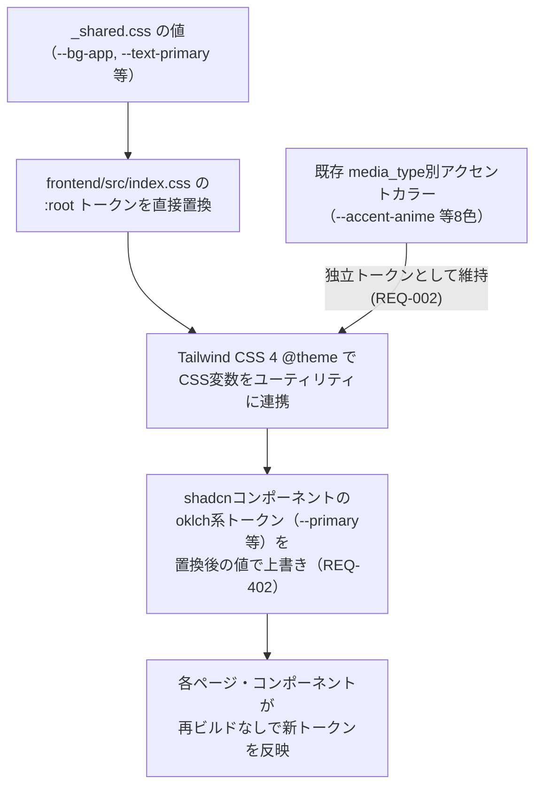
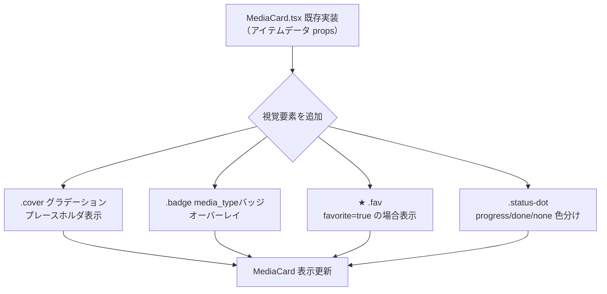
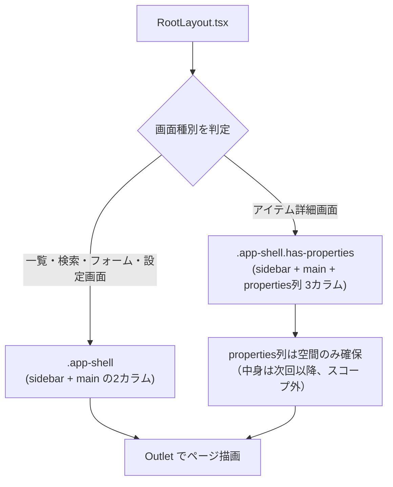
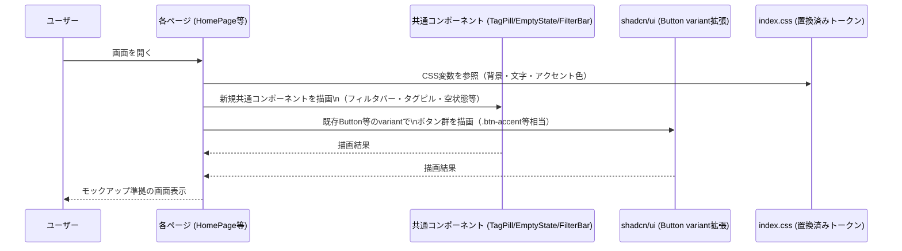

# frontend-ui-compliance データフロー図

**作成日**: 2026-07-03
**関連アーキテクチャ**: [architecture.md](architecture.md)
**関連要件定義**: [requirements.md](../../spec/frontend-ui-compliance/requirements.md)

**【信頼性レベル凡例】**:
- 🔵 **青信号**: EARS要件定義書・設計文書・ユーザヒアリングを参考にした確実なフロー
- 🟡 **黄信号**: EARS要件定義書・設計文書・ユーザヒアリングから妥当な推測によるフロー
- 🔴 **赤信号**: EARS要件定義書・設計文書・ユーザヒアリングにない推測によるフロー

---

## トークン反映の全体フロー 🔵

**信頼性**: 🔵 *requirements.md REQ-001・REQ-402・ヒアリング回答（トークン反映方法）より*



## コンポーネント拡張のデータフロー

### Sidebar拡張（REQ-003） 🔵

**信頼性**: 🔵 *requirements.md REQ-003・PRD「全体一覧」節より*

```mermaid
flowchart TD
    A[Sidebar.tsx 既存実装] --> B{モックアップ要素を追加}
    B --> C[ブランドロゴ表示\nドットアイコン+MediaVault]
    B --> D[ナビ項目の件数バッジ\n.nav-item .count]
    B --> E[サブカテゴリのインデント階層\n.nav-item.indent]
    B --> F["ライブラリ」セクション見出し\n.nav-section-label]
    B --> G[設定の下部固定配置]
    C --> H[Sidebar 表示更新]
    D --> H
    E --> H
    F --> H
    G --> H
```

**備考**: 件数バッジの値は既存のAPI取得データ（items一覧のcount）をそのまま表示に利用する想定 🟡（表示ロジックのみ追加、データ取得フローは変更なし）

### MediaCard拡張（REQ-004） 🔵

**信頼性**: 🔵 *requirements.md REQ-004・受け入れ基準より*



### RootLayout / app-shell グリッド化（REQ-006） 🔵

**信頼性**: 🔵 *requirements.md REQ-006・受け入れ基準より*



**備考**: properties列は`--properties-w: 300px`分のグリッド列を確保するのみで、中身のコンポーネント実装はスコープ外（ヒアリングQ1/Q4）🔵

## 画面別スタイル適用フロー 🔵

**信頼性**: 🔵 *requirements.md画面別要件（REQ-005〜010）より*



**注記**: このフローはAPIデータ取得・状態管理には関与しない。既存の[frontend-collection-ui](../frontend-collection-ui/dataflow.md)のデータ取得フローに視覚表現層を上乗せするのみ 🔵

## エラーハンドリングフロー 🔴

**信頼性**: 🔴 *要件定義に記載なし*

本要件は視覚表現の変更のみでビジネスロジック・エラーハンドリングを変更しないため、エラーハンドリングフローの新規追加は発生しない。既存の[frontend-collection-ui](../frontend-collection-ui/architecture.md)のエラーハンドリング（`apiClient` → `ApiClientError` → sonner toast）をそのまま利用する。

## 関連文書

- **アーキテクチャ**: [architecture.md](architecture.md)
- **要件定義**: [requirements.md](../../spec/frontend-ui-compliance/requirements.md)
- **参照設計（既存データフロー）**: [frontend-collection-ui/dataflow.md](../frontend-collection-ui/dataflow.md)

## 信頼性レベルサマリー

- 🔵 青信号: 10件 (77%)
- 🟡 黄信号: 2件 (15%)
- 🔴 赤信号: 1件 (8%)

**品質評価**: 高品質（要件定義書・受け入れ基準との対応が明確。件数バッジのデータソースのみ推測🟡）
