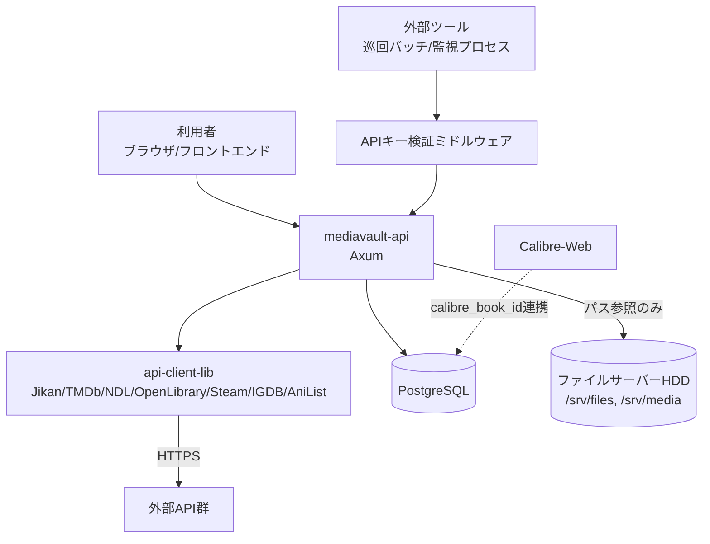

# mediavault-backend アーキテクチャ設計

**作成日**: 2026-06-22
**関連要件定義**: [requirements.md](../../backend/spec/mediavault-backend/requirements.md)
**ヒアリング記録**: [design-interview.md](design-interview.md)

**【信頼性レベル凡例】**:
- 🔵 **青信号**: EARS要件定義書・設計文書・ユーザヒアリングを参考にした確実な設計
- 🟡 **黄信号**: EARS要件定義書・設計文書・ユーザヒアリングから妥当な推測による設計
- 🔴 **赤信号**: EARS要件定義書・設計文書・ユーザヒアリングにない推測による設計

---

## システム概要 🔵

**信頼性**: 🔵 *requirements.md 概要より*

MediaVaultバックエンドは、映画・アニメ・漫画・小説・ドラマ・ゲーム・論文/文献・学術書/専門書のメタデータを一元管理するセルフホスト型アプリケーションのAPIサーバーである。単一ユーザー前提でユーザー管理・認証機能を持たず、Rust(Axum) + PostgreSQL(sqlx) + Docker構成で実装する。`backend/src` は現状空のスケルトンであり、`api-client-lib`（Jikan/TMDb/NDL/OpenLibrary/Steam/IGDB/AniList クライアント実装済み）を活用してゼロから実装する。

## アーキテクチャパターン 🔵

**信頼性**: 🔵 *tech-stack.md「推奨ディレクトリ構造」より*

- **パターン**: レイヤードアーキテクチャ（routes → handlers → services → db/repository）+ Cargo workspace によるライブラリ分離
- **選択理由**:
  - sqlxのコンパイル時SQLチェックを活かすため、DBアクセスをdb層に集約し、ハンドラから直接SQLを書かない構成にする
  - 外部API連携は既存の `api-client-lib`（`ApiClient` トレイトによる統一インターフェース）にすでに分離されているため、API本体はこれを呼び出すクライアントとして利用するのみで、自前で外部APIロジックを持たない
  - 単一ユーザー・小規模運用のため、CQRSやマイクロサービス等の過剰な分割は行わない

## コンポーネント構成

### APIサーバー（`mediavault-api`） 🔵

**信頼性**: 🔵 *tech-stack.mdより*

- **フレームワーク**: Axum
- **認証方式**: 内部REST APIのみ、固定APIキー1本によるヘッダー検証ミドルウェア（ユーザー認証なし）
- **API設計**: REST（JSON）
- **ミドルウェア**: APIキー検証（内部APIエンドポイントのみ）、リクエストロギング、エラーハンドリング（tower middleware）

### 外部APIクライアント（`api-client-lib`） 🔵

**信頼性**: 🔵 *backend/api-client-lib 既存実装より（コード読了済み）*

- 既存実装済み。`ApiClient` トレイト（`execute(Request) -> Result<ApiResponse<Model>, ApiError>`）を各クライアント（jikan/tmdb/ndl/openlibrary/steam/igdb/anilist）が実装
- `mediavault-api` からは `clients::{provider}` を呼び出すラッパー（`ExternalSearchService`）を新設し、`media_type` → provider のディスパッチを行う 🟡（既存traitに準拠した新規ラッパーの設計、API本体側は未実装のため妥当な推測）

### データベース 🔵

**信頼性**: 🔵 *PRD・tech-stack.mdより*

- **DBMS**: PostgreSQL（Dockerコンテナ）
- **アクセス方法**: sqlx（コンパイル時SQLチェック、async、`sqlx::query!`/`query_as!`マクロ使用）
- **マイグレーション**: sqlx-cli（`sqlx migrate`）
- **キャッシュ**: 導入しない（単一ユーザー・小規模データのため不要） 🟡 *NFR-001の規模感から妥当な推測*

### ファイルストレージ 🔵

**信頼性**: 🔵 *PRD・tech-stack.mdより*

- ファイル本体はアプリコンテナ外のファイルサーバーHDDにバインドマウント
  - PDF: `/srv/files/pdf`（Calibre-Web連携）
  - 画像等: `/srv/media/photos`
- DBには相対パスのみ保持し、バイナリ本体はAPIコンテナ内に保存しない（REQ-402）

## システム構成図



**信頼性**: 🔵 *PRD・要件定義より*

## ディレクトリ構造 🔵

**信頼性**: 🔵 *backend/docs/tech-stack.md「推奨ディレクトリ構造」より（既存定義をそのまま採用）*

```
backend/
├── Cargo.toml                # workspace定義（既存）
├── mediavault-api/            # API本体（Axum）※新規作成
│   ├── Cargo.toml
│   ├── src/
│   │   ├── main.rs
│   │   ├── routes/            # エンドポイント定義（items, groups, episodes, tags, mylists, staff, files, import, settings）
│   │   ├── handlers/          # ハンドラ（routesに対応）
│   │   ├── services/          # ビジネスロジック（外部API呼び分け、インポート処理、ファイル配置）
│   │   ├── db/                # sqlxクエリ・接続管理（repository層）
│   │   ├── middleware/        # APIキー検証
│   │   └── models/            # DBモデル（リクエスト/レスポンスDTO含む）
│   ├── migrations/            # sqlx-cliマイグレーション
│   └── tests/
├── api-client-lib/             # 外部API連携（既存・実装済み）
└── docker-compose.yml          # 新規作成（Postgresコンテナ+アプリコンテナ）
```

**備考**: 現状の `backend/src`（main.rs="Hello, world!"のみ）と `backend/Cargo.toml` のワークスペース構成は、tech-stack.md記載の `mediavault-api` クレートへの移行が必要 🟡 *現状コード調査より妥当な推測（現Cargo.tomlの実構成は未確認、本設計ではtech-stack.md記載構成を正とする）*

## 非機能要件の実現方法

### パフォーマンス 🟡

**信頼性**: 🟡 *NFR-001/002から妥当な推測*

- コネクションプール（sqlx `PgPool`）は最大5〜10接続程度の小規模設定で十分
- 一覧・絞り込みAPIは `items` への適切なインデックス（media_type, status, is_favorite, タグ・カテゴリの中間テーブル）で1秒以内を実現

### セキュリティ 🔵

**信頼性**: 🔵 *NFR-101〜103・REQ-403/404より*

- 内部REST APIは `Authorization: Bearer {API_KEY}` ヘッダー検証ミドルウェアで保護（固定キー、`.env`管理）
- 外部APIキー（TMDb/IGDB/NDL等）はDBの `api_credentials` テーブルで管理（REQ-015、平文保存可、暗号化は本フェーズ対象外）
- 入力検証はAxumのextractor（`Json<T>`のデシリアライズ + 手動バリデーション）で実施
- HTTPS終端は本APIの責務外（リバースプロキシ想定）

### スケーラビリティ 🟡

**信頼性**: 🟡 *単一ユーザー前提から妥当な推測*

- 単一インスタンス・単一DBで十分。水平スケーリング・シャーディングは対象外

### 可用性 🟡

**信頼性**: 🟡 *セルフホスト前提から妥当な推測*

- セルフホスト運用のため厳密なSLAは設定せず、Docker Composeでの再起動ポリシー（`restart: unless-stopped`）程度で十分

## 技術的制約

### パフォーマンス制約 🟡

- 数千件規模のitemsで1秒以内応答（NFR-002）

### セキュリティ制約 🔵

- ユーザー認証機能を持たない（REQ-401）
- ファイル本体をコンテナ内に保存しない（REQ-402）
- 内部APIはAPIキー必須（REQ-403）
- APIキーをリポジトリにコミットしない（REQ-404）

### 互換性制約 🔵

- DBスキーマは `items` 共通テーブル + メディア種別ごとの詳細テーブルのJOIN構成（REQ-405）
- 既存の `api-client-lib`（`ApiClient`トレイト）のインターフェースを変更せずに利用する

## 関連文書

- **データフロー**: [dataflow.md](dataflow.md)
- **型定義**: [types.rs](types.rs)
- **DBスキーマ**: [database-schema.sql](database-schema.sql)
- **API仕様**: [api-endpoints.md](api-endpoints.md)
- **要件定義**: [requirements.md](../../backend/spec/mediavault-backend/requirements.md)

## 信頼性レベルサマリー

- 🔵 青信号: 18件 (75%)
- 🟡 黄信号: 6件 (25%)
- 🔴 赤信号: 0件 (0%)

**品質評価**: 高品質（要件定義・既存コード調査に基づく設計。新規ラッパー部分のみ🟡で要確認）
