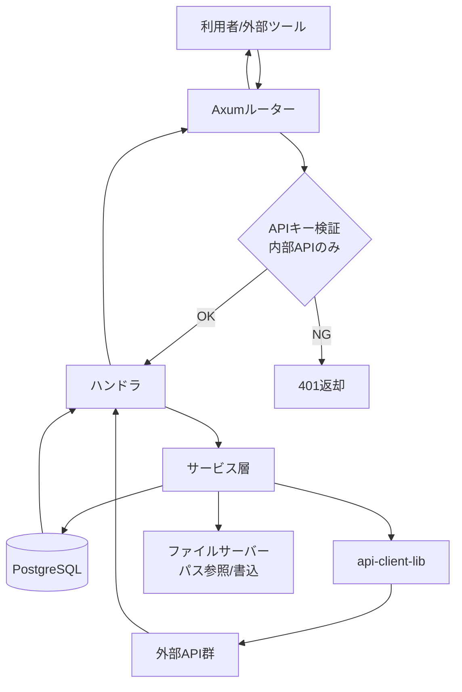
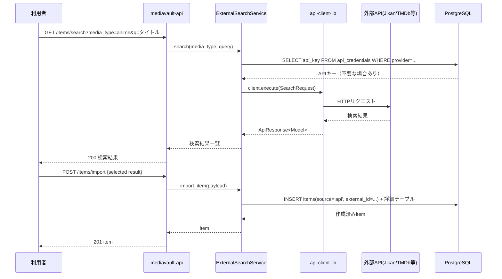
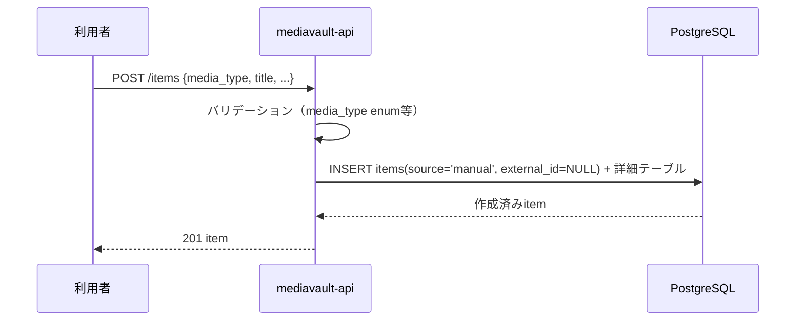
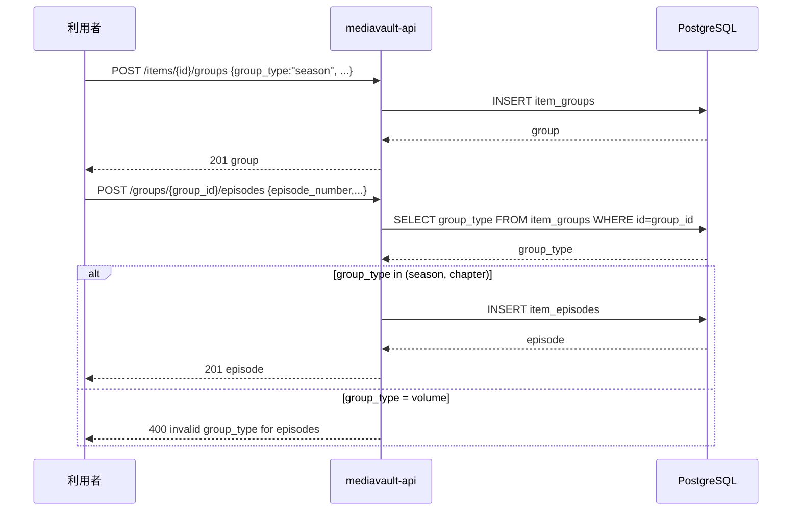
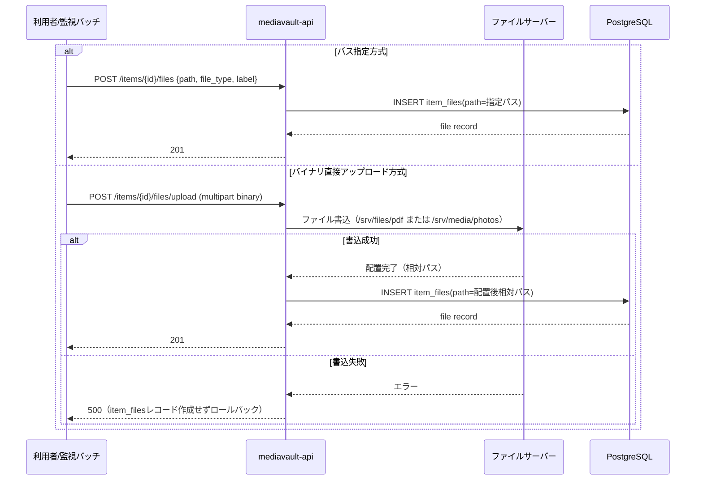
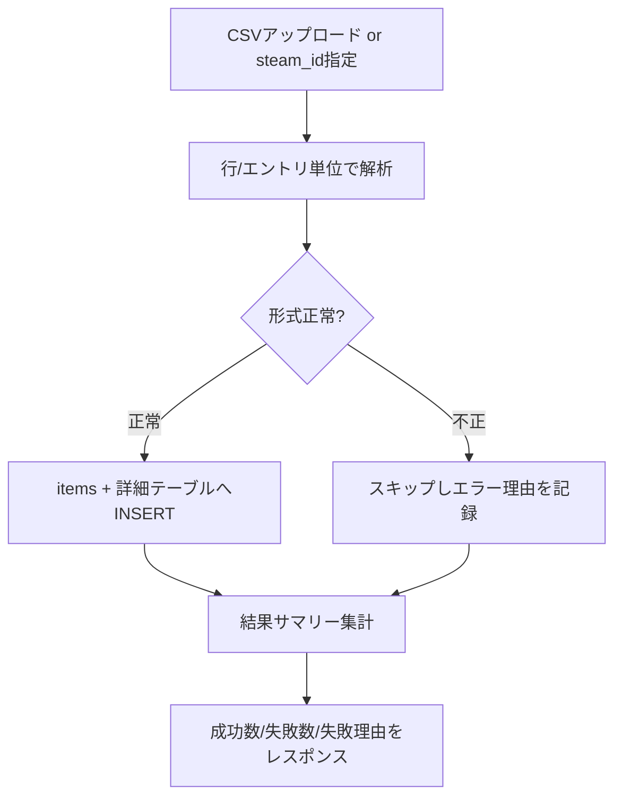
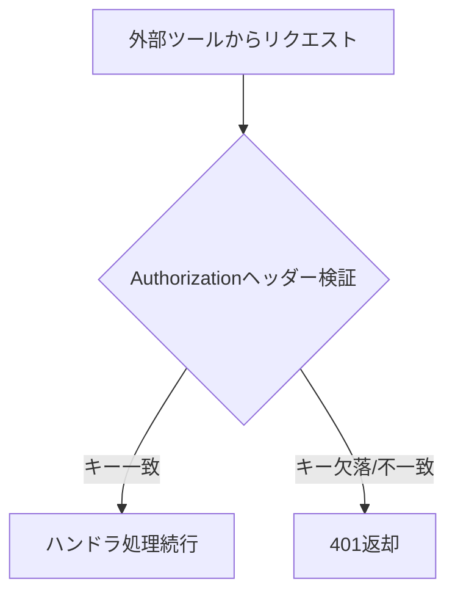
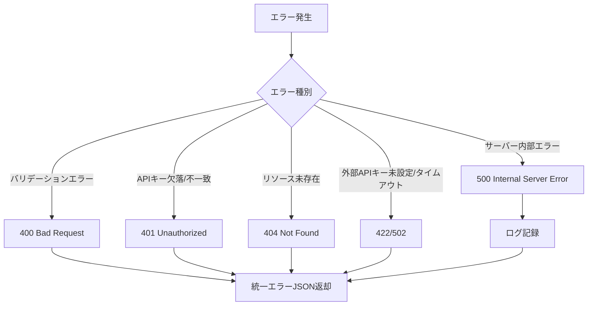
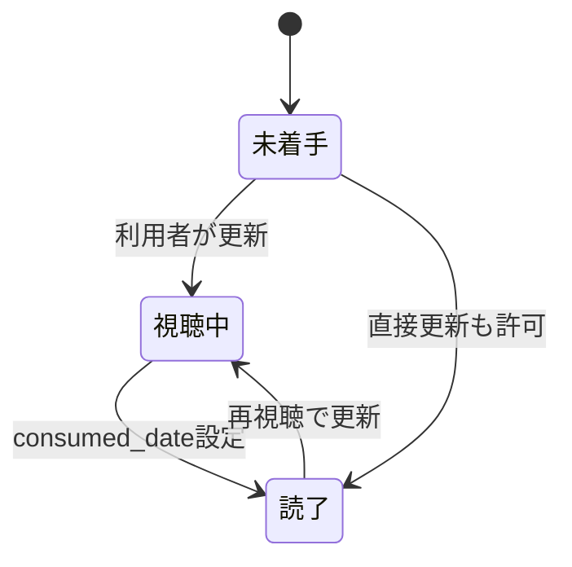

# mediavault-backend データフロー図

**作成日**: 2026-06-22
**関連アーキテクチャ**: [architecture.md](architecture.md)
**関連要件定義**: [requirements.md](../../backend/spec/mediavault-backend/requirements.md)

**【信頼性レベル凡例】**:
- 🔵 **青信号**: EARS要件定義書・設計文書・ユーザヒアリングを参考にした確実なフロー
- 🟡 **黄信号**: EARS要件定義書・設計文書・ユーザヒアリングから妥当な推測によるフロー
- 🔴 **赤信号**: EARS要件定義書・設計文書・ユーザヒアリングにない推測によるフロー

---

## システム全体のデータフロー 🔵

**信頼性**: 🔵 *要件定義・user-stories.mdより*

## 主要機能のデータフロー

### 機能1: 外部API検索→アイテム追加 🔵

**信頼性**: 🔵 *user-stories 1.1・TC-002-01〜03より*

**関連要件**: REQ-002

**詳細ステップ**:
1. 利用者がmedia_typeとタイトルを指定して検索APIを呼ぶ
2. サービス層がmedia_typeに対応するプロバイダ（jikan/tmdb/ndl/openlibrary/steam/igdb）を選択し、必要に応じてDBから外部APIキーを取得
3. `api-client-lib` の `ApiClient::execute` を介して外部APIへ問い合わせ、結果を返す
4. 利用者が結果を選択し `/items/import` を呼ぶと、`items` + メディア別詳細テーブルへ `source=api` で登録する

### 機能2: 手動追加 🔵

**信頼性**: 🔵 *user-stories 1.2・TC-001-01より*

**関連要件**: REQ-003

### 機能3: シーズン・話数管理 🔵

**信頼性**: 🔵 *user-stories 3.1・TC-010-01/E01より*

**関連要件**: REQ-010, REQ-101, EDGE-101

### 機能4: ファイル登録（パス指定／バイナリアップロード） 🔵

**信頼性**: 🔵 *user-stories 6.2・TC-007-01/TC-019-01/E01より*

**関連要件**: REQ-007, REQ-019, REQ-104, EDGE-003

### 機能5: ブクログCSV／Steamライブラリ インポート 🔵

**信頼性**: 🔵 *user-stories 5.1/5.2・TC-016-01/E01・TC-017-01より*

**関連要件**: REQ-016, REQ-017, EDGE-002

### 機能6: 内部REST API認証フロー 🔵

**信頼性**: 🔵 *TC-018-01/E01/E02より*

**関連要件**: REQ-018, REQ-403, NFR-101

## エラーハンドリングフロー 🟡

**信頼性**: 🟡 *Axum標準パターンから妥当な推測*

## データ処理パターン

### 同期処理 🔵

**信頼性**: 🔵 *単一ユーザー前提・アーキテクチャ設計より*

CRUD・検索・ファイル登録などすべてのAPI呼び出しは同期的にレスポンスを返す（バックグラウンドジョブキューは導入しない）。

### 非同期処理 🟡

**信頼性**: 🟡 *インポート機能の処理量から妥当な推測*

ブクログCSV・Steamライブラリインポートはリクエスト内で同期処理し、完了をレスポンスで返す（件数が多い場合でも単一ユーザー想定のため非同期ジョブ化は不要）。

### バッチ処理 🟡

**信頼性**: 🟡 *PRD「外部から登録・更新・検索をするためのAPI」より*

巡回バッチ・ファイルサーバー監視プロセス自体はmediavault-api外の別プロセスとして動作し、内部REST API経由でmediavault-apiを呼び出す（バッチ実行自体は本APIの責務外）。

## 状態管理フロー

### アイテムstatus状態遷移 🟡

**信頼性**: 🟡 *REQ-008・PRDの「視聴中/読了/未着手」から妥当な推測*

## データ整合性の保証 🟡

**信頼性**: 🟡 *REQ-405・EDGE-003・カスケード削除要件から妥当な推測*

- **トランザクション管理**: items作成時の詳細テーブルINSERTはsqlxトランザクションで一括コミット/ロールバック
- **カスケード削除**: `item_tags`/`item_links`/`item_files`等の関連レコードはitems削除時に`ON DELETE CASCADE`で自動削除（TC-001-03）
- **整合性チェック**: EDGE-101（volume配下へのepisode登録拒否）はアプリケーション層でgroup_type検証

## 関連文書

- **アーキテクチャ**: [architecture.md](architecture.md)
- **型定義**: [types.rs](types.rs)
- **DBスキーマ**: [database-schema.sql](database-schema.sql)
- **API仕様**: [api-endpoints.md](api-endpoints.md)

## 信頼性レベルサマリー

- 🔵 青信号: 14件 (70%)
- 🟡 黄信号: 6件 (30%)
- 🔴 赤信号: 0件 (0%)

**品質評価**: 高品質
