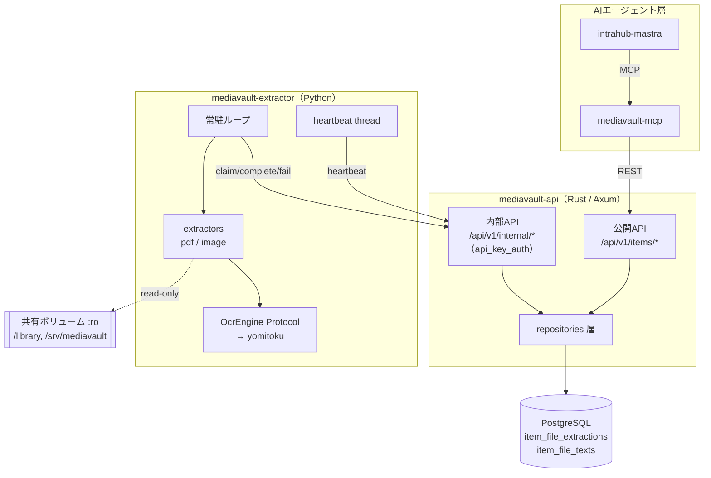

# MediaVault Extractor アーキテクチャ設計

**作成日**: 2026-08-14
**関連要件定義**: [requirements.md](../spec/requirements.md)
**ヒアリング記録**: [design-interview.md](design-interview.md)
**作業規模**: フル設計

**【信頼性レベル凡例】**:
- 🔵 **青信号**: EARS要件定義書・設計文書・既存実装・ユーザヒアリングを参考にした確実な設計
- 🟡 **黄信号**: EARS要件定義書・設計文書・既存実装・ユーザヒアリングから妥当な推測による設計
- 🔴 **赤信号**: EARS要件定義書・設計文書・既存実装・ユーザヒアリングにない推測による設計

---

## システム概要 🔵

**信頼性**: 🔵 *[requirements.md](../spec/requirements.md) §概要・[PRD.md](../PRD.md) §1より*

MediaVault に登録されたファイル（MVPでは PDF と画像）から非同期にプレーンテキストを抽出し、`GET /api/v1/items/{id}/text` を通じて AI エージェントへチャンク単位で提供する。

汎用 `jobs` 抽象は採用せず、`item_files` に従属する**抽出リソース**として実装する。抽出処理そのものは Rust 製 API から分離した Python worker が担い、OCR・PDF 処理の重い依存を API プロセスへ持ち込まない。

```text
intrahub-mastra
       │ MCP
       ▼
mediavault-mcp ──── request_extraction / get_extraction_status /
       │ REST       cancel_extraction / get_item_text
       ▼
mediavault-api ──── 抽出リソースの正本（PostgreSQL）
       ▲
       │ /api/v1/internal/extractions/*（INTERNAL_API_KEY）
       ▼
mediavault-extractor（Python worker）
       ├─ pypdfium2（埋め込みテキスト / ページラスタライズ）
       └─ yomitoku OCR（CPU 既定 / CUDA）
              ▲
              │ read-only volume
       共有ボリューム（/library, /srv/mediavault）
```

---

## アーキテクチャパターン 🔵

**信頼性**: 🔵 *既存実装 `backend/mediavault-api/src/` の構造・[tech-stack.md](../tech-stack.md) より*

- **全体**: 責務分離型の2プロセス構成（Rust API = 状態の正本 / Python worker = 計算）
- **API側**: 既存 mediavault-api のレイヤードアーキテクチャを踏襲する
  - `routes/` → `handlers/` → `repositories/` → PostgreSQL
  - `models/` にドメイン型・DTO・バリデーション関数を置く
  - `services/` は横断的処理（ファイルストレージ解決等）
- **worker側**: 同期ループ + Protocol 境界による差し替え可能性

### 選択理由

既存 mediavault-api は 18 個の repository と 23 個の handler がすべて同一パターンで書かれている（`handlers/item_files.rs` → `repositories/item_file_repository.rs`）。抽出機能だけ別パターンを持ち込む理由がないため、**既存パターンを完全に踏襲する**。

worker 側を asyncio にしない理由は、OCR が CPU/GPU バウンドで並列度1が初期値であり、async の利点が薄く複雑さだけが増えるためである（[tech-stack.md](../tech-stack.md) §worker 実行モデル）。

---

## コンポーネント構成

### mediavault-api（Rust / Axum / sqlx / PostgreSQL）🔵

**信頼性**: 🔵 *既存実装の実測より*

| 層 | 新規追加するファイル | 既存の踏襲元 |
|---|---|---|
| routes | `src/routes/internal.rs`（改修） | 既存の `build_internal_router` |
| handlers | `src/handlers/item_extractions.rs`（公開API）<br>`src/handlers/internal_extractions.rs`（worker内部API）<br>`src/handlers/item_text.rs`（全文取得） | `src/handlers/item_files.rs` |
| repositories | `src/repositories/item_extraction_repository.rs`<br>`src/repositories/item_file_text_repository.rs` | `src/repositories/item_file_repository.rs` |
| models | `src/models/item_extraction.rs`<br>`src/models/item_file_text.rs` | `src/models/item_file.rs` |
| services | `src/services/file_ref.rs`（`item_files.path` → `FileRef` 解決） | `src/services/file_storage.rs` |
| migrations | `migrations/{timestamp}_add_extraction.up.sql` / `.down.sql` | `20260623000001_init_schema` |

**既存資産の再利用** 🔵:
- `models::response::{ApiOk, ApiError, ApiErrorCode}` — エラーコードは `ApiErrorCode` enum と `code_and_status()` に4件追加するのみ（`src/models/response.rs:52`）
- `middleware::api_key_auth::api_key_auth` — worker 内部APIにそのまま適用（`src/middleware/api_key_auth.rs:15`）
- `repositories::db_error_utils::{is_unique_violation, is_foreign_key_violation}` — 部分UNIQUE違反の検出に使用
- `update_updated_at_column()` トリガー関数 — `init_schema` で定義済み。新テーブルへ `CREATE TRIGGER` するだけでよい
- `models::item_file::FileType` — 抽出対象判定に再利用（`Pdf` / `Image` のみ許可）

### mediavault-extractor（Python 3.12 / uv / Docker）🔵

**信頼性**: 🔵 *[tech-stack.md](../tech-stack.md) §推奨ディレクトリ構造より*

```text
extractor/src/mediavault_extractor/
├── __main__.py         # 常駐ループ（claim → extract → complete/fail）
├── config.py           # pydantic-settings
├── logging.py          # structlog + マスキング processor
├── api_client.py       # 内部APIクライアント（5操作）
├── heartbeat.py        # lease延長スレッド・キャンセル伝播
├── files.py            # FileRef → 絶対パス解決 + 許可ルート検証
├── detect.py           # MIME/シグネチャ判定
├── extractors/{base,pdf,image}.py
├── ocr/{base,yomitoku}.py
├── normalize.py
└── boundaries.py       # ページ境界の文字範囲構築
```

### mediavault-mcp（Rust）🔵

**信頼性**: 🔵 *ヒアリングQ7（要件定義フェーズ）より*

`enqueue_job` / `get_job` / `list_jobs` / `cancel_job` の4ツールを削除し、`request_extraction` / `get_extraction_status` / `cancel_extraction` の3ツールへ再定義する。

### データベース（PostgreSQL）🔵

**信頼性**: 🔵 *[requirements.md](../spec/requirements.md) REQ-040〜044・既存 `init_schema` より*

- **DBMS**: PostgreSQL（既存）
- **接続**: sqlx（既存 `AppState.db: PgPool`）
- **キャッシュ**: 導入しない。抽出結果は DB の `SUBSTRING` で直接切り出す（REQ-008）
- **新規テーブル**: `item_file_extractions` / `item_file_texts`
- **新規 ENUM**: `extraction_state`
- 詳細は [database-schema.sql](database-schema.sql)

---

## 主要な設計決定

### D-1: 抽出リソースはファイル従属 🔵

**信頼性**: 🔵 *ヒアリングQ1（要件定義フェーズ）・REQ-001〜003より*

公開パスは `/api/v1/items/{id}/files/{file_id}/extraction`。`job_type` / `dedup_key` / 型なし `payload` を持たない。

冪等性は `dedup_key` ではなく**部分UNIQUE index**で担保する。

```sql
CREATE UNIQUE INDEX uq_item_file_extractions_active
    ON item_file_extractions (item_file_id)
    WHERE state IN ('queued', 'running', 'cancelling');
```

これにより「1ファイルにつき未完了の抽出は最大1件」がDBレベルで保証され、アプリケーション側の重複チェックとレースコンディションの検討が不要になる。

### D-2: 抽出は履歴を残す 🔵

**信頼性**: 🔵 *設計ヒアリングQ1より*

再抽出のたびに `item_file_extractions` へ新しい行を追加する。部分UNIQUE index は未完了状態のみを縛るため、終端状態（`succeeded` / `failed` / `cancelled`）の行は同一 `item_file_id` に複数残る。

- `GET .../extraction` は `created_at DESC LIMIT 1` で**最新1件**を返す
- 失敗履歴・OCR方式の変遷（CPU軽量モデル → GPU通常モデル）を後から追跡できる（[user-stories.md](../spec/user-stories.md) ストーリー4.1・4.2）
- 一方 `item_file_texts` は `item_file_id` UNIQUE で**常に1行**。現行の抽出結果のみを保持する（REQ-041）

**トレードオフ**: 行数は増えるが、単一ユーザーのセルフホスト規模では問題にならない。`(item_file_id, created_at DESC)` の複合indexで最新1件の取得を高速化する。

### D-3: ファイル参照は「root 種別 + 相対パス」 🔵

**信頼性**: 🔵 *設計ヒアリングQ4（要件定義フェーズ）・item-files.md §2つの登録経路より*

`item_files.path` は登録経路によって意味が異なる（リンク=絶対パス / アップロード=`STORAGE_ROOT` からの相対パス）。この差を API 側で吸収し、worker へは**マウントパスに依存しない形式**で渡す。

```json
{
  "file_ref": { "root": "storage", "relative_path": "{item_id}/{uuid}.pdf" }
}
```

| `root` | api 側の基準 | worker 側のマウント |
|---|---|---|
| `storage` | `STORAGE_ROOT` + `STORAGE_SUBDIR_FILES` | `EXTRACTOR_STORAGE_ROOT`（`/srv/mediavault`） |
| `library` | 実データ領域のルート | `EXTRACTOR_LIBRARY_ROOT`（`/library`） |

api と worker でコンテナ内のマウントパスが異なっても壊れない。api 側が worker のマウントレイアウトを知る必要がないという点が、絶対パスを返す案に対する優位点である。

**worker 側の検証手順**（REQ-403・NFR-103）:
1. `root` から許可ルートを引く（未知の `root` は即エラー）
2. `allowed_root / relative_path` を組み立てる
3. `Path.resolve()` で symlink を展開する
4. **展開後に** `is_relative_to(allowed_root)` を判定する
5. 判定を通過してから初めてファイルを開く

### D-4: 結果は完了時に一括送信し、同一トランザクションで確定 🔵

**信頼性**: 🔵 *ヒアリングQ4（要件定義フェーズ）・REQ-025より*

`complete` ハンドラは1つのトランザクション内で以下を行う。

```text
BEGIN
  1. lease_token 照合 + state='running' 確認（FOR UPDATE で行ロック）
  2. item_file_texts を UPSERT（ON CONFLICT (item_file_id) DO UPDATE）
  3. item_file_extractions を state='succeeded' へ UPDATE
COMMIT
```

ステップ1が失敗すれば `INVALID_LEASE_TOKEN`、state が `cancelling` / 終端なら拒否する（REQ-204・EDGE-002・EDGE-003）。「抽出結果は保存されたがジョブは失敗」という不整合が構造的に発生しない。

### D-5: label は範囲表記 🔵

**信頼性**: 🔵 *設計ヒアリングQ2より*

`chunk_size` の既定値 4000 文字は通常数ページ分に相当するため、1チャンクが複数ページにまたがるのが常態である。チャンクの文字範囲と交差する全境界からラベルを合成する。

| チャンク範囲 | 交差する境界 | `label` |
|---|---|---|
| 0-3999 | p.1, p.2, p.3 | `"p.1-3"` |
| 12000-15999 | p.9 のみ | `"p.9"` |
| 任意 | 境界情報なし | `null` |

`index` は形式非依存の0起点連番のまま変えない（REQ-413）。ページ情報は表示用 `label` にのみ現れるという [item-text.md](../../backend/mediavault-api/item-text.md) の規約を維持する。

### D-6: 内部APIは `/api/v1/internal/*` へ即時移設 🔵

**信頼性**: 🔵 *設計ヒアリングQ3・既存 `src/main.rs:64` の実測より*

現状の `main.rs` は次のようになっている。

```rust
let app = axum::Router::new()
    .nest("/api/v1", routes::build_router(state.clone()))
    .merge(routes::internal::build_internal_router(state))   // ← ルート直下
    .layer(cors);
```

これを、内部ルーターを公開ルーターへ `merge` してから `/api/v1` 配下へ `nest` する形へ変更する。

```rust
let app = axum::Router::new()
    .nest(
        "/api/v1",
        routes::build_router(state.clone())
            .merge(routes::internal::build_internal_router(state)),
    )
    .layer(cors);
```

`merge` は各 Router に付与済みのレイヤーを保持するため、`api_key_auth` は内部ルート群にのみ適用され続ける。`internal.rs` 側のパス文字列（`/internal/items` 等）は変更不要で、`nest` により結果的に `/api/v1/internal/items` になる。

旧 `/internal/*` は残さない。利用者は mediavault-mcp のみであり、その mcp が元々 `/api/v1/internal/*` を前提に内部APIキー判定を書いているため、移設によってむしろ不整合が解消される。

### D-7: OCRフォールバックは文字密度の閾値 🔵

**信頼性**: 🔵 *設計ヒアリングQ4より*

「テキストが存在しない」だけでなく「品質基準を満たさない」（FR-004）を扱うため、**ページ面積あたりの抽出文字数**を判定に用いる。

```python
def needs_ocr(page_text: str, page_area_pt2: float, min_chars_per_page: int) -> bool:
    if not page_text.strip():
        return True
    # A4 (595x842pt) を基準に正規化した文字数
    normalized = len(page_text) * (A4_AREA_PT2 / page_area_pt2)
    return normalized < min_chars_per_page
```

閾値は `EXTRACTOR_OCR_FALLBACK_MIN_CHARS_PER_PAGE`（既定値 50 🟡）で調整可能とし、実データでチューニングできるようにする。文字数0のみを条件にすると、文字化けPDFや透かしテキストだけのスキャンPDFを取りこぼす。

### D-8: 抽出方式の記録粒度 🟡

**信頼性**: 🟡 *REQ-043・FR-007から妥当な推測*

PDF は「一部ページのみ OCR」がありうるため、`method` を単一値にすると実態を表せない。`extractor` jsonb に方式ごとのページ数を持たせる。

```json
{
  "method": "mixed",
  "embedded_text_pages": 7,
  "ocr_pages": 3,
  "ocr": { "engine": "yomitoku", "device": "cpu", "model": "..." }
}
```

`method` は `embedded_text` / `ocr` / `mixed` の3値。OCRを一度も使わなかった場合 `ocr` は `null` とする。

---

## システム構成図 🔵

**信頼性**: 🔵 *[requirements.md](../spec/requirements.md) §API仕様サマリー・[tech-stack.md](../tech-stack.md) §インフラより*



**重要な非依存関係**:
- worker → DB の直接接続は**存在しない**（REQ-070。依存関係にDBドライバを含めないことで強制）
- worker → 公開API の呼び出しも存在しない
- api → worker の呼び出しは存在しない（pull 型。worker が落ちても api は影響を受けない = NFR-201）

---

## ディレクトリ構造 🔵

**信頼性**: 🔵 *既存プロジェクト構造・[tech-stack.md](../tech-stack.md) より*

```text
intrahub-mediavault/
├── backend/mediavault-api/
│   ├── migrations/
│   │   ├── 20260623000001_init_schema.{up,down}.sql   # 既存
│   │   └── {timestamp}_add_extraction.{up,down}.sql   # 新規
│   └── src/
│       ├── handlers/
│       │   ├── item_extractions.rs        # 新規（公開API 3本）
│       │   ├── internal_extractions.rs    # 新規（worker API 5本）
│       │   └── item_text.rs               # 新規（GET /items/{id}/text）
│       ├── models/
│       │   ├── item_extraction.rs         # 新規
│       │   └── item_file_text.rs          # 新規
│       ├── repositories/
│       │   ├── item_extraction_repository.rs   # 新規
│       │   └── item_file_text_repository.rs    # 新規
│       ├── services/file_ref.rs           # 新規（path → FileRef 解決）
│       ├── routes/{mod.rs,internal.rs}    # 改修
│       └── models/response.rs             # 改修（ApiErrorCode 4件追加）
├── extractor/                              # 新規（Python worker）
└── docs/extractor/
    ├── PRD.md / tech-stack.md
    ├── spec/                               # 要件定義（6ファイル）
    └── design/                             # 本設計（6ファイル）
```

---

## 非機能要件の実現方法

### パフォーマンス 🔵

**信頼性**: 🔵 *NFR-001〜004・[item-text.md](../../backend/mediavault-api/item-text.md) §実装上の注意より*

| 項目 | 実現方法 |
|---|---|
| 巨大本文の部分取得 | `SELECT SUBSTRING(content FROM $1 FOR $2)` でDB側切り出し。全文をアプリメモリへ載せない（REQ-008・NFR-001） |
| `total_chunks` 算出 | `CEIL(CHAR_LENGTH(content)::numeric / $1)`。**バイト長ではなく文字数**（EDGE-103） |
| claim の競合回避 | `SELECT ... FOR UPDATE SKIP LOCKED LIMIT 1` — 2台のworkerがブロックせず別々の行を取る（EDGE-001） |
| ポーリング負荷 | `EXTRACTOR_POLL_INTERVAL_SEC`（既定5秒 🟡）。claim は index を使った1行取得のみ |
| 同時実行数 | 既定1（`EXTRACTOR_MAX_CONCURRENCY`。NFR-002） |
| OCR処理時間 | **数値目標は未定**。実測後に `EXTRACTOR_JOB_TIMEOUT_SEC` を確定（NFR-003） |

### セキュリティ 🔵

**信頼性**: 🔵 *NFR-101〜106・既存 `api_key_auth` 実装より*

| 項目 | 実現方法 |
|---|---|
| 内部API認証 | 既存 `api_key_auth` ミドルウェアを内部ルーターへ適用。未設定・不一致は `401 UNAUTHORIZED`（NFR-101） |
| 公開APIからの遮断 | claim/heartbeat/complete/fail/cancelled は内部ルーターにのみ登録。公開ルーターに存在しない（REQ-406） |
| lease token | claim 時に UUID を発行し、complete/fail/cancelled で照合。不一致は `409 INVALID_LEASE_TOKEN`（REQ-407） |
| パス脱出防止 | `root` は enum（`storage` / `library`）。`relative_path` に `..` を含む値は api 側でも worker 側でも拒否。worker は resolve 後に `is_relative_to` 判定（REQ-402・REQ-403） |
| read-only マウント | compose の `:ro` 指定（NFR-102） |
| ログマスキング | structlog の processor 1箇所に集約。`INTERNAL_API_KEY`・本文・画像を出力しない（NFR-104・REQ-405） |
| DB直接接続の禁止 | worker の依存関係に psycopg / asyncpg を含めない（NFR-106） |
| 保存サイズ上限 | `content` と `error` に上限を設け、超過時は complete を拒否（REQ-408・EDGE-009） |

### 可用性・分離 🔵

**信頼性**: 🔵 *NFR-201〜203より*

- **pull 型アーキテクチャ**: api は worker へ一切リクエストしない。worker 停止時は抽出が `queued` のまま滞留するだけで、検索・登録・更新は無影響（NFR-201・NFR-203）
- **lease による自動復旧**: worker が異常終了しても `lease_expires_at` 経過後に再claim可能（NFR-202・REQ-118）
- **compose の分離**: worker は `mediavault-api` ネットワークのみに接続し、`media-db` へは接続しない

### 可観測性 🔵

**信頼性**: 🔵 *NFR-401〜403より*

| 対象 | 方法 |
|---|---|
| worker ログ | structlog JSON。抽出ID・ファイルID・処理形式・ページ数・処理時間・終了状態・OCRデバイス/エンジン/モデル |
| api ログ | 既存 `tracing` + `ApiError::into_response` の自動ログ（`src/models/response.rs:200`）。5xx は ERROR、4xx は WARN |
| ヘルスチェック | プロセス生存 / api到達性 / OCRバックエンド到達性を**別シグナル**として区別（NFR-403） |
| 運用メトリクス | `item_file_extractions` への集計クエリで、待機数・待機時間・成功率・処理時間・lease切れ回数を取得可能（NFR-402） |

### GPU共存性 🔵

**信頼性**: 🔵 *NFR-301〜303・[tech-stack.md](../tech-stack.md) §GPU制約より*

- 既定は `EXTRACTOR_OCR_DEVICE=cpu`。vLLM が `--gpu-memory-utilization 0.90` でGPUを常時予約しているため、CPU実行を標準運用とする
- `cuda` 指定時は**起動時に**デバイス可用性を検証し、不可なら claim を開始せずプロセスを終了する（REQ-113・REQ-412）。yomitoku の暗黙CPUフォールバックには依存しない
- デバイスは起動時に確定し、処理中の抽出では変わらない（REQ-411）

---

## 技術的制約

### 既存実装からの制約 🔵

**信頼性**: 🔵 *既存コード実測より*

- `ApiOk<T>` の `IntoResponse` は常に `200` を返す。`201` を返すハンドラは `(StatusCode::CREATED, Json(ApiOk::new(x))).into_response()` を明示する（`src/handlers/item_files.rs:46` と同じ）
- `ApiError` に `candidates` を持たせるのは `GET /items/{id}/text` の `AMBIGUOUS_FILE` のみの拡張。共通の `ApiErrorBody { code, message }` は変更しない
- migration は `init_schema` 1本のみ。新規 migration は追加ファイルとして作り、`init_schema` は改変しない
- `update_updated_at_column()` は `init_schema:240` で定義済み。新テーブルへは `CREATE TRIGGER` のみでよい
- 公開API（`/api/v1/*`）は**認証なし**。単一ユーザー・セルフホスト前提であり、抽出リソースにも認証を追加しない

### 互換性制約 🔵

**信頼性**: 🔵 *[requirements.md](../spec/requirements.md) REQ-413・REQ-414より*

- チャンク `index` は形式非依存の0起点連番。intrahub-mastra の出典参照仕様に由来し、`boundaries` 導入で変更してはならない
- 同一 `(file_id, extraction_version, chunk_size)` に対する `index` と本文の対応は不変
- `TEXT_NOT_EXTRACTED` と `FILE_NOT_FOUND` の区別は必須

### 廃止に伴う制約 🔵

**信頼性**: 🔵 *REQ-090・REQ-091より*

- `docs/backend/mediavault-api/jobs.md` は**作成しない**。代わりに `extraction.md` を作る
- `JOB_NOT_FOUND` / `JOB_ALREADY_FINISHED` を `ApiErrorCode` へ追加しない（未実装のため削除ではなく「追加しない」）
- `/import/booklog/jobs/*` は別機構であり廃止対象外

---

## 実装フェーズ 🟡

**信頼性**: 🟡 *[acceptance-criteria.md](../spec/acceptance-criteria.md) §テスト実施計画から妥当な推測*

| Phase | 内容 | 独立して価値が出る単位 |
|---|---|---|
| 1 | migration + models + repositories + 内部APIパス移設 | DBスキーマとパス規約が確定する |
| 2 | 公開API 3本 + `GET /items/{id}/text` | 手動INSERTしたテキストで Item Text API が動く |
| 3 | worker 内部API 5本（claim / heartbeat / complete / fail / cancelled） | curl で worker を模擬して全状態遷移を検証できる |
| 4 | Python worker 本体 | エンドツーエンドで抽出が通る |
| 5 | mediavault-mcp ツール3本 + ドキュメント改訂 | AIエージェントから利用可能になる |
| 6 | 非機能検証（CPU/GPU実測・VRAM共存・可観測性） | 運用値が確定する |

Phase 3 が完了した時点で、api 側は worker なしで受け入れ基準の大半（[acceptance-criteria.md](../spec/acceptance-criteria.md) の PRD §8.8 全9項目）を検証できる。

---

## 要件トレーサビリティ 🔵

**信頼性**: 🔵 *[requirements.md](../spec/requirements.md) 全125要件との突合結果*

要件125件すべてが設計文書のいずれかで扱われていることを確認した。ID が本文中に現れない要件は下表で対応箇所を示す。

### 設計文書に ID 参照がある要件（103件）

`grep -ohE '(REQ|NFR|EDGE)-[0-9]+' docs/extractor/design/*` で確認できる。宛先のない ID 参照は0件。

### 本文で扱っているが ID 参照がない要件（22件）

| 要件 | 内容 | 設計上の対応箇所 |
|---|---|---|
| REQ-028 | 内部API認証 | 本書 §セキュリティ「内部API認証」・[api-endpoints.md](api-endpoints.md) §認証 |
| REQ-061 | 処理対象は `item_file_id` と検証済み参照のみ | D-3（`FileRef`）・[dataflow.md](dataflow.md) フロー2 |
| REQ-064 | 校正・LLM書き換えの禁止 | [interfaces.py](interfaces.py) `ExtractionOutcome.content`（決定的変換のみ）・[dataflow.md](dataflow.md) フロー2 `normalize` |
| REQ-071 | 構造化ログの必須項目 | 本書 §可観測性の表 |
| REQ-081 / REQ-082 | `get_extraction_status` / `cancel_extraction` | [api-endpoints.md](api-endpoints.md) §mediavault-mcp ツールの対応表 |
| REQ-105 | PDFテキストレイヤー優先 | D-7・[dataflow.md](dataflow.md) フロー2・[interfaces.py](interfaces.py) `needs_ocr()` |
| REQ-107 | 画像はOCR対象 | [interfaces.py](interfaces.py) `Extractor` Protocol（`extractors/image.py`） |
| REQ-108 | 未対応形式は再試行不可エラー | [interfaces.py](interfaces.py) `PermanentError` + `ExtractionErrorKind.UNSUPPORTED_FORMAT` |
| REQ-114 | 未知のデバイス値で起動時エラー | [interfaces.py](interfaces.py) `OcrDeviceSetting`（enum のため未知値はパース時に失敗） |
| REQ-302 | `EXTRACTOR_MAX_CONCURRENCY`（既定1） | [interfaces.py](interfaces.py) `ExtractorSettings` |
| REQ-303 | ヘルスチェックのシグナル分離 | 本書 §可観測性の表 |
| REQ-304 | EPUB章境界を後から追加可能な構造 | D-5・[interfaces.rs](interfaces.rs) `TextBoundary`（`label` は自由文字列のため `"第3章"` を表現できる） |
| REQ-404 | read-only マウント | 本書 §セキュリティ「read-only マウント」 |
| NFR-105 | worker は公開HTTP APIを持たない | 本書 §システム構成図（worker への入力矢印が存在しない） |
| NFR-302 / NFR-303 | GPU共存の実機確認・観測 | 本書 §GPU共存性 |
| NFR-501 | `TEXT_NOT_EXTRACTED` と `FILE_NOT_FOUND` の区別 | [api-endpoints.md](api-endpoints.md) §GET /items/{id}/text・[dataflow.md](dataflow.md) §AIエージェント視点でのエラー識別 |
| NFR-601 | 再現性（同一version → 同等本文） | [interfaces.py](interfaces.py) `ExtractionOutcome`（決定的変換のみで構成） |
| NFR-602 | カバレッジ80% / Ruff / mypy --strict | [interfaces.py](interfaces.py) 冒頭の方針 |
| EDGE-007 | 全ページOCR失敗時に部分結果を確定しない | [dataflow.md](dataflow.md) §worker 側のエラー分類（`PermanentError` → `fail`。complete を送らない） |
| EDGE-105 | 抽出結果が空文字列でも「未抽出」と区別する | [api-endpoints.md](api-endpoints.md) §GET /items/{id}/text（判定は `item_file_texts` の行の有無のみ。空文字列なら `total_chunks: 0` の抽出済み） |

### 実装フェーズ別の要件配分

| Phase | 主な要件 |
|---|---|
| 1 | REQ-029, REQ-040〜044, REQ-409 |
| 2 | REQ-001〜008, REQ-101, REQ-102, REQ-115〜117, REQ-401, REQ-410, EDGE-101〜105 |
| 3 | REQ-020〜028, REQ-103, REQ-104, REQ-110〜112, REQ-118, REQ-201〜207, REQ-406〜408, EDGE-001〜003, EDGE-009, EDGE-010 |
| 4 | REQ-060〜071, REQ-105〜109, REQ-113, REQ-114, REQ-402〜405, REQ-411, REQ-412, EDGE-004〜008, EDGE-106, EDGE-107 |
| 5 | REQ-080〜083, REQ-090, REQ-091 |
| 6 | NFR-001〜602 |

## 関連文書

- **データフロー**: [dataflow.md](dataflow.md)
- **DBスキーマ**: [database-schema.sql](database-schema.sql)
- **API仕様**: [api-endpoints.md](api-endpoints.md)
- **型定義（api）**: [interfaces.rs](interfaces.rs)
- **型定義（worker）**: [interfaces.py](interfaces.py)
- **ヒアリング記録**: [design-interview.md](design-interview.md)
- **要件定義**: [requirements.md](../spec/requirements.md)
- **PRD**: [PRD.md](../PRD.md)
- **技術スタック**: [tech-stack.md](../tech-stack.md)

## 信頼性レベルサマリー

設計判断項目（見出し単位）29件の内訳。

| レベル | 件数 | 割合 |
|---|---|---|
| 🔵 青信号 | 27件 | 93% |
| 🟡 黄信号 | 2件 | 7% |
| 🔴 赤信号 | 0件 | 0% |

**品質評価**: ✅ 高品質（設計の完全性: 完全 / 技術的実現可能性: 確実 / パフォーマンス: 考慮済み / セキュリティ: 十分）

🟡 は D-8（抽出方式の記録粒度）と実装フェーズ分割の2件。いずれも要件に反しない範囲での具体化であり、実装時に調整可能。
