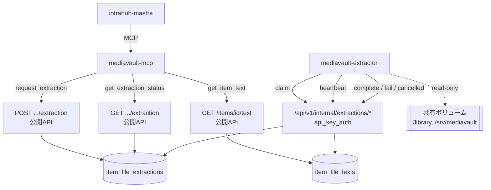
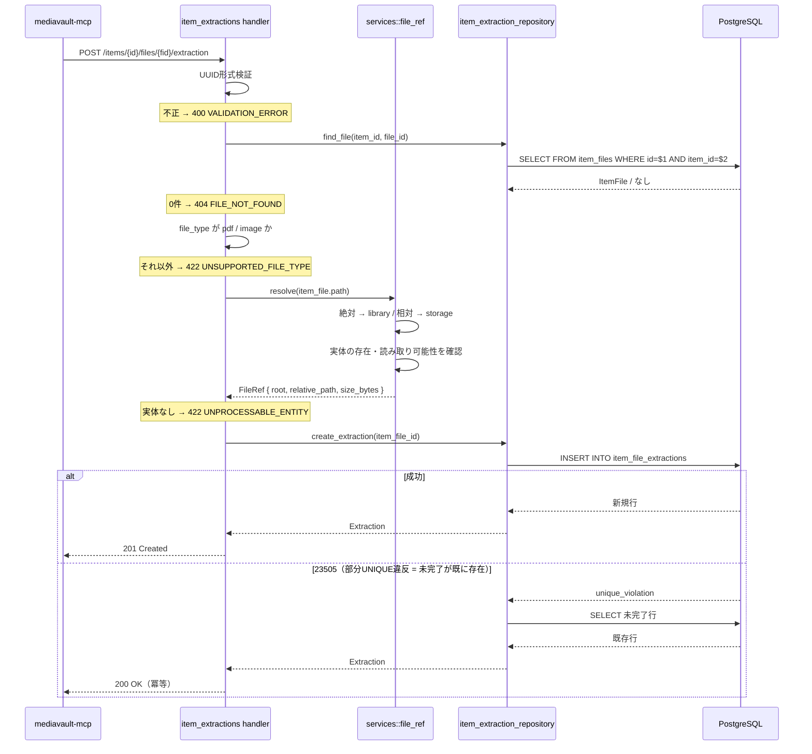
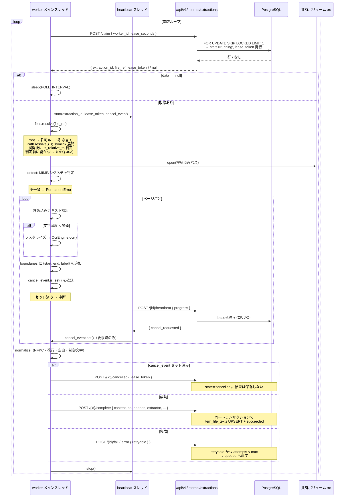
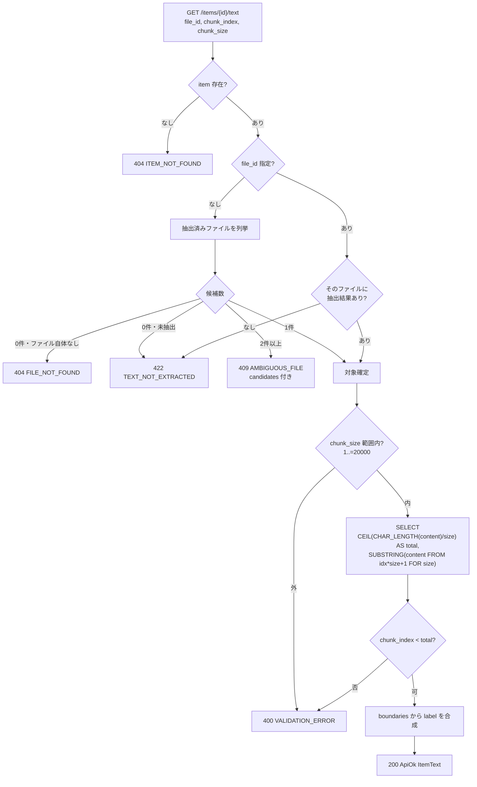
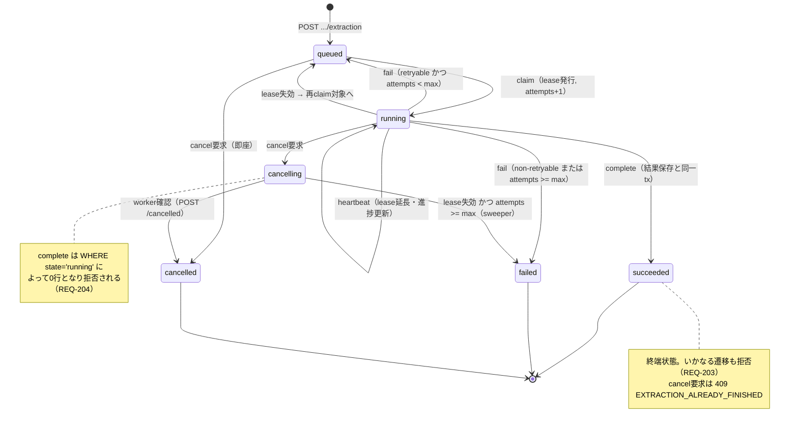
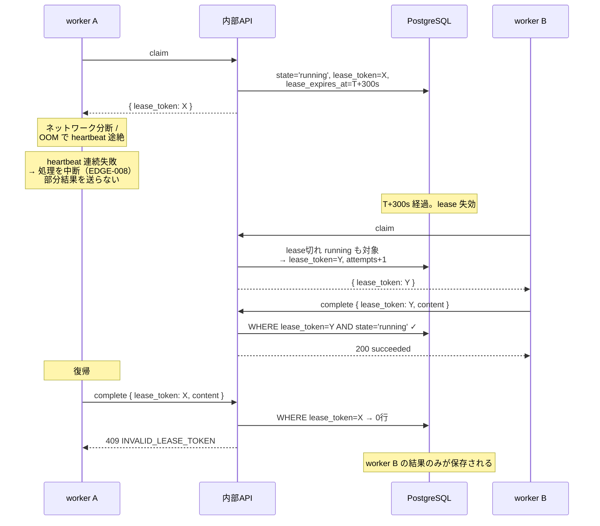
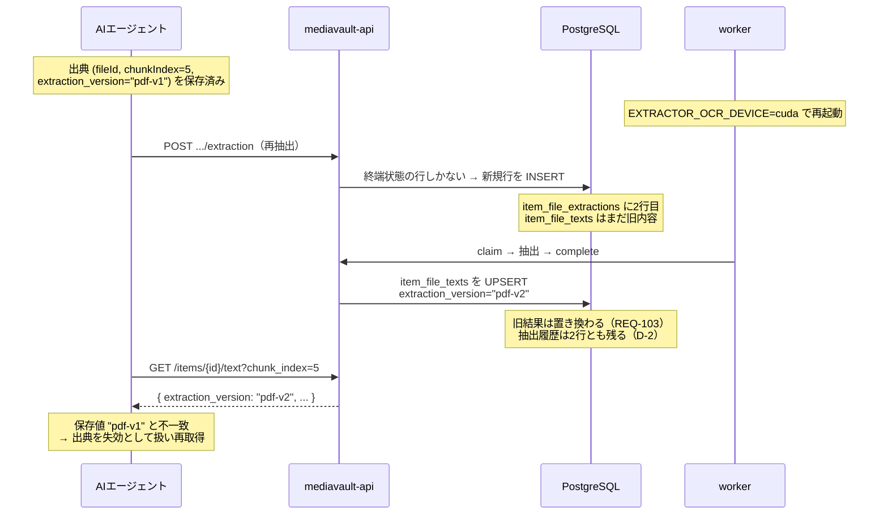
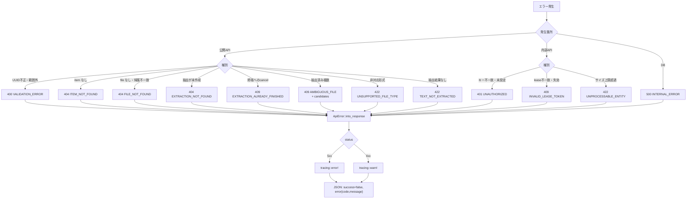

# MediaVault Extractor データフロー図

**作成日**: 2026-08-14
**関連アーキテクチャ**: [architecture.md](architecture.md)
**関連要件定義**: [requirements.md](../spec/requirements.md)

**【信頼性レベル凡例】**:
- 🔵 **青信号**: EARS要件定義書・設計文書・既存実装・ユーザヒアリングを参考にした確実なフロー
- 🟡 **黄信号**: EARS要件定義書・設計文書・既存実装・ユーザヒアリングから妥当な推測によるフロー
- 🔴 **赤信号**: EARS要件定義書・設計文書・既存実装・ユーザヒアリングにない推測によるフロー

---

## システム全体のデータフロー 🔵

**信頼性**: 🔵 *[requirements.md](../spec/requirements.md) §API仕様サマリー・[architecture.md](architecture.md) より*



**pull 型である点が最重要** 🔵 *NFR-201より*: api から worker への矢印は存在しない。worker が停止しても api の応答性・可用性に影響しない。

---

## 主要機能のデータフロー

### フロー1: 抽出リクエスト（冪等）🔵

**信頼性**: 🔵 *REQ-001・REQ-004・REQ-101・REQ-044・TC-001-01〜B01より*

**関連要件**: REQ-001, REQ-004, REQ-044, REQ-101, REQ-102, REQ-410



**詳細ステップ**:
1. パスパラメータの UUID 形式を検証する
2. `item_files` を `id + item_id` の両方で引く。片方だけ一致するケースを `FILE_NOT_FOUND` として弾く（TC-001-E02）
3. `file_type` を判定する。MVPは `pdf` / `image` のみ（REQ-410）
4. `path` から `FileRef` を解決し、実体の存在を確認する（PRD §8.3「読み取り可能性を検証してからジョブを作成する」）
5. INSERT を試みる。部分UNIQUE index が未完了1件を保証しているため、違反時は既存行を返す

**冪等性が並列でも壊れない理由** 🔵 *TC-001-B01より*: 重複チェックをアプリ側の SELECT → INSERT で行うと、2リクエストが同時に SELECT を通過して両方 INSERT する余地がある。部分UNIQUE index に直接 INSERT を投げる方式では、DB が排他制御するため必ず片方だけが成功する。既存の `db_error_utils::is_unique_violation` をそのまま使える。

---

### フロー2: worker の抽出ループ 🔵

**信頼性**: 🔵 *REQ-020〜027・REQ-060〜071・[tech-stack.md](../tech-stack.md) §実行ループの骨子より*

**関連要件**: REQ-020, REQ-021, REQ-022, REQ-023, REQ-024, REQ-060〜068, REQ-403



**キャンセル伝播の経路** 🔵 *REQ-066・REQ-207・[tech-stack.md](../tech-stack.md) より*: heartbeat は独立したスレッドで動くため、メインスレッドが OCR で長時間ブロックしていてもキャンセル要求を受け取れる。伝播は `threading.Event` 1本で行い、メインスレッドは**ページ境界でのみ**確認する。ページの途中で中断すると boundaries が不整合になるため。

**「キャンセル後に成功を確定しない」の二重の担保** 🔵 *REQ-204・REQ-207より*:
- worker 側: complete を送る直前に `cancel_event.is_set()` を確認する
- api 側: complete の `WHERE state = 'running'` により `cancelling` は0行になる

どちらか一方が漏れても成功確定は起きない。

---

### フロー3: 全文取得とチャンク切り出し 🔵

**信頼性**: 🔵 *REQ-005〜008・REQ-115〜117・[item-text.md](../../backend/mediavault-api/item-text.md) より*

**関連要件**: REQ-005, REQ-006, REQ-007, REQ-008, REQ-115, REQ-116, REQ-117



**詳細ステップ**:
1. `item_file_extractions` は**参照しない**。`item_file_texts` に行があるかどうかだけで判定する（REQ-117・TC-005-E04/E05）
2. 主ファイルの解決は「抽出済みのもの」を候補とする。抽出済みが2件以上なら推測で選ばず `409`（REQ-115）
3. `total_chunks` は `CHAR_LENGTH`（文字数）で算出する。`OCTET_LENGTH` では日本語で境界がずれる（EDGE-103）
4. `SUBSTRING` で DB 側切り出しを行い、全文をアプリメモリへ載せない（REQ-008・NFR-001）

**label 合成のアルゴリズム** 🔵 *設計ヒアリングQ2・[architecture.md](architecture.md) D-5より*:

```text
chunk_start = chunk_index * chunk_size
chunk_end   = chunk_start + 実際に取得した文字数

overlapping = [b for b in boundaries
               if b.start < chunk_end and b.end > chunk_start]

len(overlapping) == 0  → label = null
len(overlapping) == 1  → label = overlapping[0].label          例: "p.9"
len(overlapping) >= 2  → label = f"{先頭.label}-{末尾の数値部}"  例: "p.1-3"
```

`boundaries` は `item_file_texts` の jsonb から取得する。要素数はページ数ぶん（数百程度）であり、アプリ側で処理して問題ない規模である 🟡。

---

### フロー4: 状態遷移 🔵

**信頼性**: 🔵 *REQ-201〜207・PRD §8.5・[architecture.md](architecture.md) D-2より*



**終端状態の行は残る** 🔵 *[architecture.md](architecture.md) D-2より*: 部分UNIQUE index は `queued` / `running` / `cancelling` のみを縛るため、終端に達した行は同一 `item_file_id` に複数残る。再抽出は新しい行を作る。`GET .../extraction` は `created_at DESC LIMIT 1` で最新1件を返す。

---

### フロー5: 障害復旧（lease 失効）🔵

**信頼性**: 🔵 *REQ-118・REQ-407・EDGE-002・NFR-202・TC-EDGE-008-01より*

**関連要件**: REQ-021, REQ-118, REQ-407, EDGE-002, EDGE-008



**古い worker が上書きできない仕組み** 🔵 *REQ-407・PRD §8.8「古いworkerからのcompleteが拒否される」より*: complete / fail / cancelled のすべてが `WHERE id = $1 AND lease_token = $2 AND state = 'running'` を条件とする。再claimで `lease_token` が新しい値に置き換わっているため、旧トークンでは0行となり必ず拒否される。

**試行上限に達した lease 切れ行の扱い** 🟡 *REQ-111から妥当な推測*: `attempts >= max_attempts` の行は claim 対象から外れるため、放置すると `running` のまま残る。定期的な sweeper で `failed` へ落とす（[database-schema.sql](database-schema.sql) §sweeper クエリ）。実行タイミング（claim 時に併せて実行 / 定期実行）は実装フェーズで決める。

---

### フロー6: 再抽出と出典の失効検知 🔵

**信頼性**: 🔵 *REQ-103・REQ-104・REQ-206・[user-stories.md](../spec/user-stories.md) ストーリー3.3・4.1より*

**関連要件**: REQ-103, REQ-104, REQ-206, REQ-414



**失敗時に既存結果が消えない** 🔵 *REQ-206・TC-026-04より*: fail 処理は `item_file_texts` に一切触れない。再抽出が途中で失敗・キャンセルされても、`GET /items/{id}/text` は従来の `pdf-v1` を返し続ける。実験的な再抽出を安全に試せる（[user-stories.md](../spec/user-stories.md) ストーリー2.3）。

---

## データ処理パターン

### 同期処理 🔵

**信頼性**: 🔵 *[requirements.md](../spec/requirements.md) §API仕様サマリーより*

すべての公開API・内部APIは同期リクエスト/レスポンス。抽出リクエストは「行を1件作って返す」だけであり、重い処理を含まない。

### 非同期処理 🔵

**信頼性**: 🔵 *PRD §2・REQ-060より*

抽出そのものが非同期。api は抽出を**起動しない**（push しない）。worker がポーリングで pull する。これにより:
- api のリクエスト処理時間が OCR 時間に引きずられない
- worker の停止・再起動が api の可用性に影響しない（NFR-201）
- worker のスケールアウトが api の変更なしに可能（同一 claim を複数 worker が奪い合わない = EDGE-001）

### バッチ処理 🟡

**信頼性**: 🟡 *REQ-111・NFR-202から妥当な推測*

lease 切れかつ試行上限に達した行を `failed` へ落とす sweeper のみ。それ以外にバッチ処理は導入しない。ファイル登録時の自動キューも行わない（REQ-401）。

---

## エラーハンドリングフロー 🔵

**信頼性**: 🔵 *[api-endpoints.md](api-endpoints.md) §追加・削除するエラーコード・既存 `src/models/response.rs` より*



**ログレベルの自動振り分け** 🔵 *既存 `src/models/response.rs:226` の `api_error_log_level` より*: `ApiError::into_response` が 5xx を ERROR、それ以外を WARN で記録する。新規エラーコードもこの仕組みに自動的に乗る。追加実装は不要。

**worker 側のエラー分類** 🔵 *REQ-109・REQ-110・[tech-stack.md](../tech-stack.md) 実行ループより*:

| 分類 | 例 | 送信内容 | 結果 |
|---|---|---|---|
| `TransientError` | api 到達失敗、一時的なI/Oエラー | `fail { retryable: true }` | `attempts < max` なら `queued` へ |
| `PermanentError` | 破損ファイル、未対応形式、シグネチャ不一致、サイズ上限超過 | `fail { retryable: false }` | 即 `failed` |
| キャンセル | `cancel_event` セット済み | `cancelled` | `cancelled` |

api 通信自体の一時失敗は tenacity の指数バックオフでリトライし、それでも失敗した場合のみ `TransientError` として扱う（REQ-109）。

**AIエージェント視点でのエラー識別** 🔵 *NFR-503・[api-tool-mapping.md](../../backend/mediavault-mcp/design/api-tool-mapping.md) §エラー分類より*:

| api の応答 | mcp が返す意味 | エージェントの次の行動 |
|---|---|---|
| `404 FILE_NOT_FOUND` | そもそも材料が無い | 別の情報源へ切り替える |
| `422 TEXT_NOT_EXTRACTED` | まだ抽出していない | `request_extraction` を呼ぶ |
| `422 UNSUPPORTED_FILE_TYPE` | この材料は使えない | 依頼を繰り返さない |
| `409 AMBIGUOUS_FILE` | 対象が絞れない | `candidates` から選んで再試行 |
| api 到達不能 | 復旧待ち | 時間をおいて再試行 |

---

## データ整合性の保証 🔵

**信頼性**: 🔵 *REQ-025・REQ-044・REQ-407・PRD §8.8より*

| 保証したいこと | 手段 | 対応要件 |
|---|---|---|
| 未完了の抽出が1ファイル1件 | 部分UNIQUE index（DB制約） | REQ-044・TC-001-B01 |
| 2台の worker が同じ行を取らない | `FOR UPDATE SKIP LOCKED` | EDGE-001・TC-020-B01 |
| 結果保存とジョブ成功が不整合にならない | 単一トランザクション | REQ-025・TC-024-01 |
| 古い worker が上書きしない | lease token による楽観ロック | REQ-407・EDGE-002 |
| キャンセル済みが成功にならない | `WHERE state='running'` + worker側の事前確認 | REQ-204・REQ-207 |
| 終端状態が上書きされない | 各遷移の `WHERE state = ...` 条件 | REQ-203 |
| 失敗しても既存結果が消えない | fail は `item_file_texts` に触れない | REQ-206・TC-026-04 |
| ファイル削除時に孤児が残らない | `ON DELETE CASCADE`（両テーブル） | REQ-409・EDGE-006 |

**ロック戦略** 🔵: 悲観的ロック（`FOR UPDATE`）を claim と complete/fail/cancelled の行ロックに使う。楽観的ロック（lease token）を worker とのプロトコル境界に使う。前者は同一プロセス内の短時間、後者は分単位のプロセス間という時間スケールの違いに対応している。

---

## 関連文書

- **アーキテクチャ**: [architecture.md](architecture.md)
- **DBスキーマ**: [database-schema.sql](database-schema.sql)
- **API仕様**: [api-endpoints.md](api-endpoints.md)
- **型定義（api）**: [interfaces.rs](interfaces.rs)
- **型定義（worker）**: [interfaces.py](interfaces.py)
- **要件定義**: [requirements.md](../spec/requirements.md)

## 信頼性レベルサマリー

フロー・パターン項目 18件の内訳。

| レベル | 件数 | 割合 |
|---|---|---|
| 🔵 青信号 | 16件 | 89% |
| 🟡 黄信号 | 2件 | 11% |
| 🔴 赤信号 | 0件 | 0% |

**品質評価**: ✅ 高品質

🟡 は sweeper のバッチ処理と、boundaries をアプリ側で処理する規模の見積もりの2件。
