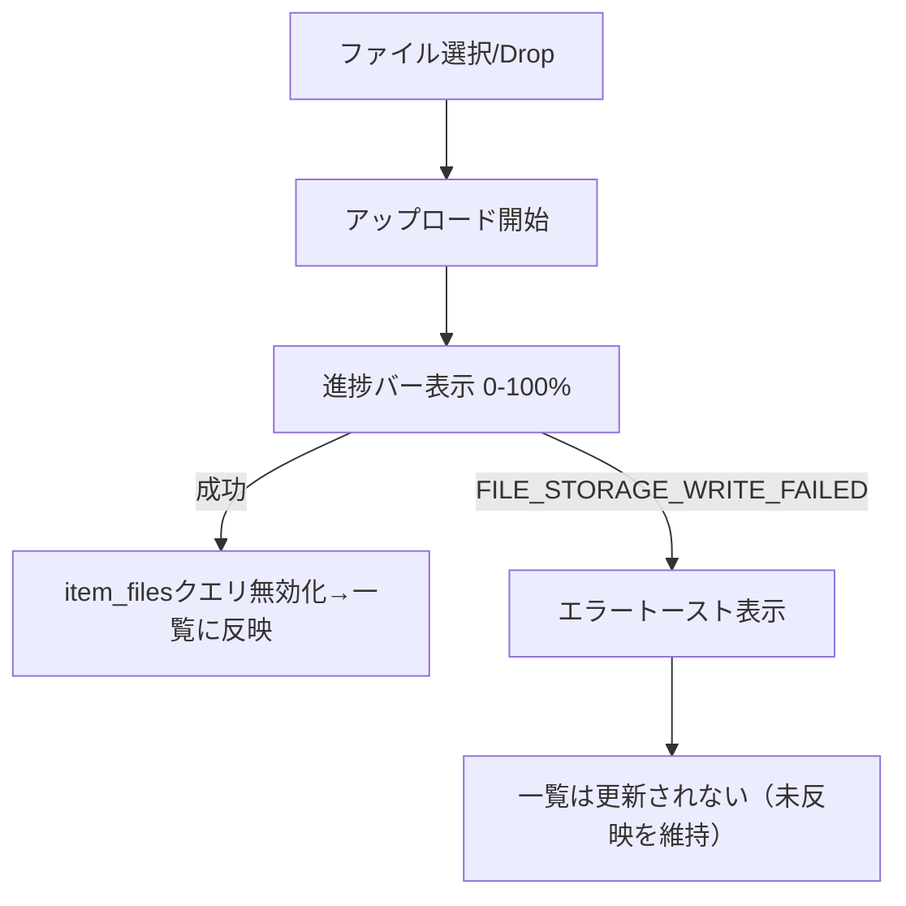

# TASK-0021: ファイルアップロード機能実装

## 概要

- **タスクID**: TASK-0021
- **タスク名**: ファイルアップロード機能実装
- **フェーズ**: Phase 3 - 詳細・グループ・関連
- **タスクタイプ**: TDD
- **推定工数**: 6h
- **前提タスク**: TASK-0020（リンク・ファイル・トレーラー管理UI実装）
- **後続タスク**: なし

## 関連文書

- [overview.md](overview.md)
- [requirements.md](../../spec/frontend-collection-ui/requirements.md)
- [architecture.md](../../design/frontend-collection-ui/architecture.md)
- [dataflow.md](../../design/frontend-collection-ui/dataflow.md)

## 背景・目的

TASK-0020で構築した`ItemFilesList`に対し、実際のファイルアップロード機能（ドラッグ&ドロップ/ファイル選択、`multipart/form-data`送信）を実装する。アップロード中は進捗表示を行い、サーバー側書き込み失敗（`FILE_STORAGE_WRITE_FAILED`）時はエラーメッセージを表示し、当該ファイルが一覧に追加されないことを保証する（EDGE-003）。

## 実装詳細

### 対象ファイル

- `src/features/links-files/FileUploadDropzone.tsx`（新規）: ドラッグ&ドロップ/クリック選択UI
- `src/features/links-files/UploadProgressIndicator.tsx`（新規）: アップロード進捗表示
- `src/api/links-files.ts`（拡張）: `useUploadItemFileMutation`の追加（TASK-0020で作成したファイルに追記）

### API要件

- 🔵 **REQ-012**: `POST /items/:id/files/upload`（`multipart/form-data`、`UploadItemFileRequest{file, fileType, label}`）を呼び出すアップロードミューテーションフックを実装する。`XMLHttpRequest`または`fetch`+`ReadableStream`の進捗イベントを利用し、アップロード進捗（%）をUIに反映する。
  *出典: requirements.md REQ-012, interfaces.ts UploadItemFileRequest*

### 機能要件対応

- 🔵 **REQ-012**: ドラッグ&ドロップまたはファイル選択ダイアログによるアップロードUIを提供する。`FileUploadDropzone`は`<input type="file">`とドラッグオーバー領域の両方を提供し、選択後`fileType`（pdf/image/other）を自動判定または手動選択させてからアップロードを実行する。
  *出典: requirements.md REQ-012*
- 🟡 **NFR-203**: アップロード中は`UploadProgressIndicator`で進捗バーを表示し、失敗時は`FILE_STORAGE_WRITE_FAILED`等のエラーコードに対応したエラーメッセージをsonner toastで表示する。
  *出典: requirements.md NFR-203（バックエンドエラーコードからの妥当な推測）*
- 🟡 **EDGE-003**: アップロードが`FILE_STORAGE_WRITE_FAILED`で失敗した場合、`useUploadItemFileMutation`は`item_files`一覧クエリ（`['items', itemId, 'files']`）を無効化・更新しない（楽観的追加を行わない設計とし、サーバー確定後のみ一覧に反映する）。これによりエラー時に一覧へファイルが追加されていない状態を保証する。
  *出典: requirements.md EDGE-003（要件に詳細実装方式の明記はないため妥当な推測）*

### 進捗・エラーフロー

🟡 *dataflow.mdエラーハンドリングフロー「FILE_STORAGE_WRITE_FAILED 500 → エラートースト+ファイル一覧へ反映しない」に基づく構成*

## UI/UX要件

- 🔵 **アップロード進捗インジケータ**: アップロード中は%表示またはプログレスバーで進捗を視覚化する。
  *出典: requirements.md NFR-203*
- 🔵 **失敗時エラー表示**: `FILE_STORAGE_WRITE_FAILED`時にsonner toastでエラーメッセージを表示する。
  *出典: requirements.md NFR-203, EDGE-003*
- 🟡 **モバイル対応**: モバイル幅ではドラッグ&ドロップ領域をタップでファイル選択ダイアログが開く領域として機能させる（タッチデバイスでのドラッグ操作は前提としない）。
  *出典: 一般的なモバイルUIパターンからの推測、要件に明記なし*

## テスト要件

### 単体テスト

- アップロード成功時、進捗が0→100%まで更新され、完了後に`item_files`一覧に新規ファイルが反映されることを確認する 🔵
- アップロード失敗（`FILE_STORAGE_WRITE_FAILED`）時、エラーメッセージが表示され、`item_files`一覧に当該ファイルが追加されていないことを確認する（EDGE-003） 🔵
  *出典: requirements.md EDGE-003*
- ドラッグ&ドロップ操作とファイル選択ダイアログ操作の両方からアップロードが開始できることを確認する 🟡

## 完了条件（Acceptance Criteria）

- [ ] ドラッグ&ドロップ・ファイル選択の両方でアップロードが開始できる
- [ ] アップロード中に進捗が表示される
- [ ] アップロード成功時に一覧へファイルが反映される
- [ ] `FILE_STORAGE_WRITE_FAILED`時にエラー表示され一覧に反映されないことが保証される
- [ ] モバイル幅でタップによるファイル選択が機能する
- [ ] 単体テストが全てパスする

## 実装手順（TDD）

1. `/tsumiki:tdd-requirements` - 要件の詳細化
2. `/tsumiki:tdd-testcases` - テストケース洗い出し（成功/失敗/進捗/D&D/タップ選択）
3. `/tsumiki:tdd-red` - 失敗するテストの作成
4. `/tsumiki:tdd-green` - テストを通す実装
5. `/tsumiki:tdd-refactor` - リファクタリング
6. `/tsumiki:tdd-verify-complete` - 完了検証

## 信頼性レベルサマリー

- 🔵 青信号: 6件 (60%)
- 🟡 黄信号: 4件 (40%)
- 🔴 赤信号: 0件 (0%)

**品質評価**: 中〜高品質。REQ-012との対応は明確。進捗表示・EDGE-003の具体実装方式・モバイル操作方式はPRD未記載のため🟡推測が多い。
